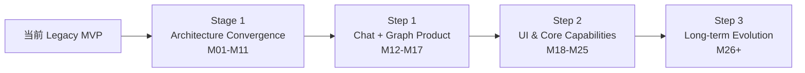
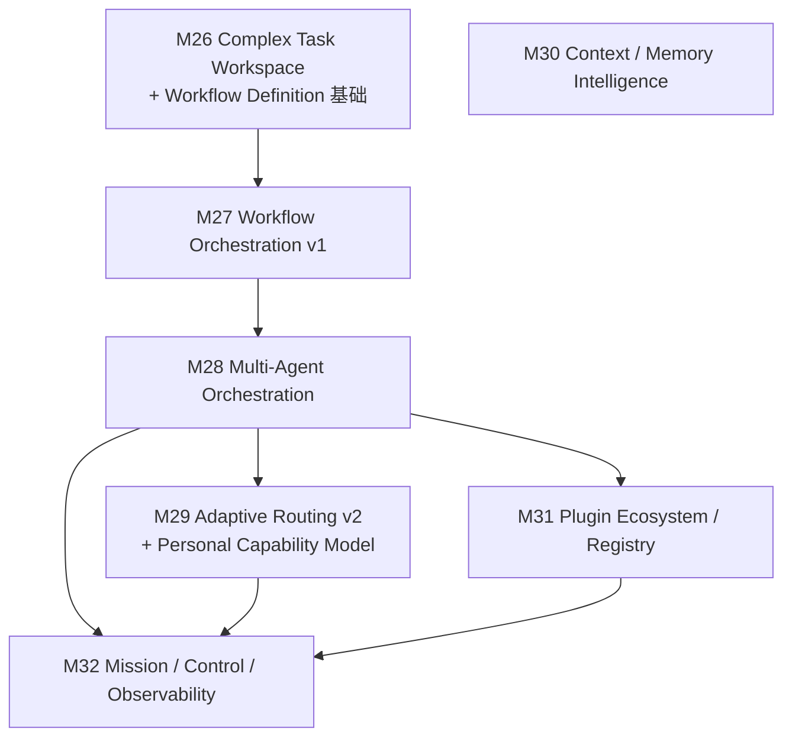

# Rhiza 开发路线图

```text
Version: V4.1
Release Date: 2026-08-24
Baseline: Rhiza Architecture & Roadmap Baseline V4.1
Status: Active
```

> 本文档与《Rhiza 技术架构设计书 V4.1》共同构成唯一生效的 **Rhiza Architecture & Roadmap Baseline V4.1**。
> 架构书回答"系统是什么、为什么这样设计";本文回答"如何从当前代码逐步实现该架构"。
> 本文引用的所有章节号(§)与不变量编号(I-xx)均指向架构书;两份文档术语、对象模型与 Milestone 编号完全一致。

---

# 1. 文档地位与使用规则

## 1.1 单一 Milestone 编号

从本基线起,**彻底停止**并行使用 Legacy-M、P1-M、R、G、WP 等多套开发编号。全部开发工作只使用一套连续、稳定、长期可扩展的正式编号:

```text
M01, M02, M03, ...
```

- 历史文档中的旧编号只作为 Historical Evidence 阅读,不定义当前工作;
- 架构 Gate 不再拥有独立编号(G0–G8 编号体系废止),验收条件内嵌于各 Milestone(见 §1.3);
- `docs/architecture-gates/` 的 G0 证据、schema 与工具**保留并复用**,后续 Milestone 的 evidence 沿用同一体系(§18.2 架构书)。

## 1.2 优先级与两级验收

- **Priority(P0/P1/P2)** 表示风险与紧迫度,按风险、依赖、迁移成本、历史数据安全与后续解锁能力排定;优先级**不替代** Milestone 编号,施工顺序以编号与依赖为准。
- 每个 Milestone 的验收分两级(架构书 §18.1):
  - **Blocking Acceptance**:不通过不得宣布完成、不得进入依赖它的后续 Milestone;
  - **Observability / Quality Metrics**:持续记录、可红、默认不阻断;在 M11(架构收敛验收)与 M17(产品验收)集中提升为阻断。
- 每个 Milestone 的验收保存机器可读 evidence(格式见架构书 §18.2),尽可能自动化,但不为形式量化制造无价值指标;禁止"基本完成""性能良好""稳定运行"等不可判定表述。
- **每个 Milestone 至少发布一个用户可感知的改进**(功能、可靠性或可解释性),防止"只落表不落产品"的漂移。

## 1.3 Milestone 模板

所有 Milestone 至少包含以下字段;Stage 2 / Step 3 的远期条目允许先给出压缩形态,但开工前必须按本模板补全并绑定 ADR:

```text
Milestone ID / 名称 / Priority
目标
用户价值 / 架构价值
Architecture Coverage(架构书章节与不变量)
当前状态
前置依赖
具体实现内容
涉及模块
数据模型 / Contract 变化
Migration / Backfill
Rollback / Recovery
测试方案
故障注入
性能与可靠性指标
Blocking Acceptance
Observability / Quality Metrics
非目标
Architecture State Change: Before → After
完成后解锁能力
```

## 1.4 事实口径

事实优先级:`当前 main 分支代码与自动化证据 > docs/项目现状.md > 本基线目标设计`。本文 §2 的现状描述已逐项经代码核查;若未来代码与本文冲突,以代码为准并在下一次修订时更新本文。

---

# 2. 当前状态(路线起点,2026-08-22)

## 2.1 已经具备(以代码为准)

- **可运行的单机 Web MVP**:节点化对话(流式、Stop、Retry、Regenerate、Edit & Resend、附件、Markdown/公式/Mermaid、Reasoning/Tool Call/Usage 展示)、Conversation Graph(自研 SVG,缩放/平移/拖拽/搜索/建删节点与关系)、显式 Context 三区管理(Auto/Assisted/Strict)、每次正式调用冻结不可变 Context Manifest、本地确定性 Planner、多 Provider 目录(AES-256-GCM 加密 Key)。
- **工程基线**:CI(lint/typecheck/unit/e2e/licenses/`verify:g0`/build,Node 24 + PostgreSQL 17);G0 characterization + evidence manifest + fixture registry 已入库并进 CI;PostgreSQL 3 个 migration + checksum 迁移器;约 69 个自动化用例。
- **有价值的既有缝**:`AIRuntime`/`RuntimeEvent` 契约与"RUN_END 才原子提交"语义、可替换的 `WorkspaceRepository`、不可变 Manifest 结构、消息版本字段、fail-fast feature flags、LibreChat 只进 Adapter 不进 Domain 的边界。

## 2.2 结构性欠账(Stage 1 的施工对象)

| # | 欠账 | 代码证据 |
| --- | --- | --- |
| 1 | Graph 删除级联**物理删除**消息与 Manifest,破坏历史 | `server/app.ts` `DELETE /api/graph/nodes/:id` |
| 2 | 持久层 mutable upsert + `deleteMissing` 物理删行;Manifest 可被改写 | `server/postgres-store.ts` |
| 3 | 无持久化 ExecutionRun;失败/取消/超时零历史;无服务端 stop | 全仓库无 run 表;stop 靠客户端 Abort |
| 4 | 无 Domain Journal;`AuditEvent` 仅 `workspace.updated` | `db/migrations/0003` |
| 5 | 无 Application 层;业务逻辑内联在 Express 路由 | `server/app.ts`(~590 行) |
| 6 | 单 Workspace 单例、无 user/workspace 表、无身份 | `DEFAULT_PROJECT_ID` |
| 7 | Graph 与 Domain 混合(坐标在领域对象、节点表即真相、全量加载) | `server/domain.ts`、`GET /api/workspace` |
| 8 | Planner 每轮全量扫描 Workspace;Manifest 无 ResourceVersion/digest/compiler version | `server/context-planner.ts` |
| 9 | 附件无内容寻址、无版本;上传直接在路由写文件系统 | `POST /api/attachments`、`var/uploads/` |
| 10 | 架构边界仅正则级测试;`libreChatRuntime`/`fileContext` flag 未接线 | `server/architecture.test.ts`、`server/index.ts` |
| 11 | 无 ADR;仓库含入库 zip 与运行时数据快照 | 无 `docs/adr/`;`Rhiza-Dev-*.zip` |
| 12 | 旧文档多处过时表述继续误导开发 | `docs/librechat-migration.md` 等(本基线已归档处理) |

其中 #1/#2 随每天使用**单调恶化**(dogfood 期间损失的历史不可回补),是唯一"现在必须处理"的一类,故 M01 为止血包。

## 2.3 未完成的 Legacy 人工证据

两项保留至 M17 关闭,不得提前视作通过:① 100 Node 真实浏览器连续一小时稳定性;② 未接触 Rhiza 的真实用户可用性测试与 P0/P1 闭环(登记于 G0 evidence,状态 pending)。

---

# 3. 总体路线结构

路线只分两个阶段,共用同一套 Milestone 编号:

```text
Stage 1 — Architecture Convergence                M01–M11
  让当前 Legacy 实现安全收敛到长期可演进架构;不以增加大量新用户功能为目标

Stage 2 — Product Development
  Step 1 — Chat + Graph Product                   M12–M17
  Step 2 — UI & Core Capabilities                 M18–M25
  Step 3 — Long-term Evolution                    M26+
```



硬依赖链(详见 §9):

```text
M01 → M02 → M03 → M04 → M05 → M06 → M07 → M08 → M09 → M10 → M11
                         (M07/M08 可在 M05 后局部并行开发,合入主路径需 M06 契约稳定)
```

---

# 4. Stage 1 — Architecture Convergence(M01–M11)

**阶段目标**:让当前 Legacy 实现安全收敛到长期可演进架构。按风险、依赖、迁移成本、历史数据安全与后续解锁能力排序。阶段完成的整体判据见 §5。

**阶段明确不做**:完整 Task 产品、Adaptive Router 评分引擎、Multi-Agent Coordinator、Extension SDK/Marketplace、跨 Workspace Mission、微服务/Kafka/CRDT、自治 Agent scheduler、完整 Event Sourcing。可以为它们预留 contract seam,但不得提前实现为产品(架构书 §19)。

---

## M01 — 止血与基线治理

- **Priority**:P0
- **目标**:立即停止"历史流失"的持续出血;建立边界、ADR 与验收分级的治理基线;清理仓库卫生;完成文档归档,使旧文档不再误导开发。
- **用户价值 / 架构价值**:用户删除 Graph 节点不再永久丢失消息与 Manifest(改为归档、可恢复);架构上兑现 I-05/I-07 的最低承诺,并为 M02+ 重构建立自动护栏。
- **Architecture Coverage**:§2(I-05/I-07)、§3.4 边界自动约束、§18.1 验收两级制、§20 ADR Policy、§1.2 文档体系。
- **当前状态**:删除路径物理级联删除;manifest `ON CONFLICT DO UPDATE`;`deleteMissing` 覆盖 manifests/messages;无 ADR;边界守护为正则级;`Rhiza-Dev-*.zip` 与运行时数据快照入库;多份过时文档生效中。
- **前置依赖**:无(可立即开工)。
- **具体实现内容**:
  1. `DELETE /api/graph/nodes/:id` 默认改为 `archived`(状态机已有 archived 与只读语义);物理删除入口保留但要求显式确认且仅允许对 archived 节点执行;UI 提供归档状态展示与恢复入口;
  2. PG 适配器:manifest upsert 改 `ON CONFLICT DO NOTHING`;`deleteMissing` 对 `rhiza_context_manifests` 与 `rhiza_messages` 停用(或改 tombstone 标记);
  3. 仓库卫生:`git rm` 入库 zip 与 `Rhiza-Dev-codex-rhiza-librechat-runtime/`、`.DS_Store`;`.gitignore` 加 `*.zip`、`**/var/data/`、`.DS_Store`;全仓库 secret 扫描一次(fixture hygiene 扫描器扩展到全仓库路径);
  4. ESLint 分区边界规则替换正则测试(`server/domain*` 禁 express/pg/node:fs;`src/**` 禁 import server 内部;路由禁存储直调),并加"故意违规 import 必须红灯"的 CI 用例;
  5. 建 `docs/adr/`,交付 ADR-001~004(依赖方向、Identity/Workspace/Scope、Resource identity 与哈希、State+Journal 事务模型);
  6. 验收分级(blocking/observational)写入 `docs/architecture-gates/README.md`,evidence schema 增加 `severity` 字段,CI 拆两个 job;
  7. 文档归档:被替代文档移入 `docs/archive/` 并加 superseded 头注;`docs/architecture.md` 限定为 Current Implementation Snapshot 并修正已知过时表述;M0–M6 验收加 Historical Evidence Only 头注;
  8. 修复 G0 API snapshot 提取器漏记 `PUT` 路由的缺陷,重新生成快照与 checksum。
- **涉及模块**:`server/app.ts`、`server/postgres-store.ts`、`server/store.ts`、`eslint.config.js`、`docs/`、`docs/architecture-gates/`、CI。
- **数据模型 / Contract 变化**:无 schema 变化;删除语义变化登记为**有意语义变更**(characterization 更新并可审计)。
- **Migration / Backfill**:无。
- **Rollback / Recovery**:全部为可逆代码/文档变更;git revert 即可。
- **测试方案**:新增回归测试"删除 Graph 节点后消息与 Manifest 仍可经 API/DB 解析";`deleteMissing` 单测断言 manifests/messages 不再出现在删除语句集合;边界违规红灯用例;characterization 全量复跑。
- **故障注入**:不适用(无新事务路径)。
- **性能与可靠性指标**:characterization 用时不显著回归(观测级)。
- **Blocking Acceptance**:
  - 删除 Graph 节点导致 Domain Object 物理删除的路径 = 0(显式 Purge 式确认入口除外);
  - 已执行 Manifest 被 UPDATE 成功次数 = 0;
  - `deleteMissing` 作用于 manifests/messages 的语句 = 0;
  - 仓库内 zip/运行时数据快照 = 0,secret 扫描命中 = 0;
  - 边界违规 import 的 CI 红灯用例通过;
  - ADR-001~004 已合并且被 M02+ 的 PR 引用;
  - 归档文档均有 superseded 头注,`architecture.md` 头注声明 Snapshot 地位。
- **Observability / Quality Metrics**:characterization 耗时趋势。
- **非目标**:不实现 tombstone 全语义(M07)、不重构存储(M05)、不拆 Application 层(M02)。
- **Architecture State Change**:`删除持续破坏历史、治理缺位` → `历史止血完成;边界/ADR/验收分级护栏就绪`。
- **完成后解锁能力**:M02 起的所有重构在护栏内进行;dogfood 数据从此可安全积累。

---

## M02 — Application 层与模块边界

- **Priority**:P0
- **目标**:建立唯一写入口(CommandEnvelope + Application handler + WorkspaceUnitOfWork 接口),路由全部变 facade;按 §3.2 完成目录分区与依赖规则,使基础设施能力不再直接污染领域语义。
- **用户价值 / 架构价值**:用户可见错误提示标准化(错误 taxonomy 落 UI);架构上为 M05 的"State+Event+Receipt 同事务"提供落点,未来任何新入口(/api/v1、CLI、Desktop IPC)不再复制业务逻辑。
- **Architecture Coverage**:§3 分层与模块边界、§15.4 Command Envelope、§15.5 API 映射、I-10。
- **当前状态**:约 590 行 `app.ts` 承载全部写路径;无 UoW;`prepareChatRun/commitChatRun` 已是事实上的 command handler。
- **前置依赖**:M01(ESLint 护栏、ADR-001)。
- **具体实现内容**:
  1. 定义 `CommandEnvelope`、Application Command/Query handler、`WorkspaceUnitOfWork` 接口与错误 taxonomy(§15.4/§15.6);
  2. `prepareChatRun/commitChatRun` 直接提为 `CreateConversationRun` 第一版,**不重写**;随后按"一条路由一条路由迁"的方式迁移 graph/context/nodes 路由,characterization 保行为;
  3. 版本推导逻辑(versionGroupId/version 计算)迁入 domain 纯函数并补性质测试;
  4. 目录分区:`server/domain/`、`server/application/`、`server/contracts/`、`server/http/` 等(§3.2),TypeScript project references 按分区执行;
  5. 上传路由中的文件系统写移交独立 adapter 占位(M04 正式接 Host Port);
  6. 错误 taxonomy 映射到前端统一错误提示。
- **涉及模块**:`server/app.ts` → `server/application/` + `server/http/`;`server/domain.ts` → `server/domain/`;`eslint.config.js`;`src/api.ts`(错误处理)。
- **数据模型 / Contract 变化**:新增 CommandEnvelope/错误 taxonomy contract;无 DB schema 变化。
- **Migration / Backfill**:无。
- **Rollback / Recovery**:路由 facade 逐条迁移,任一条可独立回退。
- **测试方案**:characterization 全量;版本推导性质测试(edit-resend/regenerate 的 version/versionGroup 语义不变);"route handler 无存储直调"lint 规则。
- **故障注入**:不适用(事务模型未变)。
- **性能与可靠性指标**:主 Command 路径 p95 相对 G0 基线回归 ≤ 25%(观测级)。
- **Blocking Acceptance**:
  - package/目录 dependency violation = 0;
  - Domain/Application 中 OS-specific import、React/Express/模型 SDK import = 0;
  - 路由 handler 中存储直调 = 0(lint 自动判定);
  - 全部 Legacy characterization 路径无回归;
  - 所有写操作经 Application Command(以覆盖率断言或 lint 判定)。
- **Observability / Quality Metrics**:command p50/p95 趋势。
- **非目标**:不拆独立发布包;不引入新存储语义;不改用户功能。
- **Architecture State Change**:`基础设施即领域(逻辑在路由)` → `唯一写入口 + 分区边界,路由为 facade`。
- **完成后解锁能力**:M03 的 Scope 校验、M05 的同事务提交有了落点。

---

## M03 — Multi-Workspace 与最小 Identity

- **Priority**:P0
- **目标**:把单 Workspace 单例升级为 User → Workspace → Object 的最小所有权模型:users/workspaces/membership 表、Workspace CRUD 与切换、`ActorRef/ScopeRef` 全链路携带、Legacy 数据确定性 backfill。
- **用户价值 / 架构价值**:用户可创建、切换、归档多个 Workspace(Sidebar 现有占位 UI 变为真实功能);架构上兑现 I-01/I-02,为 Scope、Beta 部署、Extension 授权提供前提。
- **Architecture Coverage**:§4 Workspace 与 Identity、§5.4 引用类型、I-01/I-02。
- **当前状态**:`DEFAULT_PROJECT_ID` 单例;无 user/workspace 表;Sidebar 项目切换器为无 handler 占位。
- **前置依赖**:M02(Command 层承载 Scope 校验);ADR-002。
- **具体实现内容**:
  1. `users`、`workspaces`、`workspace_members` 表(§4.1/§4.2)与 expand migration;
  2. 本地单机部署首启 bootstrap 确定性 local user;HTTP 层预留 actor 解析中间件(认证 seam,不实现密码/OAuth);
  3. `CreateWorkspace / RenameWorkspace / ArchiveWorkspace / RestoreWorkspace / ListWorkspaces / SwitchWorkspace` Command/Query;
  4. 所有 Command 强制携带 `ActorRef/ScopeRef`,执行 ownership/membership 与 Workspace 边界校验;
  5. API scope 前缀 `/api/v1/workspaces/:workspaceId/...` 起步(旧 `/api/*` facade 继续工作于 default workspace);
  6. Legacy 数据 backfill:现有单例数据归入 default workspace(保留 `DEFAULT_PROJECT_ID` 为其 id,不重发 ID),local user 为 owner;
  7. 前端:Workspace 切换器、创建/重命名/归档入口(基础形态;完备管理 UI 在 M13)。
- **涉及模块**:`server/identity/`、`server/application/`、`db/migrations/`、`src/`(Sidebar/App)。
- **数据模型 / Contract 变化**:新增三张表;CommandEnvelope 增加强制 actor/scope;ObjectRef/ActorRef/ScopeRef contract 定稿。
- **Migration / Backfill**:expand migration + 确定性 backfill;backfill 幂等(重复运行 checksum 不变)。
- **Rollback / Recovery**:migration 有对应 down;backfill 前快照;旧 facade 在 default workspace 上不受影响。
- **测试方案**:characterization 新增"创建第二个 Workspace、切换、互不可见";backfill 幂等与 dangling ref 扫描;Scope 越界访问负例测试。
- **故障注入**:backfill 中断后重跑等价性。
- **性能与可靠性指标**:workspace 切换查询 p95(观测级)。
- **Blocking Acceptance**:
  - 跨 Workspace 数据可见性 = 0(负例测试通过);
  - backfill dangling refs = 0,重复运行 checksum 不变;
  - 无 ActorRef/ScopeRef 的写 Command = 0;
  - 第二 Workspace 全链路 characterization(创建→对话→切换→归档)通过;
  - Legacy 单 Workspace 路径无回归。
- **Observability / Quality Metrics**:workspace 数量、切换延迟。
- **非目标**:不做密码/OAuth/会话;不做 member 协作与权限引擎;不做跨 Workspace 引用。
- **Architecture State Change**:`单 Workspace 单例、无身份` → `User→Workspace→Object 最小所有权模型,Scope 全链路携带`。
- **完成后解锁能力**:多项目日常使用;M09 Bundle 的 Workspace 边界;未来共享部署与 Beta 的前提。

---

## M04 — Resource、Blob 与 Host Runtime Port

- **Priority**:P0
- **目标**:落地 Resource / 不可变 ResourceVersion / content digest / Blob promote 协议,替换平面附件存储;落地 HostRuntimePort 与四平台 Fake capability matrix,使 Core 可 Headless。
- **用户价值 / 架构价值**:文件上传获得完整性校验与按内容去重;架构上兑现 I-08/I-09/I-10,是 Manifest v1(M08)、Provenance(M09)与可移植性的地基——越早越便宜。
- **Architecture Coverage**:§9 Resource 与 Content-addressed Storage、§13 Host Runtime Protocol、I-08/I-09/I-10。
- **当前状态**:附件为 `var/uploads/{uuid}` + 元数据,无 digest 无版本;上传/密钥/存储路径直接耦合 OS。
- **前置依赖**:M02;ADR-003。
- **具体实现内容**:
  1. `resource` / `resource_version` 表与 `sha256` digest、canonicalization 规则(§9.1/§9.2);
  2. content-addressed BlobStore:temp write → verify → atomic promote → DB commit(§9.3),幂等 put/promotion,orphan GC(grace period);
  3. `POST /api/attachments` 内部改走 `RegisterResource + CreateResourceVersion`(对外兼容);现有附件 backfill 为 Resource(计算 digest、迁移 blob key);
  4. `HostRuntimePort` 接口 + `NodeServerHostAdapter` + 四份 Fake descriptor(Windows/macOS/Linux/headless);上传写盘、store 路径、secret-vault 密钥获取迁到 Host Port 之后;
  5. FileChunk 等派生物标记为 materialization(不替代原 ResourceVersion)。
- **涉及模块**:`server/infrastructure/`、`server/host-protocol/`、`server/host-node/`、`server/application/`、`db/migrations/`。
- **数据模型 / Contract 变化**:新增 resource/resource_version 表;BlobStore/HostRuntimePort port contract;ResourceVersion schema。
- **Migration / Backfill**:附件 backfill(uuid 文件 → sha256 key + ResourceVersion 行);幂等、可重跑。
- **Rollback / Recovery**:旧附件读取路径保留至 backfill 验证通过;blob 双读窗口。
- **测试方案**:StorePort/BlobStore contract tests;HostRuntimePort 四平台 fake matrix 跑同一 Application 用例;digest 校验负例(损坏 blob)。
- **故障注入**:temp write、promote、verify、DB-commit、read-after-commit 五个 checkpoint 分别注入故障。
- **性能与可靠性指标**:上传→可用延迟(观测级)。
- **Blocking Acceptance**:
  - 各 checkpoint 故障注入后 committed dangling blob refs = 0;
  - 四平台 Fake contract = 4/4;
  - Domain/Application OS-specific import = 0(host 能力全部经 Port);
  - 附件 backfill dangling = 0、重跑 checksum 一致;digest 校验失败时读路径显式报错(silent fallback = 0);
  - 附件相关 characterization 无回归。
- **Observability / Quality Metrics**:blob 存储量、orphan GC 清理量。
- **非目标**:不做真实桌面壳;不做全文索引/embedding(M08);不做 Artifact 对象族(M19)。
- **Architecture State Change**:`平面文件附件、OS 耦合散布` → `内容寻址 Resource/Blob + Headless Core(Host Port 注入)`。
- **完成后解锁能力**:Manifest v1 的 ResourceVersion 引用;Bundle 的 blob descriptor;桌面/嵌入式 Host 成为纯增量。

---

## M05 — Domain Journal 与事务事实层

- **Priority**:P0
- **目标**:关键行为同时留下当前状态与可排序、可重放的业务事实:Event Envelope、Event Catalog、per-workspace sequence、CommandReceipt,State+Event+Receipt 同事务;JSON store 降级为 importer/fixture,生产持久化统一到具真实事务的后端。
- **用户价值 / 架构价值**:用户获得 Journal 支撑的 Workspace 活动时间线视图 v0;架构上兑现 I-03,是 ExecutionRun、Graph Projection、Replay 的共同前提。
- **Architecture Coverage**:§6 Transactional State 与 Domain Journal、§16.2 Embedded Backend、I-03。
- **当前状态**:无 journal;`AuditEvent` 仅 `workspace.updated`;两个存储后端均为全量 read-modify-write + 进程内串行队列。
- **前置依赖**:M03(事件需携带 workspace_id/actor/scope);ADR-004、ADR-005。
- **具体实现内容**:
  1. `workspace_events`、`workspace_event_heads`、`command_receipts` 表与 Event Envelope(§6.1–6.3);Event Catalog v1(§6.5,含预留 type);
  2. Application Command 统一走"advisory lock → 校验 revision → 写 state → 预留 sequence → append events → 写 Receipt → COMMIT"(§6.6);
  3. append-only 数据库保护(权限 + 触发器)并测试验证;
  4. shadow dual-write 过渡:新写路径按 aggregate repository 逐步替换全量 snapshot persist;历史数据 backfill 为 baseline snapshot + 显式 backfill events(§6.7);reconcile 工具;
  5. JSON store 降级为 legacy importer/fixture loader;无 `DATABASE_URL` 的默认部署切换到 embedded backend(PGlite,真实事务),与 PostgreSQL 共用 StorePort contract tests;`postgresPersistence` flag 语义相应收敛;
  6. 事件分类文档:语义 Domain Event / Trace / Transient Stream 的边界(I-04);
  7. UI:Workspace 活动时间线 v0(读 Journal)。
- **涉及模块**:`server/application/`、`server/infrastructure/postgres/`、`server/infrastructure/embedded/`、`db/migrations/`、`src/`(时间线)。
- **数据模型 / Contract 变化**:三张新表;Event Envelope/payload JSON Schema;CommandReceipt contract。
- **Migration / Backfill**:expand migration;baseline snapshot + backfill events;reconcile 报告。
- **Rollback / Recovery**:dual-write 期间旧读路径可回退;backfill 可重跑;rollback 后已写入的 Journal 仍可读。
- **测试方案**:StorePort contract tests 双后端;幂等重放;并发 sequence;snapshot+tail replay 等价性;characterization 全量。
- **故障注入**:State、Event、Receipt 三个写点分别注入失败;backfill 中断重跑。
- **性能与可靠性指标**:journal_append_latency、command p95(观测级,相对基线回归 ≤ 25%)。
- **Blocking Acceptance**:
  - characterization 关键路径 missing semantic event = 0;
  - 同一 command 重放 100 次,新增 event = 0;
  - 三写点故障注入 half commit = 0;
  - 同 Workspace 100 并发 command,duplicate/out-of-order sequence = 0;
  - backfill 重跑 checksum 一致;
  - token/stdout/file-read 等高频记录进入 Domain Journal 的数量 = 0;
  - append-only 保护:journal UPDATE/DELETE 被数据库层拒绝(测试验证)。
- **Observability / Quality Metrics**:snapshot + tail replay 与 current 的 checksum 等价性(观测级,M11 提升为阻断);journal 体积增长。
- **非目标**:不做全量 Event Sourcing;不向用户暴露原始事件浏览器;不做 Upcaster 工具链。
- **Architecture State Change**:`全量快照 RMW、无业务事实历史` → `State+Journal+Receipt 同事务;事实可排序可重放;JSON store 退役为 importer`。
- **完成后解锁能力**:M06 Run 生命周期事件、M07 投影重建、M09 Replay 全部有了事实来源。

---

## M06 — ExecutionRun 与执行历史

- **Priority**:P0
- **目标**:所有模型调用先成为有持久身份的 ExecutionRun;成功、失败、超时、取消、崩溃、重试在用户与系统层面均可解释;TraceSink/StreamSink 落地;telemetry 开始积累。
- **用户价值 / 架构价值**:用户看到每次调用的运行状态、错误分类与恢复入口,服务端 Stop 生效,失败不再"消失";架构上兑现 I-04/I-11,并为 Adaptive Routing 积累 `ModelSpec × ProviderEndpoint` telemetry。
- **Architecture Coverage**:§7 Execution Runtime、§8 Trace 与 Stream、I-04/I-11。
- **当前状态**:无 run 表;`RUN_ERROR` 零持久化;stop 靠客户端断开 SSE;Regenerate 无 run 谱系。
- **前置依赖**:M05(Run 生命周期事件与 Receipt);ADR-006(裁决 pause/resume 契约位与 fencing 适用范围)。
- **具体实现内容**:
  1. `execution_runs` 表与状态机(§7.1/§7.2),含 `paused` 枚举与 `execution.run_paused/run_resumed` event type **预留**(不实现行为);
  2. `ModelSpec`/`ProviderEndpoint` identity,自现有 provider/model UUID 目录 backfill(不重发 ID);
  3. `ContextEnvelope v0`(不可变输入引用 + content hash);Run 单向引用 envelope;
  4. 三段式事务(§7.5):Tx A 建 Run(created)→ 外部调用 → Tx C fenced 终态提交;`collectRuntimeResult` 的"无 RUN_END 即异常"映射为 `interrupted`;
  5. Lease/Fencing 全套仅对 `side_effects=true` 的 executor 强制;纯 LLM chat(`side_effects=false`)简化恢复(重试=新 Run);以 Fake side-effect Runtime 验证 fencing 契约;
  6. `POST /api/v1/runs/:id/cancel` 服务端 Stop(`cancel_requested` 语义,SSE 断开不再是唯一停止手段);Retry/Regenerate 建新 Run 并以 `parent_run_ref` 关联;
  7. TraceSink(batch/backpressure,§8.3)与 TransientStreamSink(bounded ring buffer,§8.4);crash reconciliation Recovery Worker;
  8. `telemetry_summary`:TTFT、总时延、token、error class;
  9. UI:消息侧运行状态徽标、失败分类与"重试/查看详情"入口。
- **涉及模块**:`server/execution-runtime/`、`server/runtime-adapters/`、`server/application/`、`db/migrations/`、`src/`(ChatView 状态展示)。
- **数据模型 / Contract 变化**:execution_runs/execution_traces 表;RuntimeAdapter contract(§7.6,现有 `AIRuntime` 事件契约平移);ExecutionRun/RuntimeSnapshot/ContextEnvelope v0 schema。
- **Migration / Backfill**:provider/model → ProviderEndpoint/ModelSpec backfill;历史消息不伪造 Run(仅此后的调用有 Run)。
- **Rollback / Recovery**:Run 表 expand-only;旧 chat 路径 facade 可回退;Recovery Worker 按 §7.3 规则处理中断 Run。
- **测试方案**:RuntimeAdapter contract tests(成功/流式/失败/取消/超时);Fake side-effect Runtime 崩溃恢复;cancel 与 late result 竞态分类;stale lease 拒绝。
- **故障注入**:dispatch、ack、terminal 三个崩溃点;Trace Store 慢/满/超时;Provider 重复/乱序/非法事件。
- **性能与可靠性指标**:run_state_transition_latency、trace_queue_depth/dropped(观测级);trace flood 阈值见下。
- **Blocking Acceptance**:
  - 外部调用 Run terminal tracking = 100%(每次调用必有终态,含失败/取消/超时/中断);
  - Fake side-effect Runtime 三崩溃点恢复后 duplicate effect = 0;
  - stale lease epoch terminal write accepted = 0;
  - created/dispatching/running 三阶段 Stop 均不产生未授权后续 Effect,cancel 与 late result 竞态分类覆盖 = 100%;
  - 多 attempt trace `(run, epoch, sequence)` 冲突/覆盖 = 0,stale trace 不进默认结果;
  - 10,000 trace records/run 下 lifecycle Domain Event ≤ 10/run,Domain Event 因 backpressure 丢失 = 0;
  - `paused` 枚举与预留 event type 已在 schema/catalog 中且被 ADR-006 引用。
- **Observability / Quality Metrics**:trace flood 下主路径 p95 回归 ≤ 25%(观测级,M11 提升为阻断);TTFT/时延分布开始积累。
- **非目标**:不实现 pause/resume 行为、自治 Agent loop、跨 Provider 智能路由、多 Agent 调度;token stream 不进业务事务或 Journal。
- **Architecture State Change**:`模型调用无持久身份,失败/取消消失` → `一切执行皆 ExecutionRun,终态与谱系可追溯,telemetry 落库`。
- **完成后解锁能力**:M09 Provenance 链的 run 环节;错误可解释 UX;Adaptive Routing 的数据地基。

---

## M07 — Universal Work Graph Projection

- **Priority**:P1
- **目标**:Graph 从"会话专用真相源"转为通用、增量、可重建的 Projection:universal object refs、relation catalog、layout 分离、incremental projector、neighborhood API、前端按需取数;删除语义全面统一为 archive/tombstone/projection.removed。
- **用户价值 / 架构价值**:大图流畅度提升(按需加载邻域);删除图视图不再影响事实;架构上兑现 I-06,Graph 具备承载 Task/Artifact 等未来对象的通用性。
- **Architecture Coverage**:§11 Universal Work Graph、§5.5 Object Registry、I-05/I-06。
- **当前状态**:节点表即真相;坐标在领域对象;`GET /api/workspace` 全量传输;M01 已止血但删除语义未统一。
- **前置依赖**:M05(Journal 驱动投影)、M06(Run 事件入图的契约稳定);ADR-007(relation taxonomy 与 Legacy 映射定名)。
- **具体实现内容**:
  1. `workspace_objects` Registry;GraphNode/GraphEdge 以 ObjectRef 为单位(§11.1);
  2. relation catalog 落地,Legacy `derived-from/references/related-to/merged-into` 按 ADR-007 映射;
  3. `graph_layouts`/`graph_layout_nodes`;`DiscussionNode.x/y` 迁出;
  4. incremental projector + `projection_checkpoints`(reducer 幂等,checkpoint 同事务);clean rebuild 流程与 read-alias 切换(§11.4);
  5. neighborhood/path/tree/changes API(§11.5);旧全量端点降为受限 compatibility facade;
  6. 前端 GraphView 改消费 neighborhood/read model(按需取数);
  7. archive/tombstone/relation.retracted/projection.removed 全语义落地,替代 M01 临时止血路径;
  8. old/new Graph semantic diff 工具(以 G0 fixture 对比)。
- **涉及模块**:`server/graph-projection/`、`server/application/`、`db/migrations/`、`src/components/GraphView.tsx`、`src/api.ts`。
- **数据模型 / Contract 变化**:Registry/GraphNode/GraphEdge/layout 表;Graph query contract;projection version。
- **Migration / Backfill**:现有 nodes/edges → Registry + relations + layout 的确定性 backfill;投影从 Journal 重建。
- **Rollback / Recovery**:旧投影保留 rollback window;read-alias 原子切换。
- **测试方案**:projector 幂等/checkpoint/rebuild contract tests;semantic diff;前端 Graph 交互测试(现有 GraphView.test 迁移)。
- **故障注入**:projection worker 在 checkpoint 前后崩溃。
- **性能与可靠性指标**:graph_neighborhood_latency;10k objects/50k edges、1-hop、limit 200 下 p95 ≤ 150ms、p99 ≤ 400ms(观测级,M11 提升为阻断)。
- **Blocking Acceptance**:
  - 删除 Graph node 导致 Domain Object 物理删除 = 0;
  - old/new Graph semantic diff = 0;clean rebuild checksum 一致;
  - Domain write 等待 layout/cluster worker 次数 = 0;
  - 单次 Graph API 返回 nodes ≤ 500;
  - 新增 Task/Artifact object type 的 contract test 不需修改 Graph Kernel;
  - Graph characterization(导航/布局/建删)无回归。
- **Observability / Quality Metrics**:projection_lag;大图查询延迟分布。
- **非目标**:不做自动布局/聚类产品、Task board、Knowledge Graph;布局/颜色/坐标不进业务事实。
- **Architecture State Change**:`Graph 即真相、全量加载、删除毁历史` → `Graph 是增量可重建 Projection,layout 分离,按需取数`。
- **完成后解锁能力**:M14 Graph 产品化;M19/M20 新对象族入图零内核改动。

---

## M08 — Context Runtime v1

- **Priority**:P1
- **目标**:Context 从"Conversation 附属 UI + 单函数 Planner"变为独立 Runtime:Contributor/CandidateIndex/Planner/Compiler 分层,materialized candidate index 消除全量扫描,ContextManifest v1 记录真实 ResourceVersion/digest/versions,不可变保护与历史解析成立。
- **用户价值 / 架构价值**:Context 解释面板——每一项为何被选/被排除可见,历史回答可解析当时输入;架构上兑现 I-07,Context 具备向 Planner v2/Context Intelligence 演进的分层。
- **Architecture Coverage**:§10 Context Runtime、I-07。
- **当前状态**:`planContext()` 同步全量扫描(300 节点 ~3ms,规模外推型问题);Manifest 无 ResourceVersion/digest/compiler version;Auto≡Assisted。
- **前置依赖**:M04(ResourceVersion)、M05(事件)、M07(Graph query contract);ADR-008(cache key 与 materialization 生命周期)。
- **具体实现内容**:
  1. 拆分 Contributor/CandidateIndex/Planner/Compiler(§10.2);现有确定性 planner 保留为默认实现(测试资产);
  2. materialized candidate index:node/segment/resource 变更时增量更新 terms/embedding/token_count(§10.3);主路径只查索引与受限 neighborhood;
  3. cache key/invalidation vector 按 §10.3 完整落地;
  4. ContextManifest v1(§10.4):selected items 关联真实 ResourceVersion + content digest,记录 contributor/planner/compiler versions、reason、priority、selection_mode(explicit/auto);
  5. Manifest 表 immutable DB protection(权限/触发器);
  6. historical manifest resolution:从任一历史消息解析其 Manifest 与各项来源版本;
  7. UI:Context 解释面板(选择/排除原因、预算占用),历史消息可回看当时 Manifest。
- **涉及模块**:`server/context-runtime/`、`server/application/`、`db/migrations/`、`src/components/ContextPanel.tsx`。
- **数据模型 / Contract 变化**:candidate index 表/物化结构;ContextManifest v1 schema(Envelope v0 的超集);Contributor/Planner/Compiler port contract。
- **Migration / Backfill**:旧 Manifest 保留原样按其 schema 解析(不改写历史);索引从现有数据构建。
- **Rollback / Recovery**:索引可整体重建;Planner 失败降级为显式 Active + 当前节点(保留现有降级语义)。
- **测试方案**:Planner 确定性回归(同输入同输出);索引增量一致性(全量重建 vs 增量结果 checksum);historical resolve;immutable 保护负例。
- **故障注入**:索引更新中断后重建等价性。
- **性能与可靠性指标**:context_candidate_lookup_latency p95 ≤ 250ms(观测级,M11 提升为阻断)。
- **Blocking Acceptance**:
  - 常规 Planner full Workspace scan = 0(以查询审计断言);
  - 已执行 Manifest 修改成功次数 = 0(数据库层拒绝);
  - historical Manifest resolve = 100%,Replay 不重新运行当前 Planner;
  - Manifest selected item 关联真实 ResourceVersion 与 digest = 100%;
  - materialization cache 只由 ResourceVersion/digest + index version 驱动;Planner/Compiler cache key 覆盖 §10.3 全部分量;
  - Context characterization(pin/exclude/预算)无回归。
- **Observability / Quality Metrics**:索引体积、增量更新延迟、planner 命中解释率。
- **非目标**:不做全 Workspace 自动记忆注入;不把"当前推荐"回写历史 Manifest;Assisted 确认流属 M15。
- **Architecture State Change**:`单函数全量扫描、Manifest 证据不完整` → `分层 Context Runtime + 候选索引 + Manifest v1 不可变证据`。
- **完成后解锁能力**:M09 Replay 的输入证据;M15 Context 产品化;M22 Planner v2 只需新增 contributor/index version。

---

## M09 — Replay、Provenance 与 Portable Bundle v1

- **Priority**:P1
- **目标**:完成用户对历史与数据的所有权:任一 AI 输出可追溯到 input/manifest/run/model/endpoint;Replay 四分类可用;tombstone/Purge policy v1;`workspace.rhiza` Bundle v1(对象族收敛为 Conversation 家族)与 clean-store round-trip。
- **用户价值 / 架构价值**:导出/导入 Workspace 按钮可用,答案可溯源、可回放;架构上兑现 I-05/I-09,Workspace 获得逻辑迁移能力。
- **Architecture Coverage**:§12 Revision/Replay/Provenance、§14 Portable Bundle、I-05/I-09。
- **当前状态**:无 Replay API、无统一 Provenance 查询、无导入导出;Purge 无定义。
- **前置依赖**:M05(Journal)、M06(Run)、M07(Projection)、M08(Manifest v1);ADR-009(Purge policy、Bundle 格式与 Export 安全)。
- **具体实现内容**:
  1. ProvenanceLink(§12.2)与 `GET /api/v1/objects/:id/provenance`;
  2. Replay 分类(Exact/Partial/Current-model/Missing-resource,§10.6)与 `POST /api/v1/runs/:id/replay`;
  3. tombstone 全语义与 Purge Workflow v1(显式、审计、crypto-shred,§2 I-05);
  4. Bundle v1 export/import(§14.2–14.5):对象族收敛为 Conversation 家族;Export DTO 过滤 secret/绝对路径/location metadata;Import 走 staging + 校验 + 原子激活;
  5. Archive 安全全套(Zip Slip/symlink/duplicate/zip bomb/配额,§14.4,不裁剪);
  6. UI:导出/导入入口;消息级"查看来源(Provenance)"与"Replay"入口。
- **涉及模块**:`server/provenance/`、`server/portable-bundle/`、`server/application/`、`src/`。
- **数据模型 / Contract 变化**:provenance_links 表;Bundle manifest/index schema(formatVersion 1.0.0);Replay API contract。
- **Migration / Backfill**:对既有数据生成 ProvenanceLink(能生成则生成,缺 Run 的历史消息标记为 pre-run 历史,不伪造)。
- **Rollback / Recovery**:导入失败清理/续传 staging;导出为只读操作。
- **测试方案**:Bundle contract tests(digest/schema/ref/round-trip);zip 攻击套件;export 泄露扫描;Replay 分类覆盖;broken reference 负例。
- **故障注入**:Bundle 导入每阶段中断;Blob 缺失/损坏/digest 不匹配。
- **性能与可靠性指标**:bundle import/export throughput(观测级)。
- **Blocking Acceptance**:
  - AI output → input/manifest/run/model/endpoint provenance = 100%(有 Run 的输出);
  - Replay 分类覆盖 = 100%;ResourceVersion 缺失时 silent fallback = 0;
  - Bundle dangling refs = 0;runtime snapshot/model spec/endpoint descriptor/context envelope resolve = 100%;
  - 默认 Export 的 location metadata/secret 扫描泄露 = 0;
  - Zip Slip、symlink、duplicate/undeclared entry、zip bomb、配额超限拒绝率 = 100%;
  - export → clean store → import 后 identity/provenance/graph/context checksum mismatch = 0,核心 Conversation 路径全通过;
  - path/DB row id 参与 logical identity = 0。
- **Observability / Quality Metrics**:bundle 体积、导入耗时。
- **非目标**:Trace segments 内嵌、Import-as-Fork、跨设备实时同步、OCI runtime 兼容。
- **Architecture State Change**:`历史可看不可证、数据不可迁移` → `Provenance/Replay 成立,Workspace 可逻辑导出导入`。
- **完成后解锁能力**:备份恢复产品化(M16);跨机迁移;Purge 合规能力。

---

## M10 — Legacy 写路径关闭

- **Priority**:P1
- **目标**:所有读写经由 Application facade 与新 Kernel;旧事实源(全量 snapshot persist、mutable upsert、`deleteMissing`、级联删除)彻底关闭;保留有界、经验证的回滚窗口。
- **用户价值 / 架构价值**:数据可靠性承诺兑现(不再有双写漂移风险);架构负债清零,后续功能不再扩张 Legacy 架构。
- **Architecture Coverage**:§16.3 Migration、§15.3 compatibility facade、I-03/I-05。
- **当前状态**:M05–M09 后新旧路径并存(shadow/facade)。
- **前置依赖**:M05–M09 全部完成;ADR-010(expand/contract 与 rollback)。
- **具体实现内容**:
  1. legacy write logging/assertion 与观测面板;
  2. 全部旧 API 转 Application facade;bundle import、projector、recovery 只走新边界;
  3. expand/contract migration 收尾、reconciliation、rollback runbook 与数据保留窗口;
  4. 从代码删除 mutable Manifest/Message upsert、`deleteMissing` 历史删除路径与 M01 临时止血代码;
  5. 未接线 feature flag 清理(`libreChatRuntime`/`fileContext` 按现实语义接线或移除)。
- **涉及模块**:`server/infrastructure/`、`server/http/`、`scripts/`。
- **数据模型 / Contract 变化**:contract 无变化;旧表进入保留窗口(不立即删除,删除属独立审批)。
- **Migration / Backfill**:最终 reconciliation;每个 checkpoint 有注入/恢复命令与 checksum。
- **Rollback / Recovery**:回滚演练:回滚后新 Journal/Bundle 数据仍可读,核心路径可执行。
- **测试方案**:staging 用代表性脱敏数据全量迁移;characterization 全量;回滚演练脚本化。
- **故障注入**:每个 migration checkpoint 注入故障并恢复。
- **性能与可靠性指标**:迁移时长、reconcile mismatch(阻断见下)。
- **Blocking Acceptance**:
  - staging 连续 24 小时 legacy write count = 0;
  - reconciliation mismatch = 0;
  - rollback 后新 Journal/Bundle 数据仍可读且核心路径可执行;
  - 代码中 mutable Manifest/Message upsert 与 `deleteMissing` 历史删除路径 = 0;
  - 每个 migration checkpoint 故障注入可恢复,恢复后 checksum 与预期一致;
  - 未接线 flag = 0(全部接线或移除)。
- **Observability / Quality Metrics**:迁移窗口内错误率。
- **非目标**:不立即删除旧表/旧数据;不以长期双写回避收口。
- **Architecture State Change**:`新旧双路径并存` → `新 Kernel 是唯一事实源,Legacy 关闭且可回滚`。
- **完成后解锁能力**:M11 收敛验收;Stage 2 在干净地基上开工。

---

## M11 — 架构收敛验收(Architecture Convergence Complete)

- **Priority**:P1
- **目标**:以固定输入证明 Kernel 可承载下一阶段对象与执行方式(十项兼容性 Spike),把此前观测级性能阈值集中提升为阻断级,正式宣布 Architecture Convergence Complete。
- **用户价值 / 架构价值**:用户获得一个可长期信赖的数据底座(大 Workspace 不劣化、故障可恢复、可迁移);架构上完成 §19 兼容性承诺的证明。
- **Architecture Coverage**:§18 验收体系、§19 长期能力兼容性(全部 seam 的 contract 证明)。
- **当前状态**:M01–M10 完成后进入。
- **前置依赖**:M10。
- **具体实现内容**——十项兼容性 Spike(每项固定 fixture digest、执行命令、预期 checksum 与失败分类;只验证 contract,不扩展为产品):

| Spike | 固定输入 | 必须证明 |
| --- | --- | --- |
| Task 对象族 | Task + Conversation + Artifact fixture | 只新增 object/relation type,不改 Graph Kernel;关系可重建 |
| Workflow Orchestration | WorkflowDefinition + WorkflowRun + Gate fixture | Workflow Runtime 只消费 Kernel contract;状态迁移、Gate 结果与恢复语义可重放 |
| External Agent Run | 20 trace + artifact + effect | Run identity/lifecycle/event contract 不变;外部 effect 可追溯 |
| Extension | contributor + subscriber + namespaced storage | Scope/Resource/Event seam 足够;extension 无法绕过 scope |
| Adaptive Router | 2 个同名模型 Endpoint + 1 个不同模型 | telemetry/score 按 Endpoint 隔离;manual fallback 可用 |
| Multi-Agent | A/B 并行、C 等待、共享 RunGroup | 独立 Run/Manifest;handoff、cancel、conflict 可解释 |
| Trace Flood | 1 Run + 10k records | batch/backpressure 生效;Domain Event ≤ 10/run |
| Host Adapter | 4 capability descriptors | 同一 Core 用例 4/4;缺 capability 给出稳定原因 |
| Portable Bundle | export → clean store → import | identity/provenance/ref checksum 一致 |
| Large Graph | 10k objects + 50k edges | neighborhood 查询有界;不返回全图 |

- **涉及模块**:全部 Kernel 模块(只读/契约测试为主)+ fixture 工具。
- **数据模型 / Contract 变化**:无(Spike 不得要求内核改动;若必须改动即为 Spike 失败,回修对应 Milestone)。
- **Migration / Backfill**:staging migration 连续执行 3 次结果一致。
- **Rollback / Recovery**:不适用(验收性质)。
- **测试方案 / 故障注入**:十项 Spike contract tests;此前各 Milestone 的故障注入全量复跑。
- **性能与可靠性指标(本 Milestone 提升为阻断)**:
  - 主 Command(不含外部等待)p95 ≤ 200ms、p99 ≤ 500ms;同 fixture 相对 G0 基线 p95 回归 ≤ 25%;
  - Graph neighborhood(10k/50k、1-hop、limit 200)p95 ≤ 150ms、p99 ≤ 400ms;
  - Context candidate lookup p95 ≤ 250ms;
  - Trace flood 下主路径 p95 回归 ≤ 25%;
  - Large Workspace 基准:10k objects、50k edges、1k resources、100 runs。
- **Blocking Acceptance**:
  - Spike contract tests = 10/10;
  - 上述全部性能阈值达标;
  - snapshot + tail replay 与 current 的 checksum 等价(自 M05 观测级提升);
  - M01–M10 全部 Blocking Acceptance 的 evidence 链完整、可复跑、可定位 commit 与 fixture;
  - 内部 dogfood 已覆盖至少一个跨多会话的真实复杂项目,问题与修复状态有记录。
- **Observability / Quality Metrics**:全部指标基线归档,作为 Stage 2 的对照基线。
- **非目标**:不把 Spike 代码无审查提升为公开产品 API;不提前实现十项对应的产品能力。
- **Architecture State Change**:`Kernel 各件就位但未联合验证` → `Architecture Convergence Complete:架构收敛完成,长期兼容性已证明`。
- **完成后解锁能力**:Stage 2 全部产品开发;后续功能不再扩张 Legacy 架构。

---

# 5. Stage 1 完成判据(Architecture Convergence Complete)

同时满足以下各项,方可宣布 Stage 1 完成并进入 Stage 2:

1. Workspace / Identity 基础稳定(M03):多 Workspace 隔离、Scope 全链路;
2. Application / Domain 边界建立且被工具守护(M01/M02);
3. 历史不可变性成立(M01/M07/M08):物理删除=0、Manifest 不可变、tombstone 语义可用;
4. Domain Journal 可用(M05):事实可排序、可重放、append-only 受保护;
5. ExecutionRun 可持久化,failure/cancel/timeout 可追踪(M06);
6. Graph 成为 Projection(M07):可重建、layout 分离、按需取数;
7. Context Manifest / ResourceVersion 语义稳定(M04/M08);
8. Runtime / Host Port 建立(M04/M06);
9. destructive Legacy write 被关闭(M10):24h legacy write = 0;
10. Migration 可验证、可回滚(M10);
11. 十项兼容性 Spike 10/10,性能阈值阻断达标(M11);
12. M01–M11 evidence 链完整可复跑。

---

# 6. Stage 2 / Step 1 — Chat + Graph Product(M12–M17)

**阶段目标**:让 Rhiza 成为可长期日常使用的 AI Chat Workspace,能替代 Cherry Studio、LibreChat 等通用聊天工具承担主要 Chat 工作流。阶段完成以 §6.7 的 **Daily Replacement Acceptance Matrix** 判定。

**阶段明确不做**:Task/Artifact 产品(M19+)、Adaptive Routing 产品(M23)、外部 Agent(M24)、桌面壳(M25)、Workflow Orchestration(M27+)、Multi-Agent(M28+)。

---

## M12 — Chat 核心体验完备

- **Priority**:P0
- **目标**:把 Chat 主循环打磨到"日常主力工具"标准:服务端 Stop 全链路、错误恢复完备、临时支线流式化、会话级模型选择、离线/重连强化。
- **用户价值 / 架构价值**:Chat 体验达到或超过通用聊天工具;所有交互路径以 Run/Journal 为底,行为可解释。
- **Architecture Coverage**:§7(Run 语义的产品化)、§12.1 行为语义、§15.5。
- **当前状态**:流式/Stop(客户端 Abort)/Retry/Regenerate/Edit&Resend 已有 UI;临时支线非流式;模型选择为工作区全局;M06 已提供服务端 cancel 与 run 状态。
- **前置依赖**:M11。
- **具体实现内容**:
  1. Stop 全链路产品化:进行中调用在任何视图可停止,停止后状态与部分输出的处理策略明确一致;
  2. `/api/temp-chat` 临时支线改走流式 + Run(保持"未保留即丢弃"语义);
  3. 会话(Conversation)级模型选择,覆盖工作区全局默认;
  4. 错误恢复:每类 error class 有明确 UI 文案、恢复动作(重试/换模型/查看 Run 详情);断流续传或明确失败;
  5. 离线/重连:队列化禁发、重连恢复、进行中 Run 状态回查;
  6. Retry 语义强化:失败消息原位重试(新 Run,`parent_run_ref` 谱系),不再"几乎等同新 send";
  7. 键盘与快捷键完备性核查。
- **涉及模块**:`src/components/ChatView.tsx`、`src/App.tsx`、`server/application/`、`server/execution-runtime/`。
- **数据模型 / Contract 变化**:Conversation 增加 model 偏好字段(expand);无破坏性变化。
- **Migration / Backfill**:无(新字段默认空,回退全局)。
- **Rollback / Recovery**:UI 功能可独立回退。
- **测试方案**:Stop/失败/重连的 characterization 扩充;临时支线流式 e2e;会话级模型选择回归。
- **故障注入**:进行中调用断网/断流/服务重启,验证 Run 状态与 UI 恢复。
- **性能与可靠性指标**:TTFT 与流式帧间隔(观测级)。
- **Blocking Acceptance**:
  - 三阶段 Stop(created/dispatching/running)在 UI 全部可用且状态一致;
  - 每类 error class 均有恢复路径且自动化覆盖;
  - 临时支线流式且不落盘语义保持(characterization);
  - 服务重启后进行中 Run 状态可查、UI 正确收敛;
  - 会话级模型选择与全局默认的优先级行为可判定且有测试。
- **Observability / Quality Metrics**:错误率、恢复成功率、TTFT 分布。
- **非目标**:多模型并行对比(Long-term)、Agent Node、语音/多模态输入。
- **Architecture State Change**:`Chat 可用但边缘路径粗糙` → `Chat 主循环达到日常主力工具的完备度`。
- **完成后解锁能力**:日常 dogfood 全面转入 Rhiza 的前提。

---

## M13 — Conversation 与 Multi-Workspace 管理产品化

- **Priority**:P0
- **目标**:补齐管理面:Conversation 创建/重命名/归档/恢复、节点状态与 Segment 管理接线、Multi-Workspace 管理 UI 完备、命令面板真实搜索 v0。
- **用户价值 / 架构价值**:多项目、多主题的日常组织能力;后端既有契约(节点状态、Segment API)全部接线,不再有"空按钮"。
- **Architecture Coverage**:§4.4 Workspace Switch、§5.2 对象生命周期、§12.1(Archive 语义)。
- **当前状态**:`PATCH /api/nodes/:id/status`、`POST /api/nodes/:id/segments` 前端未接;Sidebar 归档/所有项目无 handler;命令面板无模糊搜索;M03 已有基础 Workspace 切换。
- **前置依赖**:M12。
- **具体实现内容**:
  1. Conversation 管理:重命名、归档/恢复、状态(draft/active/resolved/stale/archived)UI,归档区视图;
  2. Segment 创建/管理 UI(划线成段、段列表);
  3. Workspace 管理页:列表、创建、重命名、归档、切换(M03 基础形态完备化);
  4. 命令面板:跨 Conversation 标题/内容的模糊搜索 v0(基于 M08 candidate index 的 lexical 索引,不建独立搜索引擎);
  5. Merge 参数接线:UI 暴露既有 `targetNodeId`/`summary` 粒度选择(全文/摘要)。
- **涉及模块**:`src/components/Sidebar.tsx`、`src/App.tsx`、`src/api.ts`、`server/application/`(查询扩展)。
- **数据模型 / Contract 变化**:搜索 Query contract;无 schema 变化。
- **Migration / Backfill**:无。
- **Rollback / Recovery**:UI 功能独立回退。
- **测试方案**:管理操作 characterization;搜索结果确定性测试;归档对象在默认视图隐藏且历史可解析。
- **故障注入**:不适用。
- **性能与可靠性指标**:搜索延迟 p95(观测级)。
- **Blocking Acceptance**:
  - 后端既有 API 的前端未接线项 = 0(节点状态、Segment、Merge 参数、Workspace 管理);
  - UI 无 handler 的空按钮 = 0;
  - 归档/恢复全链路 characterization 通过;
  - 搜索可命中任意既有 Conversation 标题与消息内容(fixture 判定)。
- **Observability / Quality Metrics**:搜索使用率、workspace/conversation 数量分布。
- **非目标**:跨对象全文检索产品(M21);团队协作;自动 stale 传播(M20 随对象族考虑)。
- **Architecture State Change**:`管理面残缺、多处占位` → `Conversation/Workspace 管理完备,无空按钮`。
- **完成后解锁能力**:真实多项目长期使用;Beta 用户可自助组织工作。

---

## M14 — Graph 产品化

- **Priority**:P0
- **目标**:Graph 从"可用"到"日常导航工具":搜索/过滤/聚焦完备、从图操作 Context、渲染性能达标(虚拟化)、语义缩放 v0。
- **用户价值 / 架构价值**:大图(数百节点以上)流畅浏览与回访;Graph 成为回访历史与组织思考的主要入口之一。
- **Architecture Coverage**:§11(neighborhood/changes API 的产品消费)、I-06。
- **当前状态**:缩放/平移/拖拽/搜索/小地图已有;无过滤、无虚拟化、无语义缩放、不能从图加 Context;M07 已提供按需取数 API。
- **前置依赖**:M12(与 M13 可并行)。
- **具体实现内容**:
  1. 图内搜索增强(高亮路径、跳转)、按 relation/status/时间过滤、图例;
  2. 视口虚拟化/按需渲染,消费 neighborhood API 的渐进加载;
  3. 语义缩放 v0:远景聚合(Conversation 级)/近景展开(Segment/Message 提示);
  4. 从图节点直接加入/移除 Context(与 ContextPanel 联动);
  5. 归档/tombstone 对象的视觉语义(默认隐藏、可显影)。
- **涉及模块**:`src/components/GraphView.tsx`、`QuickGraph.tsx`、`src/api.ts`。
- **数据模型 / Contract 变化**:无(消费既有 API)。
- **Migration / Backfill**:无。
- **Rollback / Recovery**:UI 独立回退。
- **测试方案**:GraphView 交互测试扩充;虚拟化正确性(视口外节点不渲染但可搜索);过滤器组合测试。
- **故障注入**:不适用。
- **性能与可靠性指标**:见 Blocking。
- **Blocking Acceptance**:
  - 300 节点 fixture 下拖拽/缩放/平移交互帧率无肉眼卡顿的自动化代理指标:交互事件处理 p95 ≤ 16ms(或等价 DOM 更新预算),且视口外节点 DOM = 0;
  - 从图加入 Context 的动作写入 selection 并反映在下次 Manifest(characterization);
  - 过滤/搜索/聚焦均有自动化覆盖;
  - Graph 主路径无回归。
- **Observability / Quality Metrics**:graph revisit 行为频率(为 M17 矩阵积累)。
- **非目标**:自动布局/聚类算法产品、多 View(M18/M20)、框选批量操作(M18)。
- **Architecture State Change**:`Graph 可用但仅小图舒适` → `Graph 是大图可用的日常导航面`。
- **完成后解锁能力**:M17 矩阵中 Graph 维度达标;M18 Graph UX v2 有性能地基。

---

## M15 — Context 产品化

- **Priority**:P0
- **目标**:三模式名副其实:Assisted 推荐经确认生效、Auto 全自动、Strict 全显式;文件/Resource Context UX 完备;Manifest/Provenance/Replay 的用户界面完整化。
- **用户价值 / 架构价值**:"AI 为什么这样回答"完全可解释、可控制、可回放——Rhiza 与通用聊天工具拉开差异的核心维度。
- **Architecture Coverage**:§10.5 模式语义、§10.4 Manifest v1、§12(Provenance/Replay UI)、I-07。
- **当前状态**:Strict 已隔离;Auto≡Assisted(planContext 无分支);Recommended 区主要来自 seed 静态项;M08 已有解释面板与 selection_mode 区分;M09 已有 Provenance/Replay API 与基础入口。
- **前置依赖**:M12(与 M13/M14 可并行);M08/M09 契约。
- **具体实现内容**:
  1. Assisted 确认流:Planner 产出 Recommended → 用户逐项确认/驳回 → 生效项进入下次 Manifest;驳回记录 reason;
  2. Auto 与 Assisted 在 Planner 行为上分化(Auto 直接纳入,selection_mode=auto);移除 seed 静态推荐;
  3. 文件/Resource Context UX:来源列表、版本显示(ResourceVersion/digest)、失效(broken reference)提示;
  4. Manifest UI 完整化:预算占用、逐项 reason/priority、与历史消息的双向跳转;
  5. Replay UI:对历史消息选择 Exact/Partial/Current-model Replay,降级原因可见;
  6. Provenance 视图:output → input/manifest/run/model/endpoint 链路展示。
- **涉及模块**:`src/components/ContextPanel.tsx`、`ChatView.tsx`、`server/context-runtime/`(Assisted 分支)、`server/seed.ts`(清理)。
- **数据模型 / Contract 变化**:context.selection_changed 事件覆盖确认/驳回;无破坏性变化。
- **Migration / Backfill**:seed 推荐项清理(一次性)。
- **Rollback / Recovery**:模式行为由 flag 渐进放开可回退。
- **测试方案**:三模式行为差异 characterization(同 fixture 下三模式产出可判定不同);确认流状态机测试;Replay 分类 UI 测试。
- **故障注入**:Replay 时人为移除 ResourceVersion,验证 UI 显式降级。
- **性能与可靠性指标**:planner 建议采纳率(观测级)。
- **Blocking Acceptance**:
  - Auto/Assisted/Strict 三模式行为可判定地不同且有自动化覆盖;
  - Assisted 未确认项进入 Manifest 的次数 = 0;
  - "当前推荐"回写历史 Manifest 的路径 = 0;
  - Replay UI 三分类可用,Missing-resource 静默降级 = 0;
  - 任一 AI 输出可从 UI 走通 Provenance 链(有 Run 的输出 100%)。
- **Observability / Quality Metrics**:context adjustment/replay 使用行为(为 M17 矩阵积累)。
- **非目标**:Context 角色扩展(Hypothesis 等)、冲突/Supersede/Stale 传播、Context Tray(M18/M22)。
- **Architecture State Change**:`三模式半成品、推荐靠 seed` → `Explicit/Auto/Assisted 语义完整,Context 全链路可解释可回放`。
- **完成后解锁能力**:M17 矩阵 Context 维度;M22 Planner v2 的 UX 承接面。

---

## M16 — 设置、数据可靠性与导入导出

- **Priority**:P1
- **目标**:模型与 Provider 设置完善;Bundle 导入导出 UI、备份/恢复流程与演练;数据安全核查闭环。
- **用户价值 / 架构价值**:用户对数据的所有权可操作化(随时带走、随时恢复);替代通用工具所需的设置完备度。
- **Architecture Coverage**:§14(Bundle 产品化)、§16.3 Backup/Restore、§17.1 安全边界。
- **当前状态**:Provider 目录固定 JSON 且与 Workspace 分储;M09 已有 Bundle API;无备份恢复产品流程。
- **前置依赖**:M13(Workspace 管理)、M09。
- **具体实现内容**:
  1. 导出/导入 UI 完备化:导出策略选择(含省略 blob 的 external descriptor 列表)、导入预检报告(缺失引用、endpoint 映射、credential_required 提示);
  2. 备份/恢复:定期导出提醒或一键备份;恢复演练文档化并脚本化;
  3. Provider/模型设置完善:endpoint 健康检查、失效 key 提示、模型目录管理(收藏/置顶已有,补批量与排序);Provider 目录纳入 Workspace 级持久化决策(ADR 记录:全局 vs per-workspace);
  4. 数据安全核查:secret 扫描进 CI 常规;导出泄露扫描产品化(用户可见"本次导出不含密钥/路径"报告);
  5. `.env`/flag/存储配置文档化(operator 手册)。
- **涉及模块**:`src/components/ProviderSettings.tsx`、`src/`、`server/portable-bundle/`、`scripts/`。
- **数据模型 / Contract 变化**:导出策略 contract;Provider 存储位置若变更走 expand migration。
- **Migration / Backfill**:Provider 目录迁移(若 ADR 决定 per-workspace)。
- **Rollback / Recovery**:导入失败不影响现有 Workspace(staging 语义已有)。
- **测试方案**:导入导出 e2e(含大文件);备份恢复演练脚本;设置回归。
- **故障注入**:导入中断续传;恢复到空环境。
- **性能与可靠性指标**:导出/导入耗时(观测级)。
- **Blocking Acceptance**:
  - export/import、backup/restore 各完成至少 1 次脚本化演练且 evidence 归档;
  - 导入预检对缺失引用/credential 的报告与实际一致(fixture 判定);
  - 导出报告的 secret/path 泄露扫描 = 0;
  - 设置面 characterization 无回归。
- **Observability / Quality Metrics**:备份频率、bundle 体积。
- **非目标**:云同步、多设备实时同步、托管服务。
- **Architecture State Change**:`数据所有权在架构层成立但不可操作` → `导出/导入/备份/恢复是产品功能`。
- **完成后解锁能力**:M17 数据可靠性维度;用户可放心把主力工作迁入。

---

## M17 — 稳定性验收与 Daily Replacement Matrix

- **Priority**:P0
- **目标**:把 Kernel 正确性转化为用户可感知的稳定性,完成两项 Legacy 人工证据,按预先冻结的 Daily Replacement Acceptance Matrix 判定"可替代 Cherry Studio / LibreChat 承担主要 Chat 工作流",宣布 Chat + Graph Product Complete。
- **用户价值 / 架构价值**:Rhiza 成为作者与早期用户的日常主力 Chat 工具。
- **Architecture Coverage**:§18(观测级集中提升)、§1.1 Product Step 1 定位。
- **当前状态**:M12–M16 完成后进入;两项人工证据 pending(§2.3)。
- **前置依赖**:M12–M16。
- **具体实现内容**:
  1. 发布前性能 suite 与预算监控(command/query/Graph/Context);
  2. loading/empty/error/offline/reconnect/retry/cancel 的一致 UI 与可访问性验证;
  3. 100 Node 生产构建连续 1 小时真实浏览器稳定性运行(warm-up 后 retained heap、DOM node、listener 无持续单调增长,保存起止数据与操作记录);
  4. 真实用户可用性测试:≥3 名未接触 Rhiza 的用户完成冻结任务集(创建 Workspace、对话、分支、Graph 回访、调整 Context、导出),P0/P1 分类与闭环;
  5. 连续 ≥4 周作者本人 100% Chat 工作流 dogfood(替代原工具),问题记录与修复;
  6. 按 §6.7 矩阵逐项判定并归档 evidence。
- **涉及模块**:全栈;测试与运维脚本。
- **数据模型 / Contract 变化**:无。
- **Migration / Backfill**:无。
- **Rollback / Recovery**:不适用。
- **测试方案 / 故障注入**:上述 suite 与演练;断网/杀进程/磁盘满的恢复路径演练。
- **性能与可靠性指标(阻断)**:主 Command p95 ≤ 200ms、p99 ≤ 500ms(不含外部等待);同 fixture 相对基线 p95 回归 ≤ 25%。
- **Blocking Acceptance**:§6.7 矩阵全部"必须项"通过;两项 Legacy 人工证据真实完成并归档;P0 = 0,阻断级 P1 = 0(其余 P1 有负责人与截止)。
- **Observability / Quality Metrics**:矩阵观测项按周趋势记录。
- **非目标**:不以内部演示替代真实用户证据;不以平均值掩盖 p95/p99;不将性能不达标归因"模型慢"而忽略本地路径。
- **Architecture State Change**:`功能完备但未经验收` → `Chat + Graph Product Complete:可日常替代通用聊天工具`。
- **完成后解锁能力**:Step 2 差异化能力开发;可选的更大范围 Beta。

## 6.7 Cherry Studio / LibreChat Daily Replacement Acceptance Matrix

判定"是否完成替代"的唯一依据。所有阈值在测试开始前冻结,不得事后放宽;任一"必须"项未过即 No-Go(回修后复测)。

| 维度 | 判定项 | 阈值 | 级别 |
| --- | --- | --- | --- |
| 功能覆盖 | 多 Provider/Model、流式、Stop、Retry、Regenerate、Edit&Resend、附件、Markdown/公式/Mermaid、会话级模型选择、多 Workspace、搜索、导入导出 | 功能清单逐项可演示且有自动化覆盖 = 100% | 必须 |
| 稳定性 | 100 Node 生产构建连续 1 小时 | 无崩溃;retained heap/DOM/listener 无持续单调增长 | 必须 |
| 稳定性 | 连续 dogfood 期间致命问题 | P0 = 0 | 必须 |
| 错误恢复 | 每类 error class 的恢复路径 | 自动化覆盖 = 100%;断网/断流/重启后无数据丢失 | 必须 |
| 数据可靠性 | 导出→清库→导入 round-trip | checksum mismatch = 0;备份恢复演练 ≥1 次 | 必须 |
| 数据可靠性 | 历史不可变 | 物理删除 = 0;Manifest 修改 = 0(持续断言) | 必须 |
| Context | 三模式行为正确、Manifest 解释、Replay 可用 | M15 Blocking 全部保持绿 | 必须 |
| 性能 | 主 Command p95/p99(不含外部等待) | ≤ 200ms / ≤ 500ms | 必须 |
| UI 完整度 | loading/empty/error/offline 状态、空按钮 | 空按钮 = 0;状态覆盖清单 = 100% | 必须 |
| 持续 dogfood | 作者本人主力 Chat 工作流迁入 | 连续 ≥4 周、100% Chat 工作流、每周使用记录 | 必须 |
| 长期日用 | 真实用户可用性 | ≥3 名新用户完成冻结任务集,完成率 ≥80%,P0=0 | 必须 |
| 长期日用 | 差异化行为出现 | dogfood 中 Branch/Graph 回访/Context 调整/Replay 至少三类每周自然发生 | 观测 |
| 性能趋势 | TTFT、Graph/Context p95 | 按周记录,无恶化趋势 | 观测 |

---

# 7. Stage 2 / Step 2 — UI & Core Capabilities(M18–M25)

**阶段目标**:从成熟 Chat Workspace 演进为具备 Rhiza 差异化能力的 AI Workspace。本阶段 Milestone 依赖 M17 完成;编号顺序即建议施工顺序,M21/M22、M23/M24 可局部并行。每个 Milestone 开工前按 §1.3 模板复核并按需补 ADR。

---

## M18 — UI/信息架构升级与 Graph UX v2

- **Priority**:P1
- **目标**:围绕"Workspace 是工作空间而非聊天列表"重构信息架构;Graph 获得框选、批量操作、图层过滤、Context Tray(从图拖入 Context)。
- **用户价值 / 架构价值**:导航效率与空间感;Graph 成为一等工作面。
- **Architecture Coverage**:§11、§10.5(Tray 是 selection 的 UI 形态)。
- **当前状态**:三栏布局 + 三视图;M14 已有过滤/虚拟化。
- **前置依赖**:M17。
- **具体实现内容**:信息架构重排(导航/面包屑/最近访问);Graph 框选与批量归档/建关系;图层(按对象类型/关系类型开关);Context Tray:图中多选拖入 Context;视图状态持久化(layout owner_scope)。
- **数据模型 / Contract 变化**:graph_layouts 的 view_type 扩展;无内核变化。
- **Migration / Backfill / Rollback**:无 / 无 / UI 独立回退。
- **测试方案**:交互自动化;批量操作的 Domain 语义正确性(批量归档=逐个 archive 事件)。
- **Blocking Acceptance**:批量操作产生的每个对象变化均有对应 Domain Event;Tray 拖入项进入下次 Manifest;Graph 主路径无回归;空按钮 = 0。
- **Observability / Quality Metrics**:导航深度、Tray 使用率。
- **非目标**:自动布局/聚类算法;主题区(theme zone)。
- **Architecture State Change**:`Chat 为中心的 IA` → `Workspace 为中心的 IA + Graph 一等工作面`。
- **完成后解锁能力**:多对象族(M19/M20)的展示与操作范式。

## M19 — Workspace State 与 Artifact / Knowledge / Decision 对象族

- **Priority**:P1
- **目标**:把 `StateView` 从静态演示变为真实产品:Artifact、Knowledge、Decision 作为新对象族落地(复用 Resource/Registry/Relation/Event seam),Workspace State 视图由 Projection 生成。
- **用户价值 / 架构价值**:结论、决策与产物从聊天流中沉淀为一等对象;验证"新增对象族零内核改动"的架构承诺。
- **Architecture Coverage**:§5.3 对象 seam、§9(Artifact 复用 Resource 协议)、§11.1、§19。
- **当前状态**:StateView 为静态四宫格;M11 Task/Artifact Spike 已证明 contract。
- **前置依赖**:M18;新对象族 ADR(object/relation/event type 定名)。
- **具体实现内容**:artifact/knowledge/decision object type + `artifact.registered` 等事件;从消息"保存为引用/提取为状态"按钮接线(现有无 handler 按钮);State 视图 = Decision/Knowledge/Open Question 的 Projection;对象可入 Graph 与 Context;supersedes 关系用于结论更替。
- **数据模型 / Contract 变化**:新增对象专用表 + Registry 注册;新增 event/relation type(minor)。
- **Migration / Backfill**:无强制回填;可选从历史消息半自动提取(用户确认)。
- **Rollback / Recovery**:新对象族独立,可整体停用。
- **测试方案**:对象族 contract test(不改 Graph Kernel 断言复用 M11 Spike);State Projection 重建等价性。
- **Blocking Acceptance**:新增对象族对 Kernel 协议改动 = 0;每个对象创建/更新/tombstone 均有事件;历史 Context 引用对象的正确版本;State 视图与 Domain 事实一致(checksum)。
- **Observability / Quality Metrics**:对象创建/引用频率。
- **非目标**:企业知识库、自动抓取本地文件、AI 自动总结为唯一事实。
- **Architecture State Change**:`只有 Conversation 一个对象族` → `Artifact/Knowledge/Decision 落地,State 是 Projection`。
- **完成后解锁能力**:M20 Task 对象;M22 Context Intelligence 有更丰富候选源。

## M20 — Task 对象与 Universal Work Graph 扩展

- **Priority**:P1
- **目标**:Goal/Task 成为 Workspace 一等事实(不依赖 Conversation 存在),`blocked_by/depends_on` 关系与 Task Graph View 由通用 Projection 生成;stale 传播 v0。
- **用户价值 / 架构价值**:"要完成什么、谁依赖谁、何时阻塞"可见;Universal Work Graph 名副其实。
- **Architecture Coverage**:§5.3、§11(多 View)、§19(Task Graph 是 Workflow 与 Multi-Agent 的前置)。
- **当前状态**:无 Task 类型;M11 Spike 已证明 contract。
- **前置依赖**:M19;Task/TaskPlan ADR。
- **具体实现内容**:goal/task object type、versioned TaskPlan、`blocked_by/depends_on` relation、依赖环检测与阻塞解释、Task View(Graph Projection 驱动)、Task 与 Conversation/Artifact 互链、手动 stale 标记与提示 v0。
- **数据模型 / Contract 变化**:新对象/关系/事件 type(minor);TaskPlan revision 语义。
- **Migration / Backfill**:无。
- **Rollback / Recovery**:对象族独立可停用。
- **测试方案**:依赖环/阻塞解释测试;Task 状态变化不扫描 raw trace 断言;View 与 relation 的一致性。
- **Blocking Acceptance**:Task 不依赖 Conversation 存在;TaskPlan 版本化且历史可解析;Task View 由通用 Projection 生成(无专用真相表);Kernel 协议改动 = 0。
- **Observability / Quality Metrics**:任务完成/阻塞时长。
- **非目标**:自治排程、完整项目管理套件、Assignment 执行(M27+)。
- **Architecture State Change**:`Graph 只有讨论对象` → `Task/Goal 入图,依赖与阻塞可解释`。
- **完成后解锁能力**:Complex Task Workspace(M26)的对象基础。

## M21 — Search 与 Resource 管理

- **Priority**:P1
- **目标**:跨对象(Conversation/Message/Resource/Artifact/Task)统一搜索;Resource 管理面(版本历史、引用关系、失效检测)。
- **用户价值 / 架构价值**:大 Workspace 的可寻性;Resource 生命周期可视化。
- **Architecture Coverage**:§10.3(索引复用)、§9、§16.3。
- **当前状态**:M13 有 lexical 搜索 v0;无 Resource 面板。
- **前置依赖**:M19(对象族)。
- **具体实现内容**:统一搜索(对象类型过滤、时间范围、相关性排序,基于 candidate index 扩展);Resource 面板:版本列表、digest、被哪些 Manifest/消息引用、broken reference 检测;搜索结果直达 Graph/Chat 定位。
- **数据模型 / Contract 变化**:搜索 index version 升级(minor);SearchQuery contract。
- **Migration / Backfill**:索引重建。
- **Rollback / Recovery**:索引可重建;搜索降级为 v0。
- **测试方案**:召回/排序确定性 fixture;引用关系一致性。
- **Blocking Acceptance**:全部对象族可被搜索命中(fixture 判定);Resource 引用图与 Provenance 一致;搜索主路径 p95 ≤ 500ms(阻断)。
- **Observability / Quality Metrics**:搜索成功率(点击率)。
- **非目标**:语义向量搜索引擎选型绑定(作为 index version 演进)。
- **Architecture State Change**:`按标题找东西` → `跨对象统一可寻性 + Resource 生命周期管理`。
- **完成后解锁能力**:M22 Context Intelligence 的检索底座。

## M22 — Context Planner v2 / Context Intelligence v0

- **Priority**:P1
- **目标**:Planner 升级:多 Contributor(对象族、Graph 邻域、时间局部性)、真实 embedding 作为新 index version、跨对象 Context 组装、Context Packet preflight(执行前审阅)。
- **用户价值 / 架构价值**:上下文质量显著提升且始终可解释;验证"新增 contributor 类型即演进"的架构承诺。
- **Architecture Coverage**:§10、§19(Context Intelligence)。
- **当前状态**:M08 分层 + M15 产品化;单一混合排序 contributor。
- **前置依赖**:M21;embedding index ADR(模型、维度、隐私边界)。
- **具体实现内容**:Contributor 扩展(artifact/task/decision 来源、图邻域加权、近期性);embedding index version(本地或可配置 provider,不改架构);Context Packet preflight UI(发送前审阅/删减);冲突提示 v0(同主题 supersedes 检测)。
- **数据模型 / Contract 变化**:新增 contributor id/version 与 index version(minor);Manifest 记录不变。
- **Migration / Backfill**:embedding 索引构建(异步 materialization)。
- **Rollback / Recovery**:index version 可回退到 lexical。
- **测试方案**:contributor 隔离测试(禁用任一不影响其余);同 fixture 下 v1/v2 计划 diff 可解释;preflight 修改进入 Manifest。
- **Blocking Acceptance**:full scan 仍 = 0;Manifest 可解释性保持 100%;禁用 v2 可完整回退 v1(flag);preflight 删减项不出现在 compiled payload。
- **Observability / Quality Metrics**:采纳率、上下文 token 效率(答案质量主观评分趋势)。
- **非目标**:全自动记忆注入、Memory 对象族(Long-term)。
- **Architecture State Change**:`单 contributor 词法排序` → `多源可解释 Context Intelligence v0`。
- **完成后解锁能力**:长期 Memory/Context Graph(M30)的演进通道。

## M23 — Execution Observability 与基础 Adaptive Routing

- **Priority**:P1
- **目标**:Run 观测面(时间线、trace 下钻、成本/延迟统计);基于 telemetry 的 Endpoint 画像 v0 与手动路由辅助(推荐 + 一键 fallback),不做自动路由。
- **用户价值 / 架构价值**:每次执行的成本/延迟/错误可观测;模型选择从记忆变为数据辅助;为 Adaptive Routing v2 积累 RoutingDecision 数据形状。
- **Architecture Coverage**:§7.1(ModelSpec×ProviderEndpoint)、§8、§19(Adaptive Routing)。
- **当前状态**:M06 起 telemetry_summary 落库;无观测 UI、无画像。
- **前置依赖**:M17(数据已积累);画像口径 ADR。
- **具体实现内容**:Run 列表/详情/时间线(trace 按 retention class 展示,stale attempt 可切换);Workspace 级统计(按 model/endpoint 的 TTFT/时延/错误率/token);Endpoint 画像 v0(样本数、置信窗口);发送面板显示画像提示与手动 fallback;RoutingDecision 记录(即便是人工选择)。
- **数据模型 / Contract 变化**:routing_decisions 表(expand);观测 Query contract。
- **Migration / Backfill**:无(自然积累)。
- **Rollback / Recovery**:观测面只读。
- **测试方案**:统计正确性 fixture;同名模型不同 Endpoint 指标隔离断言。
- **Blocking Acceptance**:同名模型不同 Endpoint 的 telemetry 隔离 = 100%;RoutingDecision 不可变且可审计;画像展示含样本数与时间窗(无样本时明示不可信);手动 fallback 全链路可用。
- **Observability / Quality Metrics**:路由建议命中率。
- **非目标**:自动路由、评分引擎黑箱决策、Personal Capability Model(M29)。
- **Architecture State Change**:`执行数据落库但不可见` → `执行可观测,路由有数据辅助`。
- **完成后解锁能力**:Adaptive Routing v2(M29)的数据与 UI 承接面。

## M24 — 外部 CLI / Coding Agent 最小接入

- **Priority**:P2
- **目标**:第一个 `side_effects=true` 的 RuntimeAdapter:受控接入一个外部 CLI 工具与一个 Coding Agent(经 HostRuntimePort spawn),全套 Lease/Fencing/审批语义启用。
- **用户价值 / 架构价值**:在 Rhiza 内发起并追溯外部执行(如代码生成任务);验证执行联邦 seam 的真实可用性。
- **Architecture Coverage**:§7.3(fencing 全套)、§13(spawn/approval)、§19(Agent Harness)。
- **当前状态**:仅 LLM chat 路径;M11 External Agent Spike 已证明 contract。
- **前置依赖**:M23;外部执行安全 ADR(授权、审批、效果追溯)。
- **具体实现内容**:CLI RuntimeAdapter(spawn 经 Host Port,capability/approval 检查);Agent adapter(一个主流 CLI coding agent);scoped 输入(只传授权 Resource refs);Effect 落 Run outputs 并入 Provenance;高风险动作审批 UI;失败/中断 reconciliation。
- **数据模型 / Contract 变化**:ExecutorProfile 落地实例;无内核变化。
- **Migration / Backfill**:无。
- **Rollback / Recovery**:外部执行可整体禁用(capability 拒绝)。
- **测试方案**:fencing 全套竞态(此前 Fake 验证转真实 adapter);spawn 审批负例;effect 追溯断言。
- **Blocking Acceptance**:外部执行未经审批 spawn = 0;所有 Effect 可回溯到授权 Run 与输入;stale attempt 写入 = 0;Adapter crash 不影响 Workspace 数据;禁用后系统完整可用。
- **Observability / Quality Metrics**:外部执行成功率、时长分布。
- **非目标**:Multi-Agent 编排、自治 loop、Rhiza 自有 code harness。
- **Architecture State Change**:`只有无副作用 LLM 调用` → `受控外部执行接入,执行联邦 seam 实证`。
- **完成后解锁能力**:M26/M27 的执行基础设施。

## M25 — Desktop / 跨平台 Host 与可移植性强化

- **Priority**:P2
- **目标**:桌面壳(Tauri 或 Electron,经 DesktopHostAdapter)+ embedded 存储的单机分发;可移植性强化(定时备份、多 Workspace 批量导出);内部 Capability/Plugin 扩展点 v0;大 Workspace 性能复验。
- **用户价值 / 架构价值**:免部署的桌面应用形态;数据随身;first-party 扩展点验证 Extension seam。
- **Architecture Coverage**:§13(DesktopHostAdapter)、§14、§16.2(embedded)、§19(Capability/Plugin)。
- **当前状态**:仅 Web + Node server;四平台 Fake matrix 已绿(M04)。
- **前置依赖**:M17(产品稳定);桌面壳选型 ADR。
- **具体实现内容**:DesktopHostAdapter(credential store、file picker、watcher);打包分发(三平台);embedded backend 为桌面默认;定时备份与批量导出;内部扩展点 v0:两个 first-party extension(如自定义 Contributor、导出格式插件),namespaced storage + scope 校验;10k objects 大 Workspace 性能复验。
- **数据模型 / Contract 变化**:extension manifest contract(内部版)。
- **Migration / Backfill**:Web→桌面迁移即 Bundle 导入。
- **Rollback / Recovery**:桌面壳独立发布;Web 形态不受影响。
- **测试方案**:三平台冒烟(真机或 CI runner);Host contract 真实 adapter 复测;extension 越权负例。
- **Blocking Acceptance**:同一 Core 在 desktop/server host 用例通过 = 100%;extension 绕过 scope = 0;桌面端 Bundle round-trip = 0 mismatch;大 Workspace 阈值(M11 口径)不回退。
- **Observability / Quality Metrics**:桌面启动时长、包体积。
- **非目标**:公开 Extension SDK/Marketplace、移动端、云同步。
- **Architecture State Change**:`单一 Web 部署形态` → `Headless Core 多 Host 实证,内部扩展点可用`。
- **完成后解锁能力**:Step 3 的分发与生态基础。

---

# 8. Stage 2 / Step 3 — Long-term Evolution(M26+)

本节为长期方向的**规划级**条目:给出演进顺序、基础依赖与启动条件,不提前锁死实现。每个条目开工前必须:按 §1.3 模板补全、绑定专项 ADR 与验收 fixture;未补全前只能做探索性 Spike,不得宣布完成。长期能力的架构承载方式见架构书 §19。

## 演进顺序与依赖



## M26 — Complex Task Workspace(候选)

- **方向**:围绕 Task Graph 组织复杂工作:多 Workstream、依赖、阻塞、Context Packet per task、人机分工视图;同时提供 WorkflowDefinition v0 的静态蓝图与 Task 映射基础。
- **基础依赖**:M20(Task 对象)、M22(Context Packet)、M24(外部执行)。
- **启动条件**:M20 的 Task 对象在 dogfood 中出现自然高频使用;至少一个真实复杂项目以 Task 组织完成全程。
- **关键验收方向**:对象/关系 checksum、TaskPlan revision、WorkflowDefinition 静态校验、跨对象 dangling refs = 0、并发 Workstream、真实 Complex Work 使用证据。
- **非目标**:不提前实现 Workflow Runtime 的 Loop、Gate、Condition、Parallel 调度或人工审批状态机。

## M27 — Workflow Orchestration v1(候选)

- **方向**:Application-level Workflow Runtime 落地 Sequence、Parallel、ForEach、Loop、Condition、Gate、HumanApproval、SubWorkflow;以 WorkflowRun 状态机编排 Task/Assignment,不把控制流伪装成 ExecutionRun。
- **基础依赖**:M26(WorkflowDefinition v0)、M24(受控外部执行);既有 Domain Journal、ExecutionRun、RuntimeAdapter、Lease/Fencing seam。
- **启动条件**:M26 静态蓝图与 Task 映射稳定;WorkflowDefinition/WorkflowRun/WorkflowGateDecision contract 与 workflow.* event catalog 完成 ADR;至少一个真实复杂项目完成可恢复的多节点流程。
- **关键验收方向**:Sequence/Parallel/ForEach/Loop/Condition/Gate 全部可重放;Gate 仅返回 PASS/REJECT/BLOCKED;WorkflowRun 崩溃恢复与 transition 幂等;REJECT 反馈回流、BLOCKED 人工介入;side-effect 不因重启重复派发;Timeline 可由 State + Journal 重建。

## M28 — Multi-Agent Orchestration 与 External Agent Harness(候选)

- **方向**:Assignment/RunGroup 调度器作为协议消费者落地:多 Executor 并行、pause/resume(启用 M06 预留契约位)、retry/reassign、human takeover、handoff、trajectory 记录。
- **基础依赖**:M24(受控外部执行)、M27(Workflow Orchestration);Run 的 `assignment_ref/run_group_ref/parent_run_ref` seam。
- **启动条件**:M27 的单 Workflow 路径稳定运行且审批/追溯零事故;pause/resume ADR 裁决完成。
- **关键验收方向**:≥3 Workstream、≥2 Executor 并行;独立 Assignment/Context/Permission;单独 pause/cancel;冲突检测与人工 reconciliation;权限负例与扩权攻击测试;所有 Effect 回溯授权 Task。

## M29 — Adaptive Routing v2 与 Personal Capability Model(候选)

- **方向**:`ModelSpec × ProviderEndpoint` 评分引擎:ObservedCapabilityProfile、RoutingDecision 自动化、Route Fingerprint、Confidence、Personal Capability Model 与 Personal Pareto Frontier;用户可关闭学习、清除历史、回退静态策略。
- **基础依赖**:M23(telemetry 画像与 RoutingDecision 数据形状)、M28(复杂执行数据);足量真实样本。
- **启动条件**:M23 画像在 ≥3 个月真实使用中被证明与主观体验一致;评分引擎 ADR(黑箱禁令:score 必含 confidence/sample/window)。
- **关键验收方向**:按任务条件区分的评分;自动决策可解释可否决;降级/回退可用;不以黑箱分数强制替换用户选择。

## M30 — 长期 Context / Memory Intelligence 与 Workspace Knowledge(候选)

- **方向**:Memory 对象族与长期记忆 Contributor、Context Graph、跨会话知识沉淀与召回,始终经 Manifest 可解释。
- **基础依赖**:M22(Contributor 体系)、M19(Knowledge 对象)。
- **启动条件**:M22 的采纳率与解释性指标稳定;记忆隐私边界 ADR。
- **关键验收方向**:记忆注入 100% 出现在 Manifest 并可关闭;召回可解释;Purge 覆盖记忆派生物。

## M31 — Plugin Ecosystem 与 Extension Registry(候选)

- **方向**:公开 Extension SDK、manifest/permission/签名、安装生命周期(权限 diff、pin 版本、卸载数据处置)、Registry 治理(发布者身份、撤回)。
- **基础依赖**:M25(内部扩展点经真实使用稳定)。
- **启动条件**:≥2 个 first-party extension 经完整生命周期使用;extension contract 冻结 ADR。
- **关键验收方向**:恶意/损坏包拒绝;签名校验;沙箱逃逸测试;Registry 不可用时已装 extension 按策略运行;卸载不等于未经确认的数据删除。

## M32 — 跨 Workspace Mission、Control Plane 与 Observability Plane(候选)

- **方向**:Mission 引用多 Workspace 而不合并事实;个人 AI 工作的统一控制面(任务、执行、成本、策略)与观测面(全链路 provenance、影响图、自动化审计);Personal AI Infrastructure 形态收束。
- **基础依赖**:M28(编排)、M29(路由)、M31(生态);I-01 的跨 Workspace 引用规则。
- **启动条件**:多 Workspace 高频真实使用;Mission 语义 ADR。
- **关键验收方向**:Mission 不突破各 Workspace 权限;Impact 推断/已发生明确区分;automation 每次触发产生 Run 且可暂停停止。

---

# 9. 依赖关系与并行边界

## 9.1 硬依赖

```text
M01 → M02 → M03 → M04 → M05 → M06 → M07 → M08 → M09 → M10 → M11 → M12 → … → M17 → Step 2
```

- **M06 不得早于 M05**:Run 终态写入没有事务事实层就是将来要迁的孤儿数据;
- **M07 有意晚于 M06**:Graph 投影需要 Run/对象事件先稳定;
- **M07/M08 可在 M05 后并行开发**,但各自只有在 M06 契约稳定后才可合入主路径;
- **M09 必须等 Manifest、Run、Graph 的历史解析稳定**,否则 Bundle 只是当前表快照;
- **M10 必须在 Bundle、Projection、Recovery 全走新边界后执行**;
- **M12–M16 内部**:M13/M14/M15 可并行,M16 依赖 M13,M17 依赖全部;
- Step 2 各 Milestone 依赖 M17;M19→M20、M21→M22、M23→M24 为串行,其余可按资源并行。

## 9.2 可提前准备、不可提前宣布完成

| 并行准备 | 可开始时点 | 限制 |
| --- | --- | --- |
| fixture、evidence 工具、故障注入脚本 | 持续 | 每个 Milestone 用同一证据格式 |
| M07/M08 的实现准备(索引/投影原型) | M05 后 | 不得绕过 Journal/identity/UoW |
| Bundle 安全测试套件 | M04 后 | 依赖 M08/M09 才能并入主线 |
| Step 2 的 UX 设计与用户研究 | M11 后 | 不在 M17 未达稳定性前引入外部测试者承担迁移风险 |

## 9.3 风险与升级规则

| 风险 | 早期信号 | 缓解 / 决策点 |
| --- | --- | --- |
| 过度重构延迟用户价值 | Milestone 只产出底层表而无纵切 | §1.2 硬约束:每个 Milestone 必有用户可感知改进;Stage 1 以 M11 dogfood 项目验收 |
| 双写漂移 | reconcile mismatch、语义 diff 非零 | M05 不绿不扩大 Journal 覆盖面;逐 mismatch 分类修复 |
| Trace 压垮主事务 | p95 回归、event 随 trace 线性增长 | TraceSink 分离与 backpressure 是 M06 阻断项 |
| Graph 第二事实源复辟 | 布局/删除影响历史、rebuild 不一致 | M07 semantic diff 与 rebuild checksum 是阻断项 |
| Context 历史失真 | Planner 重跑、Manifest 被改、版本缺失 | M08 不可变保护与 historical resolve 是阻断项 |
| 验收成本吞噬开发 | evidence 收敛一次需多个 commit | 两级验收纪律:观测级不阻断合并;例外有 owner/expiry,过期自动升级为阻断 |
| Legacy 无法关闭 | 24h 仍有旧写、rollback 失读 | facade telemetry + staged cutover;超窗则暂停新功能 |
| 长期能力提前建设 | 出现未在本文编号内的"平台化"工作 | 一律按 §8 启动条件裁决;不满足即停止 |

需要 ADR 的高成本决策清单与交付时点见架构书 §20。

---

# 10. 治理与文档一致性

## 10.1 每周治理节奏

- **工程**:更新当前 Milestone evidence、失败分类、性能回归、迁移 checkpoint;
- **产品**:检查当前 Milestone 是否仍有可演示的用户纵切,是否出现不属于当前 Stage 的功能膨胀;
- **架构**:审核新增依赖、direct storage/provider/host access、事件/trace 混用与临时旁路;
- **发布**:确认例外清单 owner/expiry;过期例外自动升级为阻断项。

## 10.2 Architecture–Roadmap Consistency(持续义务)

本基线发布时已完成一次 Architecture–Roadmap Consistency Review;此后任何修订必须保持:

1. 架构书所有 Convergence / Product Step 1 模块都有对应 Milestone(见架构书 §21 映射表);
2. 所有 Milestone 的 `Architecture Coverage` 指向真实存在的架构章节/不变量;
3. Domain Object、Module、Contract、State Machine、Scope 命名两文完全一致;
4. 开发顺序满足架构依赖(§9.1);
5. 无长期能力被提前实现(§8 启动条件);
6. 无正确旧设计被无意义重构(修改必须能指出:与代码冲突 / 评审缺陷 / 与长期目标冲突之一);
7. 无新旧架构概念并存、无多套开发编号;
8. 两文的文件名、Version、Release Date、Baseline 完全一致。

## 10.3 版本治理

- 文档命名:`文档名称_Vx.x_YYYYMMDD.md`;版本大写 `Vx.x`,日期 `YYYYMMDD`,顺序固定;不使用日期前缀、final、new 等非结构化命名;
- 两份基线文档必须同版本、同日期、同 Baseline 声明;
- `Vx.0`:架构基线、核心 Contract、模块边界、阶段或里程碑结构显著变化;`Vx.y`:不改变整体基线的增量修订;
- 历史文档无需按新规则重命名;
- 新 Baseline 生效后,被替代的旧技术架构、路线、Phase 规划、重构方案与迁移规划统一移入 `docs/archive/`(不删除、不强制重命名);Legacy Acceptance 与历史 Gate Evidence 作为 Historical Evidence Only 保留,不得继续定义当前 Milestone。

---

# 11. 路线摘要

```text
Stage 1(M01–M11):先止血再收敛——止血/治理 → Application 边界 → Identity/Workspace →
  Resource/Host → Journal → ExecutionRun → Graph 投影 → Context Runtime →
  Replay/Provenance/Bundle → Legacy 关闭 → 收敛验收。
Stage 2 / Step 1(M12–M17):把 Kernel 正确性转化为日常主力 Chat 工具,
  以 Daily Replacement Matrix 判定完成。
Stage 2 / Step 2(M18–M25):IA/Graph UX → 对象族(State/Artifact/Task) →
  Search → Context Intelligence → 执行观测与路由辅助 → 外部执行 → 桌面与扩展点。
Stage 2 / Step 3(M26+):Complex Task Workspace → Workflow 编排 → Multi-Agent 编排 →
  Adaptive Routing v2 → 长期记忆 → 生态 → Control/Observability Plane。
```

执行纪律:**先止血,再建边界与身份;先事实层,再执行与投影;先收敛,再产品化;先内部实证,再开放长期能力。**

---

*本路线图是 Rhiza Architecture & Roadmap Baseline V4.1 的里程碑权威。被替代的历史路线见 `docs/archive/`。*
