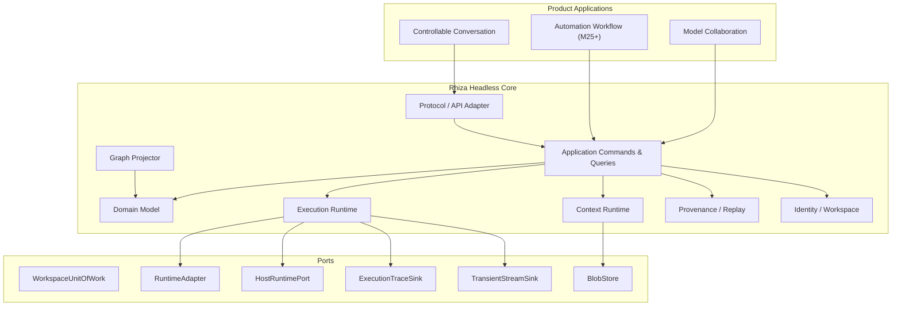

# Rhiza 技术架构设计书

```text
Version: V4.2
Release Date: 2026-08-29
Baseline: Rhiza Architecture & Roadmap Baseline V4.2
Status: Active baseline; M01–M06 accepted, M07 next
Supersedes: V4.1
```

> 本文与《Rhiza 开发路线图 V4.2》共同构成 V4.2 基线。
> V4.2 是对 V4.1 的最小修订：不改变已经验证有效的 Workspace / Application / Domain / Journal / ExecutionRun / ContextManifest / Projection / RuntimeAdapter 等核心设计；只修正产品层次、开发顺序，以及少数为远期 Workflow 过早预支的实现义务。
> M01–M06 已有实现与接受证据；V4.2 不要求重新开发。下一开发里程碑是 M07。M04–M06 的可选真实 PostgreSQL 验证在未配置 `DATABASE_URL` 的证据环境中明确记录为 skipped，不视为通过。

---

# 1. 系统定位与产品层次

## 1.1 系统定位

Rhiza 是一个以 **Workspace 为顶层边界** 的 Human–AI 工作系统。Rhiza 的核心价值是**组织智能**：组织、协调、监控和调整外部模型、Agent、工具与上下文，而不是把专业工作能力不断内生为一个“超级 Agent”。

Rhiza 的产品由两个一级系统构成，但 **不并行开发**：

```text
Rhiza Workspace
      │
      ├── 可控上下文对话系统
      │     Conversation / Branch / Graph / Context
      │     Model Collaboration / Synthesis / Convergence
      │
      └── 可编排自动化工作流
            Plan / Dispatch / Execute
            Evaluate / Iterate / Consult
            Full Auto（用户授权后）
```

开发顺序固定为：

```text
Shared Kernel 收敛
    ↓
Chat / Graph / Context 达到可长期日用
    ↓
Chat 差异化能力与共享基础设施
    ↓
Automation Workflow
    ↓
长期优化：Adaptive Routing / Memory / Plugin / Control Plane
```

因此，“两个一级系统”是产品架构关系，不代表研发资源双线并行。V4.2 明确执行 **Chat first, Workflow second**。

## 1.2 V4.2 的上位设计原则

### P-01 质量优先

Rhiza 默认以交付高完成度、技术上可靠且长期合理的结果为第一目标，帮助专业/非专业用户都能做出专业产品；资源效率用于实现这一目标，而不是取代这一目标。

### P-02 组织智能，不替代专业执行者

Rhiza 负责编排、监控、调整、评估与收敛；实际专业工作由外部模型、Agent、Harness、工具或人类完成。

### P-03 功能收敛，结构灵活

功能上不预支未来，结构上不封死未来。未经真实需求或实验验证的机制不得提前实现为平台；若可以以极低成本保留 seam，则允许保留，但不得显著增加当前复杂度、维护成本或性能开销。

### P-04 模型具有能力差异，也具有认知差异

不同模型不仅是可替换的算力资源，还可能因训练数据、训练目标、对齐方式与设计取向形成不同视角、推理路径与表达倾向。可控上下文对话系统应允许结论被检查、补充、反驳、修正与收敛。

### P-05 Workflow 主动承担质量责任

自动化工作流不应只把选项或失败重新抛给用户。它应尽可能自行完成专业判断、推荐、检查、迭代和收敛；只有真正涉及目标变化、价值取舍、重大不可逆风险或无法自行消解的冲突时才升级给用户。

---

# 2. 架构不变量

V4.1 的 12 条 Architecture Invariants 保持不变。

### I-01 Workspace 是所有权根

所有长期 Domain Object 必须拥有 `workspace_id`。Conversation 不得成为 Task、Artifact、Resource 或 Execution 的所有者根。跨 Workspace 引用必须显式声明。

### I-02 最小 Identity 与成员关系

每个 Workspace 归属于至少一个 User。Command 携带 `ActorRef` 与 `ScopeRef`。近期只实现 ownership / membership / Workspace boundary，不提前建设完整 IAM/RBAC/ABAC。

### I-03 Current State + Append-only Domain Journal

Transactional State 是当前业务状态；Domain Journal 是不可变语义历史；可声明为 Projection 的数据必须可由 Journal + versioned snapshot 重建。**不做全量 Event Sourcing，不做 CQRS 平台。**

### I-04 Domain Event / Execution Trace / Transient Stream 三分

```text
Domain Event       低频业务事实
Execution Trace    高频执行细节
Transient Stream   实时有界帧
```

token/stdout/file-read 等高频记录不得进入 Domain Journal。

### I-05 历史默认不物理删除；Purge 是唯一硬删除路径

普通删除使用 archive/tombstone/retracted/removed 语义；不可逆 Purge 走显式流程。

### I-06 Graph 是 Projection

Graph Node/Edge 不是 Domain Truth；布局与可视化状态不承载业务唯一事实。

### I-07 ContextManifest 不可变

历史 Context 必须可精确解释；更正通过新 Manifest + supersedes，不覆盖旧 Manifest。

### I-08 Resource identity 内容寻址、与位置解耦

逻辑 identity 由 ResourceVersion + content digest 承载。

### I-09 Portable Identity

逻辑 identity 不依赖文件路径、数据库 row id、自增值或 OS 特定格式。

### I-10 Core 必须 Headless

Domain/Application 不直接依赖 React、Express、Node fs、桌面壳、PTY、具体模型 SDK。

### I-11 外部 Effect 不参与本地数据库事务

Provider/Agent/CLI 调用通过 ExecutionRun 表达，位于本地事务之间。

### I-12 长期 Contract 必须版本化

Event、Command、Run、Manifest、ResourceVersion、Projection、Bundle 与 Host Protocol 必须版本化。

---

# 3. 分层与模块边界

## 3.1 总体结构



关键边界：

- Chat / Model Collaboration / Workflow 都是 **Application-level composition**，不得演变为新的 Kernel。
- `Planner`、`Reviewer`、`Tester`、`Executor` 首先是工作流角色，不是固定 Agent class。
- Workflow 可以调用多模型讨论、独立 review 等能力，但对话系统的多模型协作与 Workflow 的质量保障在产品语义上仍然独立。
- Shared Kernel 只提供事实、执行、上下文、图、追溯和适配能力。

## 3.2 模块目录

V4.1 已有分区继续有效：

```text
server/domain/
server/application/
server/contracts/
server/identity/
server/execution-runtime/
server/context-runtime/
server/graph-projection/
server/provenance/
server/portable-bundle/
server/host-protocol/
server/infrastructure/
server/runtime-adapters/
server/host-node/
server/http/
src/
```

V4.2 只新增 Application-level 逻辑目录建议，不要求 M04 立即创建：

```text
server/application/conversation-collaboration/   # Product Step 1
server/application/workflow/                     # M25+
```

不得为了这两个目录修改 Domain 依赖方向。

---

# 4. Workspace、Identity 与 M03 状态

## 4.1 M03 结论

M03 已完成以下目标：

- users / workspaces / memberships；
- ActorRef / ScopeRef；
- scoped API；
- Legacy default workspace backfill；
- Workspace create / rename / archive / restore / switch；
- cross-workspace negative tests；
- recovery / idempotency evidence。

V4.2 **不重新开发 M01–M03**。

V4.2 对 M03 的唯一要求是：

1. 正常合并当前开发分支；
2. 复跑 M03 evidence；
3. 若 V4.2 后续 contract 新增字段，不得倒逼 M03 schema 重构；通过 additive migration 实现。

## 4.2 Scope

近期 Scope 仍保持：

```text
user | workspace | conversation | run
```

完整 Policy Engine、Delegated Authority System、动态权限学习均不进入当前架构。

---

# 5. Object Model

## 5.1 Core Domain Truth

继续保留：

```text
Workspace / User / Membership
Conversation / Message / MessageRevision
Segment / Anchor / Relation
Resource / ResourceVersion
ExecutionRun
ContextManifest
ProvenanceLink
```

Graph Node/Edge、搜索索引、Context Candidate Index、UI read model 属于 Projection。

## 5.2 Additive object seam

Artifact、Knowledge、Decision、Goal、Task、WorkflowDefinition、WorkflowRun 等仍通过新增 object/relation/event type 接入。

V4.2 的限制是：

> seam 可以存在，但在相应 Milestone 到来前，不得为了证明未来对象可接入而实现专用 runtime、专用权限模型或大量未来字段。

Task/Workflow 的真实实现压力应在 M20/M25 反向验证 Kernel，而不是在 M04–M11 提前模拟完整未来。

---

# 6. Domain Journal 与事实层

V4.1 的 State + Journal + CommandReceipt 模型保持不变。

M05 仍负责：

- Event Envelope；
- per-workspace sequence；
- CommandReceipt；
- State + Event + Receipt 同事务；
- append-only DB protection；
- legacy baseline/backfill；
- shadow write / semantic reconciliation；
- transactional embedded backend。

不因 Workflow 提前引入 `workflow.*` Event Catalog。Workflow event namespace 到 M25 再冻结。

---

# 7. Execution Runtime

## 7.1 ExecutionRun 的定位

`ExecutionRun` 是“一次外部执行”的持久身份。它服务于 Chat，也服务于未来 Workflow，但 M06 首先只为当前 Chat 的真实需求落地。

M06 必须实现：

```text
run identity
model/provider endpoint identity
immutable input envelope
created / dispatching / running / terminal lifecycle
server-side cancel
retry/regenerate lineage
error taxonomy
trace / transient stream separation
telemetry summary
crash reconciliation
```

## 7.2 V4.2 延后项

以下 V4.1 中主要为 Workflow/Multi-Agent 提前预留的行为，不再属于 M06 Blocking Acceptance：

```text
Assignment / RunGroup 调度行为
pause / resume 行为
Multi-Agent handoff
完整 side-effect fencing 实现
根据历史表现动态扩大/收紧自治权限
```

允许 contract 中保留不产生运行时复杂度的 nullable metadata seam；若 seam 本身导致 migration、状态机或测试复杂度，则直接延后到 M24–M26。

### side_effects=false

LLM provider Chat Run 不要求完整外部副作用 fencing。

### side_effects=true

外部 CLI / Agent Harness 的 lease / fencing / approval / effect provenance 在 M24 真实接入时实现并验证。

---

# 8. Resource、Blob 与 HostRuntimePort

## 8.1 M04 保留部分

Resource / ResourceVersion / digest / content-addressed Blob / atomic promote / attachment backfill 全部保留。

这些能力直接服务当前 Chat 的附件、Context 和长期数据可靠性。

## 8.2 M04 收敛 HostRuntimePort

V4.1 将 file/path/secret/spawn/cross-platform capability 一次性放入 M04。V4.2 改为：

M04 只实现当前 Chat 必需的 Host 能力：

```text
file access
path normalization
blob storage bridge
secret/credential access seam
current Node/headless adapter
```

以下延后：

```text
spawn / PTY / process supervision      → M24
Windows/macOS/Linux 真正 host matrix   → M29
DesktopHostAdapter                     → M29
```

可以保留 capability descriptor 的通用形状，但不得为了未实现 capability 建四套 fake 行为和完整恢复语义。

---

# 9. Graph Projection

Graph-as-Projection 保持不变。

M07 的主要目标仍然是：

- domain/layout 分离；
- ObjectRef-based relation；
- incremental projector；
- bounded neighborhood query；
- clean rebuild；
- archive/tombstone/retract/remove 语义；
- large graph performance。

V4.2 不再要求 M07 通过 Task/Artifact/Multi-Agent fixture 来“证明全部未来”。泛化 ObjectRef 本身就是低成本 seam；未来对象到 M19/M20 再用真实功能验证。

---

# 10. Context Runtime

V4.1 的 Contributor → CandidateIndex → Planner → Compiler → ContextManifest 分层保持不变。

```text
Workspace / Branch / User Input
        ↓
Contributors
        ↓
Candidate Index
        ↓
Planner
        ↓
Compiler
        ↓
Immutable ContextManifest
        ↓
ExecutionRun
```

M08 继续聚焦：

- 主路径消除 full Workspace scan；
- Manifest v1；
- ResourceVersion/digest；
- versioned planner/compiler/index；
- historical resolution；
- explanation UI；
- Auto / Assisted / Strict 的可验证语义基础。

Context Intelligence v2 仍在 M22，不在 M08 提前实现 embedding / memory。

---

# 11. 可控上下文对话系统

## 11.1 Chat 是第一产品主线

M12–M17 的目标不是“继续堆聊天功能”，而是让 Rhiza 首先成为可长期日用的主力 Chat Workspace。

完成标准仍由 Daily Replacement Matrix 决定。

## 11.2 Model Collaboration v1

多模型讨论正式进入 Conversation Application，但不进入 Kernel。

底层只需要三个通用动作：

```text
invoke(models, shared_context)
exchange(outputs, rounds?)
synthesize(outputs)
```

产品层可以组合出：

```text
Independent Review
Peer Review
Debate
Second Opinion
Expert Panel
```

V4.2 不建立：

```text
PeerReviewEngine
DebateEngine
ArgumentGraph
Debate State Machine
```

### 独立性

同一轮独立评审默认共享同一个 immutable Context base，但各模型第一轮不得看到其他模型输出，避免早期锚定。

### 交换

需要互评/辩论时，后续轮次显式引用前轮输出。

### 收敛

Synthesis 模型必须输出：

- 推荐结论；
- 主要替代方案；
- 关键分歧；
- 各方案优缺点与适用条件；
- 推荐理由；
- 尚未消解的风险。

### 资源控制

用户可以：

- 选择模型；
- 限制轮数；
- 设定 Token/时间预算；
- 随时停止；
- 选择是否让模型互看输出。

### 数据模型

Model Collaboration v1 复用：

```text
ExecutionRun
ContextManifest
Message / MessageRevision
Provenance
```

可以使用轻量 `collaboration_ref` 进行 UI 分组，但不得创建新的 Kernel execution hierarchy。

---

# 12. Replay、Provenance 与 Portable Bundle

V4.1 保持不变：

- output → input / manifest / run / model / endpoint 可追；
- Replay 区分 Exact / Partial / Current-model / Missing-resource；
- Bundle import/export staging；
- secret / path / zip-slip / symlink / zip bomb 等安全边界；
- logical identity 与物理位置分离。

这部分同时服务 Chat 和未来 Workflow，因此不延后。

---

# 13. Automation Workflow

## 13.1 产品定位

Workflow 是 Rhiza 的第二一级产品系统，但只有在 M17 Chat Product Complete 后进入实施主线。

Rhiza 负责：

```text
Plan
Dispatch
Execute
Evaluate
Iterate
Consult
```

实际工作由外部模型 / Agent / Harness / Tool / Human 完成。

## 13.2 Workflow v1 最小闭环

M25 的首要目标是形成：

```text
Goal
 ↓
Plan
 ↓
Dispatch
 ↓
Execute
 ↓
Evaluate
 ↓
通过？ ── Yes → Deliver
   │
   No
   ↓
Revise / Replan
   ↓
Execute
```

`Consult` 是执行过程中的旁路：

```text
Executor
  ↓ critical ambiguity
Consult(model/role)
  ↓
answer
  ↓
resume execution
```

第一版不建立通用 Supervisor Runtime。

## 13.3 Review 是必需，Continuous Supervision 不是

每个需要质量判断的节点都可以有 Evaluate / Review。

基础基线是：

```text
Task → Execute → Evaluate → Pass / Revise
```

只有真实数据证明“大量问题在执行中已经明显偏离、等最终 Review 才发现造成高返工”之后，才研究持续监督或 Execution Digest 优化。

## 13.4 Workflow completion 语义

```text
All steps executed != Work completed
```

只有满足 acceptance / quality criteria 才能进入 completed / delivered。

## 13.5 BLOCKED 语义

`BLOCKED` 不再等价于“必须等待用户”。

Full Auto / Assisted 模式下按以下顺序处理：

```text
retry
re-contextualize
consult
replan
reassign executor
↓
仍无法自行消解
↓
user escalation
```

只有目标变化、价值取舍、重大不可逆风险或真正不可消解冲突必须交给用户。

## 13.6 Full Auto

Full Auto 属于 Workflow Application Policy，不属于 Kernel 权限系统。

用户给定：

```text
Goal
constraints
resource budget / quality strategy
```

Rhiza 负责自主推进计划、执行、评估和迭代。

V4.2 明确不引入：

```text
Delegated Authority System
Authority State Machine
Natural Language Policy Compiler
Semantic Effect Inspector
Three Lines Runtime
```

如果未来简单 Workflow 机制无法满足质量目标，再由实测失败证明新增机制的必要性。

---

# 14. External Executor / Agent Harness

M24 将 V4.1 的“外部 CLI / Coding Agent”改为通用 **External Executor / Agent Harness v1**。

Coding Agent 可以是首个 PoC，但架构不得绑定 coding。

ExecutorProfile 继续表达：

```text
llm-provider
cli
agent
human (seam)
```

对于 `side_effects=true` executor，M24 才正式实现：

- controlled spawn；
- approval；
- scoped input；
- effect provenance；
- lease / fencing；
- crash reconciliation；
- disable fallback。

不同 Harness 控制能力不同，RuntimeAdapter 可以声明 capability；Rhiza 不承诺对所有 CLI 提供同等级实时控制。

---

# 15. Multi-Agent Orchestration

M26 在 Workflow v1 成立后增加多 Executor 调度：

- independent assignments；
- parallel execution；
- retry / reassign；
- pause/resume（若真实 Harness 支持）；
- handoff；
- human takeover；
- trajectory。

Multi-Agent 是 Workflow 的执行能力，不是独立 AI hierarchy。

同一个模型可以在不同节点担任不同角色；不同模型也可以因认知差异参与 Plan/Evaluate 等开放任务。

---

# 16. Full Auto 与质量闭环

M27 专门验证“Rhiza 主动承担质量责任”是否真正可用，而不是提前建设复杂治理平台。

最小机制：

```text
acceptance criteria
objective tests / benchmark
independent review where needed
replan / revise loop
consult
user escalation boundary
```

需要研究但不预设答案的问题：

- 什么时候结果不够好？
- 什么时候需要更强模型或额外 review？
- 什么时候继续迭代收益已很低？
- 什么时候必须问用户？
- 怎样把专业判断留给系统，同时不隐藏关键取舍？

M27 的任何新增控制机制都必须由真实 Workflow failure case 证明。

---

# 17. Adaptive Routing

Adaptive Routing 继续作为独立优化问题，不作为 Workflow 成立的前提。

M23 只做：

- Run observability；
- ModelSpec × ProviderEndpoint telemetry；
- Endpoint profile；
- 手动推荐 / fallback；
- immutable RoutingDecision。

M28 才允许 Adaptive Routing v2 / Personal Capability Model。

Static role mapping 始终可用：

```text
architecture → model A
implementation → model B
review → model C
```

质量优先，不以“最低成本模型总是获胜”为优化目标。

---

# 18. Architecture Convergence 与验收

## 18.1 M11 的定义修正

V4.1 的 M11 同时试图证明 Task、Agent、Extension、Adaptive Router、Multi-Agent、Workflow 等大量远期能力不会破坏 Kernel。V4.2 认为这违反“功能上不预支未来”。

M11 改为：

> **Chat-era Architecture Convergence v1**

它只需要证明 M01–M10 对当前 Chat / Graph / Context / Run / Data Ownership 的架构目标成立。

Blocking 范围保留：

- state/journal consistency；
- ExecutionRun durability；
- trace flood separation；
- Graph rebuild/bounded query；
- Context lookup/Manifest；
- Bundle round trip；
- Host current adapter contract；
- performance budget；
- dogfood/evidence audit。

以下远期兼容性仅作为 Observational Spike，不阻断 M11：

```text
Task object additive seam
External side-effect executor
WorkflowDefinition / WorkflowRun additive seam
```

以下不再在 M11 提前验证：

```text
Extension sandbox/platform
Multi-Agent RunGroup/handoff
Adaptive capability learning
Full Auto authority evolution
```

## 18.2 Kernel 稳定性分阶段

M11 通过代表：

```text
Chat-era Kernel v1 stable
```

不代表所有未来 Workflow contract 已被证明永远无需改变。

M25 Workflow v1 完成后必须再做一次 **Workflow Compatibility Review**：

- 优先 additive extension；
- 若真实 Workflow 证明现有 contract 不足，可以走 ADR + major schema；
- 不为了维护“V4.1 曾经承诺未来无需改 Kernel”而引入更复杂旁路。

---

# 19. 长期能力兼容性

| 能力 | V4.2 承载方式 | 时机 |
| --- | --- | --- |
| Model Collaboration | Conversation Application over Run/Manifest/Provenance | M16 |
| Artifact/Knowledge/Decision | additive object/relation/event + Graph/Context | M19 |
| Task / Complex Task | additive object + TaskPlan + relation | M20 |
| Context Intelligence | contributor/index/planner/compiler evolution | M22 |
| External Executor | RuntimeAdapter + HostRuntimePort | M24 |
| Workflow | Application-level consumer of Task/Execution | M25 |
| Multi-Agent | Workflow execution layer | M26 |
| Full Auto Quality Loop | Workflow application policy | M27 |
| Adaptive Routing v2 | telemetry reader + own projection | M28 |
| Desktop / Multi-host | Host Adapter | M29 |
| Memory | Contributor + object family | M30 |
| Plugin Ecosystem | extension contracts after real first-party consumers | M31 |
| Control Plane | application/projection composition | M32 |

---

# 20. ADR 与变更纪律

V4.1 的 ADR policy 保持不变。

V4.2 新增两条执行纪律：

1. **Completed Milestone Protection**：M01–M03 已完成。后续架构修订不得默认要求重做；只有出现明确 correctness/security regression，或新需求无法通过 additive migration 满足时，才允许开修复 issue。
2. **Complexity Earned by Failure**：任何新的 runtime、state machine、policy engine、智能控制器，都必须能够指出“哪一个更简单层已经通过真实数据证明不足”。

V4.2 的推荐开发原则：

> 先把 Chat 做到可长期使用；对 Chat 直接有价值的能力可以前移；只服务 Workflow 的能力在 Chat Product Complete 之后串行进入；Workflow 先做最小闭环，再逐步增加 Multi-Agent 与 Full Auto。
