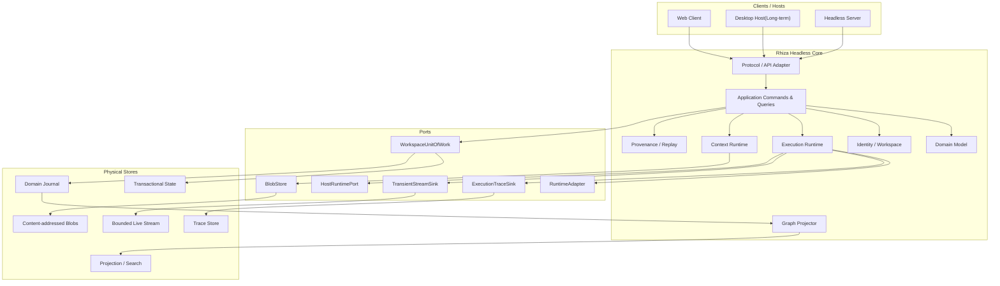
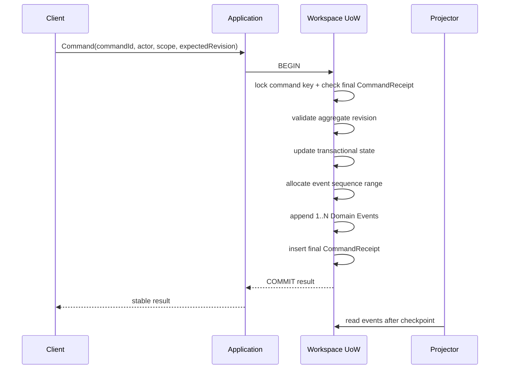
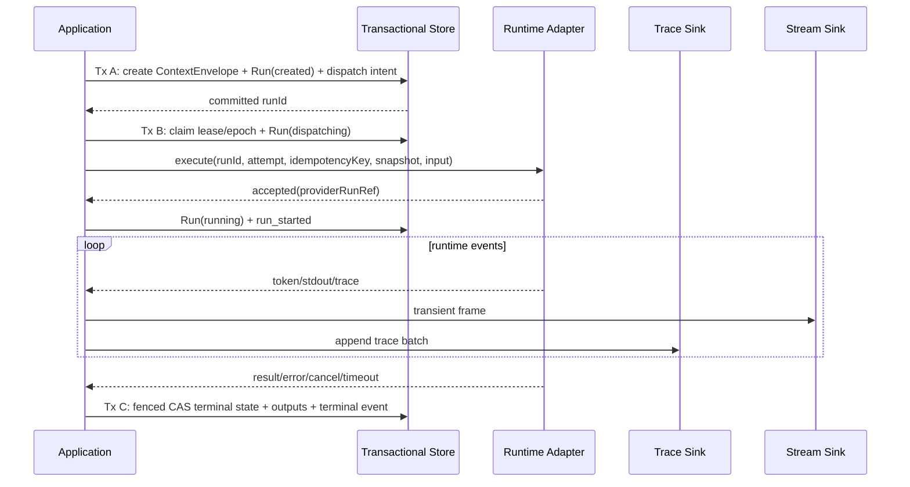

# Rhiza 技术架构设计书

```text
Version: V4.0
Release Date: 2026-08-22
Baseline: Rhiza Architecture & Roadmap Baseline V4.0
Status: Active
```

> 本文档与《Rhiza 开发路线图 V4.0》共同构成唯一生效的 **Rhiza Architecture & Roadmap Baseline V4.0**,是后续架构决策、开发、Code Review、AI Coding Agent、测试与里程碑验收的统一依据。
> 本文回答"系统是什么、为什么这样设计";路线图回答"如何从当前代码逐步实现该架构"。
> 两份文档使用完全一致的术语、对象模型、模块边界、Contract、架构状态与 Milestone 编号(`M01+`)。

---

# 1. 系统定位与文档治理

## 1.1 系统定位

Rhiza 是一个以 **Workspace 为顶层边界** 的 Human–AI 工作系统。它的技术定位按时间分层,长期目标不得被描述为当前实现:

| 阶段 | 定位 | 状态 |
| --- | --- | --- |
| 当前 | 单机、单用户、可独立构建运行的 AI Chat Workspace Web MVP:节点化对话 + Conversation Graph + 显式 Context + 不可变 Manifest + 多 Provider 流式调用 | **已实现**(见 §1.4) |
| Architecture Convergence(Stage 1) | 具备可追溯、可重建、可迁移历史的 **Workspace Kernel**:Domain Journal、ExecutionRun、Graph Projection、Context Runtime、Multi-Workspace 与最小 Identity | 本基线的施工目标 |
| Product Step 1(Stage 2 / Step 1) | 可长期日常使用的 AI Chat Workspace,能替代 Cherry Studio、LibreChat 等通用聊天工具承担主要 Chat 工作流 | 规划 |
| Product Step 2(Stage 2 / Step 2) | 具备 Rhiza 差异化能力的 AI Workspace:Universal Work Graph、Context Intelligence、Execution Observability、基础 Adaptive Routing | 规划 |
| Long-term(Stage 2 / Step 3) | Complex Human–AI Work Runtime,并演进为个人 AI 工作的 Control Plane、Observability Plane 与 Personal AI Infrastructure | 长期方向,仅预留 seam |

## 1.2 文档体系

| 文档 | 地位 |
| --- | --- |
| 本文 | 正式技术架构设计,唯一架构权威 |
| `Rhiza_开发路线图_V4.0_20260822.md` | 正式施工路线,唯一里程碑权威 |
| `docs/architecture.md` | **Current Implementation Snapshot**:仅描述已部署实现,不承载目标设计,不与本文形成双重权威 |
| `docs/项目现状.md` | 以代码为准的现状梳理,新开发者入门必读 |
| `docs/adr/` | 高成本、难逆转决策的 ADR(政策见 §20) |
| `docs/architecture-gates/` | 机器可读验收证据(G0 证据体系保留复用,见 §18) |
| `docs/M0–M6_ACCEPTANCE.md` | Legacy 验收,**Historical Evidence Only**,不定义当前 Milestone |
| `docs/archive/` | 被本基线替代的历史文档,保留不删除 |

## 1.3 架构状态的时间维度

本文所有核心模块都标注以下五种状态之一,区分"已经实现 / 近期必须实现 / 后续实现 / 仅预留 seam":

```text
Current          已在 main 分支代码中实现并可运行
Convergence      Stage 1(Architecture Convergence, M01–M11)必须落地
Product Step 1   Stage 2 / Step 1(M12–M17)落地
Product Step 2   Stage 2 / Step 2(M18–M25)落地
Long-term        Stage 2 / Step 3(M26+)方向,当前只预留 Contract seam
```

事实优先级:`当前 main 分支代码与自动化证据 > 项目现状 > 本基线的目标设计`。本文将目标设计与当前事实分开陈述,任何"Current"标注均以代码核查为准。

## 1.4 当前实现快照(2026-08-22,以代码为准)

- 运行形态:React 19 + Vite 前端(`src/`),Express 5 单进程 API(`server/`),无 `/api/v1`、无认证;单 pnpm 包,非 monorepo。
- 存储:默认 `var/data/workspace.json` 全量读写;`postgresPersistence=true` 时切换 PostgreSQL(3 个 migration,自研迁移器);两种后端都是"读全量快照 → 变异 → 差量 upsert + `deleteMissing` 物理删除"。
- 领域:单 Workspace 单例(`DEFAULT_PROJECT_ID`),无 user/workspace 表;DiscussionNode/Edge/Message/Segment/Anchor/ContextManifest/Attachment/AuditEvent。
- 执行:`AIRuntime.generate` → `ProviderRuntime` → OpenAI-compatible SSE;`RUN_END` 后原子提交 Message + Manifest,`RUN_ERROR` 零持久化;**无持久化 ExecutionRun**,失败/取消/超时不留历史。
- Context:`planContext()` 同步全量扫描 Workspace;Manifest 结构化冻结但无 ResourceVersion/digest/compiler version,且 PG 层可被 upsert 改写。
- Graph:自研 SVG,节点表即真相源,`DELETE /api/graph/nodes/:id` 级联物理删除消息与 Manifest。
- 工程:CI 单 job(lint/typecheck/unit/e2e/licenses/`verify:g0`/build);G0 characterization + evidence 体系已建立;架构边界仅有正则级测试守护。

上述与目标架构的差距即路线图 Stage 1 的施工对象。

---

# 2. 架构不变量(Architecture Invariants)

以下 12 条是长期稳定约束。任何实现若需违反,必须先提交 ADR 并更新对应 Milestone 的 Blocking Acceptance,不能以临时兼容代码绕过。

### I-01 Workspace 是所有权根

所有长期 Domain Object 必须拥有 `workspace_id`。Conversation 不得成为 Task、Artifact、Resource 或 Execution 的所有者根。跨 Workspace 引用必须显式声明,不得隐式共享事实。

### I-02 最小 Identity 与成员关系

每个 Workspace 归属于至少一个 User(经 membership)。所有 Command 必须携带 `ActorRef` 与 `ScopeRef`。Phase 内只校验 ownership/membership 与 Workspace 边界,不提前建设完整 IAM/RBAC/ABAC(权限 seam 见 §4.5)。

### I-03 Current State + Append-only Domain Journal

- Transactional State 是 Command 校验与当前业务状态的高效来源;
- Domain Journal 是不可变的语义历史;
- 声明为 Projection 的数据必须能从 Journal + versioned snapshot 重建;
- 缓存、布局、全文索引和临时 UI 状态不要求事件化;
- State、Journal 与 Command Receipt 必须在同一数据库事务内提交;
- **不做全量 Event Sourcing,不做 CQRS 平台**。

### I-04 Domain Event / Execution Trace / Transient Stream 三分

```text
Domain Event       = 业务事实,低频,可靠,事务一致,长期保留
Execution Trace    = 执行细节,高频,可批量,可分级保留
Transient Stream   = 实时帧,有界缓冲,可合并,可丢弃
```

任何 token chunk、stdout chunk、file-read trace 都不得进入 `workspace_events`。三者物理路径与 retention 分离。

### I-05 历史默认不物理删除;Purge 是唯一硬删除路径

普通删除语义统一为 `archive / tombstone / relation.retracted / projection.removed`。真正的硬删除只能由显式、不可逆、带权限的 Purge Workflow 执行:Purge 生成最小化审计事实、枚举受影响引用,把无法保留的 Provenance 标为 `redacted` 或 `purged`,不能静默断链。可删除正文、Secret、PII 不得直接进入永久 Journal payload,只能以 `blob_ref + digest` 引用;敏感 Blob 使用 workspace/resource data key 加密,Purge 删除 Blob 并销毁 key。已导出到用户控制范围之外的 Bundle 无法召回,Purge UI 与导出协议必须明确提示。

### I-06 Graph 是 Projection

删除 UI Graph Node 只能移除 Projection 或布局,不得删除 Domain Object。Graph 可从 Journal + snapshot 完整重建;布局、坐标、颜色不是业务真相。

### I-07 Context Manifest 不可变

Manifest 创建后,普通 Application role 禁止 UPDATE/DELETE。更正只能创建新 Manifest 并以 `supersedes_ref` 关联。特权 Purge 可 crypto-shred 其正文 Blob 并保留无正文 tombstone,不得级联删除 identity 与引用关系。历史 Replay 不得重新运行当前 Planner 推测旧上下文。

### I-08 Resource identity 内容寻址、与位置解耦

Resource 的逻辑身份由 `ResourceVersion + content digest` 承载。绝对路径、URL、Git remote 等只能作为 `origin_metadata` 位置提示,不参与 identity。

### I-09 Portable Identity

任何逻辑身份不得包含文件路径、数据库 row id、自增值或 OS 特定分隔符。Workspace 内全部对象、事件、关系与 Provenance 必须可在数据库、机器与操作系统之间逻辑迁移(§14 Portable Bundle)。

### I-10 Core 必须 Headless

Domain/Application 不得 import React、Express、Electron、Tauri、PTY、`child_process`、OS credential API 或具体模型 SDK。OS 能力只经由 `HostRuntimePort` 注入(§13)。

### I-11 外部 Effect 不参与本地数据库事务

Provider/Agent/CLI 调用位于两个本地事务之间,通过 ExecutionRun 状态机表达,不做跨系统分布式事务(§7.5)。

### I-12 长期 Contract 必须版本化

Event、Command、Run、Manifest、ResourceVersion、Graph Projection、Bundle 与 Host Protocol 都必须有 schema/contract version。破坏性变化产生新 major schema;历史数据始终按其历史 schema 解析。

---

# 3. 分层与模块边界

## 3.1 总体架构



## 3.2 模块划分

Phase 内以 **目录分区 + TypeScript project references + ESLint boundary rule** 实现,不拆独立发布包(发布包等 Extension SDK 有真实外部消费者再做):

```text
server/domain/            # Entity、Value Object、Domain Rule、Port types(纯类型与纯函数)
server/application/       # Commands、Queries、UoW 编排、错误 taxonomy
server/contracts/         # Event/Command/API JSON Schema 与 wire types
server/identity/          # User、Workspace、membership、Scope 校验
server/execution-runtime/ # ExecutionRun 状态机、trace/stream routing
server/context-runtime/   # Contributor、CandidateIndex、Planner、Compiler、Manifest
server/graph-projection/  # Universal graph reducers 与 query contracts
server/provenance/        # Replay、revision、provenance query
server/portable-bundle/   # workspace.rhiza export/import
server/host-protocol/     # HostRuntimePort 与 capability descriptor
server/infrastructure/
  postgres/               # PostgreSQL adapters(UoW、repositories、projectors)
  embedded/               # 具真实事务的 embedded adapter(PGlite 候选)
server/runtime-adapters/  # OpenAI-compatible / LibreChat / 未来 CLI adapters
server/host-node/         # Node server host adapter
server/http/              # Express composition root 与路由 facade
src/                      # React Web Client
```

## 3.3 依赖方向与禁止依赖

```text
Web / Server Host / Desktop Host
              ↓
         Application
              ↓
            Domain

Infrastructure ──implements──> Domain/Application Ports
Runtime Adapter ─implements──> Execution Runtime Port
Host Adapter    ─implements──> Host Runtime Port
```

禁止依赖:

```text
Domain → Application
Domain → React / Express / Node fs / pg / 具体模型 SDK
Application → Web / Express / 具体数据库驱动
Web → 数据库或 server 内部模块(仅经 contracts 与 HTTP API)
Runtime Adapter → UI state / Domain 直写
Graph Projection → 同步 Domain write
HTTP 路由 → 直接调用存储(必须经 Application Command/Query)
```

## 3.4 边界自动约束

架构边界必须由工具而非纪律维持:

- ESLint `no-restricted-imports` 分区规则(如 `server/domain/**` 禁 import express/pg/node:fs;`src/**` 禁 import `server/**` 除 contracts);
- TypeScript project references 按目录分区;
- CI dependency test:故意提交违规 import 必须红灯;
- lint 规则:路由 handler 中不得出现存储直调。

## 3.5 架构状态

| 项 | Current | 目标 |
| --- | --- | --- |
| 分层 | 业务逻辑内联在 Express 路由(`server/app.ts`),无 Application 层 | Convergence(M02) |
| 模块目录 | `server/` 平铺 + `src/` | Convergence(M02 起逐步分区) |
| 边界守护 | 仅正则级 `architecture.test.ts` | Convergence(M01 ESLint 规则) |
| Domain 类型独立 | `server/domain.ts` 纯类型,已被测试守护 | Current,保留并拆分 |
| Headless Core | 上传写盘、文件路径、密钥直接耦合 OS | Convergence(M04 Host Port) |

---

# 4. Workspace 与 Identity

Multi-Workspace 与最小用户 Identity 属于**近期基础架构**(Convergence),不是长期选配:单 Workspace 单例是当前实现最大的结构性欠账之一,且是共享部署、Closed Beta 与一切 Scope 语义的前提。

## 4.1 User(最小身份)

```text
users
  user_id          uuid
  display_name     text
  created_at       timestamptz
```

- 本地单机部署在首次启动时 bootstrap 一个确定性的 local user;
- 不实现密码、OAuth、会话管理;HTTP 层预留 actor 解析中间件作为认证 seam;
- 共享部署(若 Beta 需要)的认证形态由独立 ADR 决定,不在本基线预设。

## 4.2 Workspace

```text
workspaces
  workspace_id     uuid
  name             text
  status           active | archived
  created_by       uuid (user_id)
  settings         jsonb
  created_at       timestamptz
  updated_at       timestamptz

workspace_members
  workspace_id     uuid
  user_id          uuid
  role             owner | member      -- member 为未来协作 seam,Phase 内仅 owner
  created_at       timestamptz
  UNIQUE(workspace_id, user_id)
```

生命周期:`create → active ⇄ archived → purge(显式 Workflow,遵循 I-05)`。

## 4.3 Object Ownership

- 所有 Domain Object、Event、Manifest、Run、Resource、Projection 行都携带 `workspace_id`(I-01);
- Workspace 经 membership 归属 User(I-02);
- Legacy 单例数据 backfill 到 default workspace,`DEFAULT_PROJECT_ID` 保留为该 workspace 的 id,不重发 ID。

## 4.4 Workspace Switch

- API 以 `/api/v1/workspaces/:workspaceId/...` 为 scope 前缀;
- 客户端持有 current workspace id,切换即重新加载该 Workspace 的查询模型;
- 不同 Workspace 的数据互不可见,由 Application 层的 Scope 校验保证,并有 characterization 测试守护。

## 4.5 Scope 与权限 seam

Phase 内只实现最小 Scope:

```text
user | workspace | conversation | run
```

Command 必须携带 `ActorRef` 与 `ScopeRef`,但只执行 ownership/membership 与 Workspace 边界校验。Scope 是未来 Permission Policy、Extension 沙箱与 Agent 授权的 seam;完整 Policy Engine 属于 Long-term(§19),不提前建设。

## 4.6 架构状态

| 项 | 状态 |
| --- | --- |
| 单 Workspace 单例、无身份 | Current(待整改) |
| users / workspaces / membership / switch / backfill | Convergence(M03) |
| Multi-Workspace 管理 UI 完备 | Product Step 1(M13) |
| member 角色、共享部署认证 | 按 Beta 前 ADR 决定 |
| 完整权限引擎、多用户协作 | Long-term,仅 Scope seam |

---

# 5. Object Model 与引用体系

## 5.1 Domain Truth 与 Projection 的区别

- **Domain Truth**:Workspace、User、Conversation、Message、Resource、ResourceVersion、ExecutionRun、ContextManifest、Relation、Revision——由 Transactional State + Domain Journal 承载,受 I-03/I-05 保护;
- **Projection**:Graph 节点/边视图、布局、搜索索引、Context 候选索引、UI read model——可删除、可重建,不承载唯一真相(I-06)。

Domain Object 与 Graph Node **不等价**:前者是事实,后者是该事实在某个视图中的投影。

## 5.2 核心 Domain Object

| 对象 | 说明 | 状态 |
| --- | --- | --- |
| Workspace | 顶层边界与所有权根 | Convergence(M03;Current 为单例 project) |
| User | 最小身份 | Convergence(M03) |
| Conversation | 讨论单元(即 Legacy `DiscussionNode`,含 main/branch),Conversation 家族的第一个 object family | Current(待收敛命名与投影分离) |
| Message / MessageRevision | 消息与版本(edit-resend/regenerate 产生 revision,已有 versionGroupId/version/operation 字段) | Current(Revision 语义收敛于 M05/M12) |
| Segment | Conversation 内片段,Context 候选源 | Current |
| Anchor | 划线/消息来源锚点,支线的出发点 | Current |
| Relation | 对象间语义关系(§11.2 catalog),Domain 事实 | Convergence(M07;Current 为 `DiscussionEdge`) |
| Resource / ResourceVersion | 可版本化外部输入(文件等),内容寻址 | Convergence(M04;Current 为 Attachment + FileChunk) |
| ExecutionRun | 一次外部执行的持久身份 | Convergence(M06;Current 不存在) |
| ContextManifest | 一次执行输入的不可变证据 | Current(结构已冻结;v1 升级于 M08) |
| ProvenanceLink | 输出到输入/Run/Manifest/模型的追溯关系 | Convergence(M09) |
| Graph Projection | Conversation/对象的图视图 | Convergence(M07;Current 为真相源,待投影化) |

## 5.3 长期对象 seam(不提前实现)

Artifact、Task、Knowledge、Decision、Goal、Workstream、Assignment、Handoff 等长期对象通过**新增 object type / relation type / event type** 接入,不修改 Kernel 语义。Event Catalog 预留 `artifact.registered`(§6.5);Graph、Context、Provenance 的 contract 均以 `ObjectRef` 为单位,天然承载新对象族。判定标准见 §19。

## 5.4 引用类型

```ts
type ObjectRef = {
  workspaceId: string;
  objectType: string;
  objectId: string;
  versionId?: string;
};

type ActorRef = {
  actorType: 'human' | 'system' | 'executor' | 'extension';
  actorId: string;
};

type ScopeRef = {
  scopeType: 'user' | 'workspace' | 'conversation' | 'run';
  scopeId: string;
};

type ExternalRef = {
  ownerType: string;
  ownerId: string;
  namespace: string;
  externalType: string;
  externalId: string;
};
```

ID 原则:

- 保留现有 Rhiza 生成的 UUID,不为"整齐"重发主键;
- 新对象使用 application-generated UUID(v7 可作实现优化,语义保持 opaque);
- 外部系统 ID 只进入 `ExternalRef`;
- 数据库自增值只用于局部排序或内部索引,不作为 portable identity(I-09)。

## 5.5 Object Registry

所有可进入 Graph、Context、Provenance 或未来 Extension 的对象注册到:

```text
workspace_objects
  object_id
  workspace_id
  object_type
  revision
  lifecycle_status        active | archived | tombstoned
  created_by_actor_ref
  scope_ref
  created_at
  updated_at
```

类型特有内容继续存放在 Conversation、Message、Resource 等专用表。Registry 提供统一引用与生命周期,不把所有对象压入巨型 JSON 表。

## 5.6 Legacy 对象映射

| Legacy(代码现状) | 目标对象 | 处理 |
| --- | --- | --- |
| `WorkspaceData` 聚合 | Workspace + 各专用表 | M03/M05 拆分,聚合仅作 legacy importer 输入 |
| `DiscussionNode`(含 x/y 坐标) | Conversation(坐标迁出到 `graph_layout_nodes`) | M07 |
| `DiscussionEdge`(derived-from/references/related-to/merged-into) | Relation(catalog 映射由 ADR 定名) | M07 |
| `StoredMessage` 版本字段 | MessageRevision 语义 | 保留字段,M05 事件化 |
| `StoredAttachment` + `FileChunk` | Resource/ResourceVersion + 派生 materialization | M04 |
| `AuditEvent`(仅 `workspace.updated`) | Domain Journal(替代),Audit 另行保留管理操作 | M05 |
| `ContextItem`(Active/Recommended/Excluded) | Context selection state(§10) | 保留语义 |

---

# 6. Transactional State 与 Domain Journal

## 6.1 Event Envelope

事件信封采用 CloudEvents 1.0 核心语义,增加 Workspace 顺序、Command 幂等与因果字段:

```text
workspace_events
  event_id                 uuid
  workspace_id             uuid
  sequence                 bigint
  ce_specversion           text        # fixed to CloudEvents 1.0 on wire
  rhiza_envelope_version   text
  event_type               text
  event_source             text
  subject                  text
  data_schema              text
  aggregate_type           text
  aggregate_id             uuid
  aggregate_revision       bigint
  actor_ref                jsonb
  scope_ref                jsonb
  command_id               uuid
  event_index              integer
  causation_id             uuid?
  correlation_id           uuid?
  payload                  jsonb
  occurred_at              timestamptz
  recorded_at              timestamptz

PRIMARY KEY(event_id)
UNIQUE(workspace_id, sequence)
UNIQUE(workspace_id, command_id, event_index)
NOT NULL(event_type, event_source, data_schema, payload)
```

`event_source + event_id` 全局唯一。wire `type` 使用 `dev.rhiza.<event_type>.v<major>`。

## 6.2 Workspace Sequence

使用 `workspace_event_heads(workspace_id, current_sequence)` 在事务中按本次事件数量原子预留 sequence range,不依赖 PostgreSQL sequence 的无间隙特性。同一 Workspace 的 Domain Command 在 event head 上短暂串行化;Trace 不走该锁,token/stdout 数量不放大业务写竞争。

## 6.3 Command Receipt 与幂等

```text
command_receipts
  workspace_id
  command_id
  command_type
  status                   committed | rejected
  result_ref               jsonb?
  committed_sequence_from  bigint?
  committed_sequence_to    bigint?
  created_at
  completed_at

UNIQUE(workspace_id, command_id)
```

相同 `command_id` 重试:已 committed 返回原结果;已 rejected 返回稳定错误;不得重复追加 Domain Event。实现上先取 `(workspace_id, command_id)` 事务级 advisory lock 再查 Receipt;Receipt 在 State/Event 写入的同一事务内插入,不存在跨事务的永久 pending 状态。

## 6.4 Append-only 保护

- Application role 对 journal 只有 `SELECT/INSERT` 权限;
- 对 `UPDATE/DELETE/TRUNCATE` 建触发器或权限防护并在测试中验证;
- Event schema migration 只新增兼容字段或新 event type/schema,不原地改写历史 payload;
- Audit Log 与 Domain Journal 分开:Audit 记录管理操作与安全访问,不替代业务事实。

## 6.5 Event Catalog v1

```text
workspace.created
workspace.archived
workspace.restored

conversation.created
message.created
message.revision_created
branch.created

relation.created
relation.retracted
object.archived
object.restored
object.tombstoned

resource.registered
resource.version_created
resource.location_changed

context.selection_changed
context.manifest_created

execution.run_created
execution.dispatch_started
execution.run_started
execution.cancel_requested
execution.run_completed
execution.run_failed
execution.run_cancelled
execution.run_timed_out
execution.run_interrupted
execution.run_paused        # 预留:pause/resume 契约位,Phase 内不发射
execution.run_resumed       # 预留:同上

artifact.registered         # 预留:长期对象族 seam
```

Event type 使用稳定小写命名。破坏性 schema 变化产生新 major `data_schema`;新增可选字段保持 event type 不变。

## 6.6 普通 Command 事务



Projection 不进入 Command 主事务。

## 6.7 Versioned Snapshot Contract(观测级)

Snapshot 只用于加速重放,不替代 Domain Event:

```text
WorkspaceSnapshot
  snapshot_id
  workspace_id
  source_sequence
  state_schema
  state_digest
  blob_ref
  created_at
```

重建固定为 `load latest compatible snapshot → verify digest/schema/source_sequence → replay events(sequence > source_sequence) → compare checksums`。在 Phase 内事件量级(千级/workspace)下重放成本可忽略,Snapshot 加速机制列为**观测级**能力:`source_sequence` 语义与 contract 保留,加速实现不阻塞 Convergence。Legacy backfill 先生成带 fixture digest 的 baseline snapshot,再追加显式 backfill events。

## 6.8 架构状态

| 项 | 状态 |
| --- | --- |
| `AuditEvent`(仅 `workspace.updated`)、`event_ordinal` 局部序号 | Current(不构成 Journal) |
| Event Envelope、sequence、Receipt、append-only 保护、shadow dual-write、backfill | Convergence(M05) |
| Snapshot 加速 | 观测级,按需实现 |
| Upcaster / 长期 schema 演进工具 | Long-term |

---

# 7. Execution Runtime

## 7.1 核心模型

```text
ModelSpec
  model_spec_id
  declared_model_id
  contract_version
  capabilities
  metadata

ProviderEndpoint
  provider_endpoint_id
  provider_type
  endpoint_identity
  config_version
  credential_ref
  metadata

ExecutorProfile
  executor_id
  executor_type            llm-provider | cli | agent | human(seam)
  side_effects             boolean     -- 声明该 executor 是否产生外部副作用
  capability_descriptor
  host_requirements

ExecutionRun
  run_id
  workspace_id
  executor_ref
  assignment_ref?          -- Multi-Agent seam
  run_group_ref?           -- Multi-Agent seam
  parent_run_ref?          -- retry/regenerate 谱系
  model_spec_ref?
  provider_endpoint_ref?
  routing_decision_ref?    -- Adaptive Routing seam
  context_manifest_ref
  runtime_snapshot_ref
  input_refs
  output_refs
  status
  dispatch_attempt
  dispatch_idempotency_key
  provider_run_ref?
  lease_owner?
  lease_epoch
  lease_expires_at?
  heartbeat_at?
  created_at
  started_at?
  finished_at?
  error_code?
  telemetry_summary        -- TTFT、总时延、token、error class 等
```

`ModelSpec × ProviderEndpoint` 是实际执行路径的身份单位:同名模型在不同 Endpoint 的表现必须可区分,这是未来 Adaptive Routing 的数据地基。ProviderEndpoint identity 直接从现有 provider/model UUID 目录 backfill,不重发 ID。

## 7.2 状态机

```text
created → dispatching → running → completed
  │          │            ├──────→ failed
  │          │            ├──────→ timed_out
  │          │            ├──────→ interrupted
  │          │            └──────→ cancel_requested → cancelled
  └──────────┴────────────→ cancel_requested / interrupted

paused(预留)  running ⇄ paused,经 execution.run_paused / execution.run_resumed
```

- 终态不可回退;Retry 与 Regenerate 创建新 Run,经 `parent_run_ref` 关联;
- `cancel_requested` 不是终态,只有 Adapter 确认取消、自然结束或超时策略完成后才进入终态;
- **pause/resume 是正式协议语义的契约位**:状态枚举与两个 event type 现在预留,Phase 内不实现任何 pause 行为;pause 究竟是 Run 级还是未来 Assignment 级语义,由 M06 绑定的 ADR 最终裁决。此预留避免未来触碰"终态不可回退"与 Event Catalog 兼容规则。

## 7.3 Durable Dispatch、Lease 与 Fencing(按副作用分级)

完整 Lease/Fencing 机制**只对声明 `side_effects=true` 的 executor 强制**(外部 Agent、CLI、Tool、有副作用的 Provider);纯 LLM chat 路径(`side_effects=false`)允许简化恢复:重试即新 Run,不要求 fencing 全套竞态覆盖。

对 `side_effects=true` 的执行:

1. 创建 `Run(status=created)` 与不可变执行规格;
2. Dispatcher 以 CAS 抢占 lease,递增 `lease_epoch` 与 `dispatch_attempt`,转 `dispatching`;
3. 每个 attempt 生成稳定 `dispatch_idempotency_key`,Adapter 支持时透传 Provider;
4. Provider 接受后保存 `provider_run_ref`,转 `running`;
5. Heartbeat 续租;只有当前 `lease_owner + lease_epoch` 能提交 trace cursor、output 或终态;
6. 旧 epoch 迟到回调只能作为 stale trace 保存,不得覆盖新 attempt 或终态。

崩溃恢复:

- `created`:可安全派发;
- `dispatching` 且无 Provider 幂等/查询能力:不得自动重复副作用调用,转 `interrupted` 并要求 reconciliation;
- 有 `provider_run_ref`:先查询/接管外部 Run 再决定续跑或终结;
- 已发送 cancel 的 Run 保持 `cancel_requested`,迟到成功结果按 policy 记为 late result,不自动产生业务 Effect;
- Provider 不支持幂等时,UI/API 必须明示"重试可能重复执行/计费"。

Stop 可发生在 `created / dispatching / running`;Dispatcher 在 claim lease 前、发送外部请求前、收到 accepted 后三个边界重读 cancellation/fencing 状态,任何阶段的 Stop 都不得产生未授权后续 Effect。

## 7.4 ContextEnvelope v0 → ContextManifest v1

为拆掉 ExecutionRun 与完整 Context Planner 的循环依赖,定义两级 contract:

```text
ContextEnvelope v0
  immutable input/resource version refs
  content hashes
  created_at
  compiler_contract_version

ContextManifest v1 extends ContextEnvelope
  contributors / candidates / selected items
  reason / priority
  planner version / compiler version
  token estimates
  compiled payload digest
```

ExecutionRun 单向引用 `context_manifest_ref`;Manifest 不回写 `run_id`,反向关系经 Run 查询。M06 先支持 Envelope v0,M08 升级 Manifest v1。

## 7.5 三段式本地事务与外部执行(I-11)



进程在任一阶段崩溃时,Recovery Worker 按 status、attempt、lease epoch、heartbeat、Provider 幂等/查询能力执行 §7.3 恢复规则,不凭超时盲目重发。

## 7.6 RuntimeAdapter Contract

```ts
interface RuntimeAdapter {
  describe(): Promise<RuntimeCapabilityDescriptor>;
  execute(spec: ExecutionSpec): AsyncIterable<RuntimeNativeEvent>;
  reconcile?(providerRunRef: string): Promise<RuntimeReconciliation>;
  cancel(runId: string): Promise<void>;
}
```

Adapter 负责协议归一化,不拥有 Rhiza Domain:Provider-native request/response、capability discovery、token/reasoning/tool call 归一化、cancel/timeout 映射;不直接写 Message、Manifest、Graph 或 Workspace state。

**迁移保 contract 换实现**:现有 `AIRuntime` 事件契约(`RUN_START / CONTENT_DELTA / REASONING_DELTA / TOOL_CALL_DELTA / USAGE / RUN_END / RUN_ERROR`)与"只有 `RUN_END` 才原子提交、`RUN_ERROR` 零持久化"的语义是本 contract 的第一版实现,直接平移;`collectRuntimeResult` 的"无 `RUN_END` 即异常"映射为 Run `interrupted`。

## 7.7 Secrets 与 Runtime Snapshot

- `credential_ref` 只引用 SecretVault/Host credential port;
- Runtime snapshot 保存可重放的非秘密配置及其 digest;
- API Key、OAuth token、自定义 secret header 永不进入 Event、Manifest、Trace 或 Bundle;
- Provider response/trace 进入 TraceSink 前执行结构化 redaction。

## 7.8 架构状态

| 项 | 状态 |
| --- | --- |
| `AIRuntime`/`ProviderRuntime` 事件契约、RUN_END 原子提交 | Current(保留) |
| 持久化 ExecutionRun、终态历史、telemetry、服务端 stop | Convergence(M06) |
| pause/resume 行为、RunGroup 调度、Assignment | Long-term(仅契约位) |
| Adaptive Routing 评分引擎、RoutingDecision 生成 | Long-term(M06 起仅落 telemetry) |
| 外部 CLI/Agent adapter | Product Step 2(M24 最小接入) |

---

# 8. Execution Trace 与 Transient Stream

## 8.1 三种记录类型

```text
RunLifecycleDomainEvent    → Domain Journal
ExecutionTraceRecord       → Trace Store
TransientFrame             → Bounded Live Stream
```

禁止用一个含糊的 `ExecutionEvent` 同时表示三者(I-04)。

## 8.2 Trace Schema

```text
execution_traces
  trace_id
  run_id
  dispatch_attempt
  lease_epoch
  trace_sequence
  trace_type
  timestamp
  payload_or_blob_ref
  schema_version
  retention_class          debug-short | operational | provenance | security-audit
  stale_attempt

UNIQUE(run_id, lease_epoch, trace_sequence)
```

每个 attempt 独立维护 trace cursor;旧 lease 迟到 trace 置 `stale_attempt=true`,不参与当前 Run 进度、结果或默认 UI 时间线。Raw token 默认不是 provenance;最终模型输出、tool effect、artifact 与关键错误经 Domain/Provenance 模型保存。

## 8.3 Batch 与 Backpressure

`ExecutionTraceSink.appendBatch()` 支持 `maxQueueSize / maxBatchSize / flushIntervalMs / exportTimeoutMs / ForceFlush / Shutdown` 与自观测指标。默认值:

```text
maxQueueSize    = 2048 records
maxBatchSize    = 256 records
flushIntervalMs = 1000
exportTimeoutMs = 10000
```

队列满时:Domain Event 绝不丢失;provenance-class trace 同步降速或落 spill buffer;debug trace 可采样/丢弃并计 `queue_full`;不得阻塞 Run terminal transaction。

## 8.4 Transient Stream

Per-run bounded ring buffer(`maxFramesPerRun = 2048`);token/progress 可合并;慢订阅者只保证从可用窗口续读。最终结果以 ExecutionRun output 与 Message/Artifact 为准,不依赖 SSE 完整到达。

## 8.5 架构状态

Current:SSE 直通、无 Trace Store、无 Stream buffer。TraceSink/StreamSink 于 Convergence(M06)落地;外部 Trace 后端(ClickHouse/OTel collector)为 Long-term,超过百万级 trace/日再议。

---

# 9. Resource 与 Content-addressed Storage

## 9.1 Resource 模型

```text
Resource
  resource_id
  workspace_id
  resource_type
  current_version_id
  origin_metadata          -- 位置与来源提示,不参与 identity(I-08)
  created_at

ResourceVersion
  resource_version_id
  resource_id
  ordinal
  content_digest
  canonicalization_version
  blob_ref
  byte_size
  media_type
  metadata_digest
  created_at
```

## 9.2 Digest 与 Canonicalization

统一格式 `sha256:<64 lowercase hex>`。导入/读取顺序:验证 descriptor size → 计算 SHA-256 → 比较 digest → 校验 media type → 再解析/索引/反序列化。

- 原始二进制:对原始 bytes 计算 digest;
- 文本:默认 UTF-8 bytes,不自动改换行;规范化结果作为派生版本保存;
- JSON:需要稳定身份时使用明确版本的 canonical JSON,并记录 `canonicalization_version`;
- 提取文本、summary、chunk、embedding 都是派生 materialization,不替代原 ResourceVersion。

## 9.3 Blob 生命周期

```text
write temporary blob
→ calculate and verify digest/size
→ atomically promote to final content-addressed key
→ verify final blob exists
BEGIN
  insert immutable ResourceVersion
  move Resource.current_version_id
  append resource.version_created
COMMIT
```

Blob Store 不参与 PostgreSQL 事务;协议保证"先有 immutable verified blob,再提交数据库引用"。Content-addressed put/promotion 必须幂等。崩溃语义:Blob 完成而 DB 未提交产生 orphan,由 grace-period GC 清理;DB 已提交则 final digest key 必须存在;Blob 后续损坏/丢失时读路径报告 `BLOB_MISSING`,禁止回退到 current ResourceVersion。被 Manifest、Run、Artifact 或 Bundle pin 引用的版本不得因 current version 更新而删除。

## 9.4 架构状态

Current:附件为 `var/uploads/{uuid}` 平面文件 + `rhiza_attachments` 元数据,无 digest、无版本。Resource/ResourceVersion/Blob 协议于 Convergence(M04)落地;Artifact/Knowledge 等对象族复用同一协议(Product Step 2)。

---

# 10. Context Runtime

## 10.1 核心流水线

```text
Workspace/Branch/User Input
        ↓
Context Contributors
        ↓
Materialized Candidate Lookup
        ↓
Planner
        ↓
Compiler
        ↓
Immutable Context Manifest
        ↓
ExecutionRun
```

## 10.2 Ports

```ts
interface ContextContributor {
  readonly id: string;
  readonly version: string;
  contribute(input: ContributorInput): Promise<ContextCandidateRef[]>;
}

interface ContextCandidateIndex {
  query(input: CandidateQuery): Promise<ContextCandidate[]>;
}

interface ContextPlanner {
  readonly version: string;
  plan(input: PlannerInput): Promise<ContextPlan>;
}

interface ContextCompiler {
  readonly version: string;
  compile(plan: ContextPlan): Promise<CompiledContext>;
}
```

现有 planner 的确定性设计(feature-hash embedding、稳定 tie-break)是测试资产,拆分时保留为默认实现;真实 embedding 模型未来只是另一个 index version,不改架构。

## 10.3 Materialization 与 Cache Key

ResourceVersion 创建或变化时异步计算 token_count、content_digest、chunk descriptors、lexical index、embedding/index version、summary digest、graph neighborhood hints。

常规 Planner 请求只查询候选索引和受限 Graph neighborhood,**不得扫描完整 Workspace**。

Materialization cache 只由 `ResourceVersion/content_digest + materializer/index version` 决定;Planner/Compiler cache key 至少覆盖:

```text
input_revision
context_selection_revision
graph_projection_version + source_sequence/checkpoint
actor/scope_digest
contributor_versions
planner_version
compiler_version
candidate_index_version
model/tokenizer contract version
```

Scope、selection 或 Graph relation 变化必须使受影响计划失效,防止陈旧 Context 或跨 Scope 泄露。

## 10.4 ContextManifest v1

```text
ContextManifest
  manifest_id
  workspace_id
  schema_version
  mode                     auto | assisted | strict
  created_at
  supersedes_ref?
  contributor_versions
  planner_version
  compiler_version
  input_refs
  selected_items[]
    resource_version_ref
    content_digest
    reason
    priority
    selection_mode         explicit | auto
    token_count
    compiled_segment_digest
  excluded_refs[]
  token_budget
  estimated_tokens
  compiled_payload_ref
  compiled_payload_digest
```

Manifest 数据库表禁止 UPDATE/DELETE(I-07)。Manifest 保存的是**实际执行输入证据**:每个 selected item 必须关联真实 ResourceVersion 与 content digest;`compiled_payload_ref` 指向 content-addressed encrypted blob。

## 10.5 Explicit / Auto Context 模式语义

```text
Strict    只使用显式 Active Context
Auto      Planner 自动检索并直接纳入本次 Manifest
Assisted  Planner 产出 Recommended,经用户确认后才生效
```

- 显式(Pin/Active)项先占预算,超预算时不被静默丢弃;
- "当前推荐"不得回写为过去已执行的 Manifest;
- Assisted 的确认工作流是产品语义(Product Step 1,M15),Runtime 层从 Convergence 起即区分 explicit/auto 的 `selection_mode`。

## 10.6 Replay 分类

```text
Exact Replay          历史 Manifest + 历史 runtime snapshot + 相同 endpoint/model contract
Partial Replay        历史 Manifest 可解析,但 endpoint/runtime 不完全相同
Current-model Replay  历史 input/context,明确使用当前模型配置
Missing-resource      任何历史 ResourceVersion 缺失时必须失败或明确降级,不得静默使用 current version
```

Regenerate 默认创建新 Manifest;用户可显式选择 Replay 旧 Manifest。历史 Replay 不重新运行当前 Planner(I-07)。

## 10.7 架构状态

| 项 | 状态 |
| --- | --- |
| 同步全量扫描 `planContext()`、Manifest 无 digest/version | Current(待整改;300 节点实测 ~3ms,是架构问题而非性能问题,不提前优化) |
| Contributor/Index/Planner/Compiler 分层、Manifest v1、immutable 保护、historical resolution | Convergence(M08) |
| Assisted 确认流、Context 解释 UI 完整化 | Product Step 1(M15) |
| Context Planner v2 / Context Intelligence / Context Graph | Product Step 2(M22),经新增 contributor 类型接入 |
| 长期记忆 / Memory 注入 | Long-term,仅 contributor seam |

---

# 11. Universal Work Graph

## 11.1 Graph 不拥有 Domain Object

```text
GraphNode
  graph_node_id
  graph_id
  workspace_id
  object_ref
  object_type
  projection_type
  projection_version
  metadata

GraphEdge
  edge_id
  graph_id
  workspace_id
  source_ref
  target_ref
  relation_type
  relation_version
  metadata
```

Domain Object 与 Graph Node 不等价;Graph 支持 Conversation、Resource,以及未来 Artifact、Task、Execution 等对象:新增对象族只新增 object/relation type,不修改 Graph Kernel(contract test 守护)。

## 11.2 Relation Catalog(Phase 1)

```text
contains
parent_of
branch_from
references
supersedes
derived_from
depends_on
produced_by
```

Legacy `derived-from / references / related-to / merged-into` 到本 catalog 的映射由 M07 绑定的 ADR 定名。关系撤销经 `relation.retracted` 更新 Projection,默认不物理删除 Domain relation fact。

## 11.3 Layout 分离

```text
graph_layouts
  layout_id
  graph_id
  view_type
  algorithm_version
  owner_scope

graph_layout_nodes
  layout_id
  graph_node_id
  x
  y
  collapsed
  style_metadata
```

布局、聚类、semantic zoom 不进入 Domain Object,不阻塞 Domain Command。`DiscussionNode.x/y` 迁出至 `graph_layout_nodes`。

## 11.4 Incremental Projector

```ts
interface ProjectionStore {
  applyBatch(events: WorkspaceEvent[], checkpoint: ProjectionCheckpoint): Promise<void>;
  getCheckpoint(projection: string, workspaceId: string): Promise<ProjectionCheckpoint>;
  reset(projection: string, workspaceId: string): Promise<void>;
}
```

Reducer 必须幂等;checkpoint 与 projection writes 同事务提交。重建流程:

```text
new projection namespace/version
→ replay journal + snapshots
→ checksum / semantic diff
→ atomic read-alias switch
→ retain old projection for rollback window
```

## 11.5 Query API

```text
GET /api/v1/workspaces/:id/graph/neighborhood
  ?objectRef=&depth=1..3&nodeLimit<=500&edgeLimit<=2000&cursor=
GET /api/v1/workspaces/:id/graph/path
GET /api/v1/workspaces/:id/graph/tree
GET /api/v1/workspaces/:id/graph/changes?afterCheckpoint=
```

禁止通过全量 Workspace 快照返回 10k/50k 级 Graph;旧 endpoint 仅作短期 compatibility facade,受 size limit 约束。前端必须同步改为按需取数,否则 API 白做。

## 11.6 架构状态

| 项 | 状态 |
| --- | --- |
| 节点表即真相、坐标在领域对象、删除级联物理删、全量加载 | Current(待整改;删除破坏历史于 M01 先行止血) |
| 投影化、layout 分离、incremental projector、neighborhood API、前端按需取数 | Convergence(M07) |
| Graph 搜索/过滤/性能/语义缩放产品化 | Product Step 1(M14) |
| 多 View(Task/Knowledge/Decision/Execution)、自动布局/聚类 | Product Step 2(M18/M20) |

---

# 12. Revision、Replay 与 Provenance

## 12.1 行为语义

```text
Edit & Resend = 新 MessageRevision + 新 Branch/Run
Regenerate    = 新 ExecutionRun + 新 Output
Branch        = 新 relation,不复制不可追踪历史
Fork          = Branch 的显式产品形态,同一语义
Replay        = 历史 input refs + 历史 Manifest + 指定 runtime policy
Archive       = 对普通 UI 隐藏,历史仍可解析
Tombstone     = 内容不可见,identity/provenance 占位保留
Supersedes    = 新版本对象经 supersedes 关系指向被替代版本
Purge         = 显式不可逆管理流程(I-05)
```

## 12.2 ProvenanceLink

```text
ProvenanceLink
  provenance_id
  workspace_id
  output_ref
  run_ref
  context_manifest_ref
  input_refs
  parent_revision_ref?
  branch_source_ref?
  model_spec_ref?
  provider_endpoint_ref?
  created_at
```

任一 AI 输出必须能查询到:input revision、branch source、context manifest、execution run、model spec、provider endpoint、runtime snapshot、output/artifact。

## 12.3 Broken Reference 与 Purged Provenance

- 历史 ResourceVersion/Blob 缺失时,Provenance 查询报告显式 broken reference,不回退 current version;
- 被 Purge 的内容以 `redacted/purged` marker 保留 identity 与关系占位;
- Bundle 导入缺失引用必须列出,不得静默成功。

## 12.4 Stable API

```text
GET  /api/v1/objects/:id/provenance
POST /api/v1/runs/:id/replay
GET  /api/v1/runs/:id
GET  /api/v1/manifests/:id
GET  /api/v1/resources/:id/versions/:versionId
```

## 12.5 架构状态

Current:消息版本字段与不可变 Manifest 已是 Provenance 的产品前提,但无 Replay API、无统一 Provenance 查询。ProvenanceLink、Replay 分类、tombstone/Purge policy 于 Convergence(M09)落地;Provenance/Replay UI 完整化于 Product Step 1(M15)。

---

# 13. Host Runtime Protocol

## 13.1 Capability Descriptor

```text
HostCapabilityDescriptor
  platform              windows | macos | linux | headless
  architecture
  filesystem
  process_spawn
  process_signal
  pty
  credential_store
  file_picker
  watcher
  network_policy
  protocol_version
```

Application 根据 capability 决定"能否执行",不根据 `process.platform` 分支。

## 13.2 Port

```ts
interface HostRuntimePort {
  capabilities(): Promise<HostCapabilityDescriptor>;
  spawn(spec: ProcessSpec): Promise<ProcessHandle>;
  signal(handle: ProcessHandle, signal: HostSignal): Promise<void>;
  openPty?(spec: PtySpec): Promise<PtyHandle>;
  pickResource?(spec: ResourcePickerSpec): Promise<HostLocation>;
  getCredential(ref: CredentialRef): Promise<SecretValue>;
}
```

## 13.3 Adapters 与跨平台策略

```text
FakeHostAdapter(Windows-like / macOS-like / Linux-like / Headless 四份 descriptor)
NodeServerHostAdapter
DesktopHostAdapter(Long-term)
BrowserLimitedHostAdapter(Long-term)
```

用四平台 Fake contract matrix(同一 Application 用例 4/4 通过)换取跨平台置信度,而不是真机矩阵。当前 OS 耦合点少而集中(上传写盘、store 文件路径、secret-vault 本机密钥),抽端口工作量可控;桌面壳(Tauri/Electron)在 Headless Core 成立后是纯增量(Product Step 2,M25)。

---

# 14. Portable Workspace Bundle

## 14.1 格式

产品级迁移格式为 `workspace.rhiza`:ZIP 容器 + OCI-like content descriptor graph。它是版本化**逻辑迁移格式**,不是数据库 dump,也不声称兼容 OCI Runtime。

```text
workspace.rhiza
  rhiza-layout.json
  index.json
  schemas/
  blobs/
    sha256/<digest>
```

根 manifest 声明 `mediaType: application/vnd.rhiza.workspace.manifest.v1+json`、`formatVersion`、descriptor 列表(`mediaType/digest/size/annotations`)。

## 14.2 v1 范围(压缩到最低可用逻辑迁移能力)

**Bundle v1 对象族收敛为 Conversation 家族**:

```text
workspace metadata + users/membership(最小)
conversation / message / revision
context envelopes 与 context manifests
execution runs 与 provenance links
resource / resource version 元数据与所需 blobs
graph relations / projection seed
model specs 与 portable provider endpoint descriptors
runtime snapshots
JSON Schemas
```

Trace segments、runtime snapshot 内嵌扩展、Import-as-Fork 均为后移选做项。**安全门槛不裁剪**(§14.4 全量保留)。

默认排除:API keys/OAuth tokens/credentials、host 绝对路径与未批准 location metadata、debug-short traces、ephemeral stream frames、数据库 row ids。Bundle 使用专门 Export DTO,默认递归剔除或 token 化 `origin_metadata` 与 annotations 中的绝对路径、用户名、内部 URL、Git remote、Host descriptor。

ProviderEndpoint descriptor 只保留 provider type、非秘密 endpoint identity/config digest 与 capability;`credential_ref` 清空并标记 `credential_required=true`。导入环境无法映射 Endpoint/Secret 时,Provenance 仍可解析,但 Exact Replay 必须降级为 Partial/Unavailable,不能伪装成功。

## 14.3 Import 流程

```text
validate format/schema/media type
→ verify every descriptor size/digest
→ import to staging Workspace namespace
→ resolve all Object/Resource/Manifest/Run refs
→ rebuild projections
→ compare counts/checksums
→ atomically activate Workspace
```

半导入状态不得暴露给 UI;声明为 external 且不可取得的 blob 必须列出缺失引用。

## 14.4 Archive 安全与配额

ZIP 在验证前是不可信输入。流式解压到隔离 staging,默认上限:

```text
maxArchiveBytes     = 2 GiB
maxExpandedBytes    = 10 GiB
maxCompressionRatio = 100
maxEntries          = 100,000
maxSingleEntryBytes = 2 GiB
```

拒绝:absolute path/drive prefix/`..`/NUL/规范化逃逸、symlink/hardlink/device entry、duplicate normalized path、未声明 entry、声明与实际 size 不符、任一配额超限、descriptor 不匹配。先解析有严格大小上限的 `index.json` 建立允许集,再单遍流式解压与 hash。任何失败删除或隔离 staging,不激活 Workspace。

## 14.5 Collision Policy

- 导入空 Store:保留全部 logical identity;
- 同 Workspace ID 且 checksum 相同:允许幂等导入;
- 同 ID 不同内容:v1 默认拒绝;
- Import-as-Fork 由后续独立 ADR 定义,不纳入 v1 round-trip。

## 14.6 架构状态

Current:无导入导出。Bundle v1 于 Convergence(M09)落地;导入导出 UI 与备份恢复产品化于 Product Step 1(M16);可移植性强化(桌面/多机)于 Product Step 2(M25)。

---

# 15. API、Protocol 与 Schema Versioning

## 15.1 JSON Schema

所有长期 JSON contract 使用 JSON Schema 2020-12,根级声明 `$schema` 与稳定 `$id`。必须建立 schema:Command Envelope、Workspace Event Envelope、每个 Event payload、ExecutionRun、Runtime Snapshot、ContextEnvelope v0、ContextManifest v1、ResourceVersion、Host Capability Descriptor、Bundle Manifest/Index。

## 15.2 Compatibility 规则

- 新增可选字段:minor-compatible;
- 字段删除、改类型、改语义:新 major schema;
- 历史 Replay 始终按历史 `data_schema` 解析;
- Upcaster 只生成读取投影,不改写历史 Event;
- Schema blob 与 digest 纳入 Bundle;
- CI 验证 `$schema`、`$id`、引用闭合与 fixture compatibility。

## 15.3 API Version

新 API 采用 `/api/v1/...`。旧 `/api/*` 作为 compatibility facade,内部调用同一 Application Command/Query,不得保留独立业务写逻辑;全量 Workspace 快照端点只允许在 compatibility 模式和受限小 Workspace 中使用。

## 15.4 Command Envelope

```ts
type CommandEnvelope<T> = {
  commandId: string;
  commandType: string;
  workspaceId: string;
  actor: ActorRef;
  scope: ScopeRef;
  expectedRevision?: number;
  correlationId?: string;
  payload: T;
};
```

所有写操作必须经 Application Command + WorkspaceUnitOfWork。

## 15.5 当前 API 迁移映射

| 当前 API | 新 Application 边界 |
| --- | --- |
| `/api/chat[/stream]` | `CreateConversationRun` + Run stream subscription |
| `/api/attachments` | `RegisterResource` + `CreateResourceVersion` |
| `/api/workspace/context*` | `ChangeContextSelection` |
| `/api/nodes` | `CreateBranch` / `CreateConversationObject` |
| `/api/graph/nodes` | `AddProjectionNode`(不创建 Domain Object) |
| `/api/graph/edges` | `CreateRelation` |
| `/api/graph/nodes/:id DELETE` | `RemoveProjectionNode` 或显式 `ArchiveObject` |
| `/api/nodes/:id/position` | `UpdateGraphLayout` |
| `/api/nodes/:id/merge` | `CreateMergeRevision` + `CreateRelation` |
| (新增) | `CreateWorkspace` / `SwitchWorkspace` / `ArchiveWorkspace` |

`prepareChatRun/commitChatRun` 已是事实上的 command handler,直接提为 `CreateConversationRun` 第一版,不重写;版本推导逻辑(versionGroupId/version 计算)迁入 domain 纯函数并补性质测试。

## 15.6 Query Model

```text
WorkspaceSummaryQuery
ConversationTimelineQuery(cursor, limit)
GraphNeighborhoodQuery(objectRef, depth, limits)
ContextInspectorQuery(runId | conversationId)
ExecutionRunQuery(runId)
ProvenanceQuery(objectRef)
ResourceVersionQuery(resourceId, versionId)
```

---

# 16. Storage 架构

## 16.1 PostgreSQL(单实例逻辑分区)

```text
transactional_*        current business state
workspace_events       append-only domain journal
projection_*           graph/context/search read models
projection_checkpoints
execution_runs         durable run state
execution_traces       batched/partitioned raw trace
resource_*             resource/version/blob descriptors
context_manifests      immutable evidence
command_receipts       idempotency
users / workspaces / workspace_members
```

Journal、Manifest、ResourceVersion、Run terminal history **禁止**复用当前 `deleteMissing` 与 mutable upsert 模式。Phase 内保持模块化单体 + 单 PostgreSQL 实例,不引入 Kafka、微服务、图数据库、专用 trace 后端或 CRDT。

## 16.2 Embedded Backend 与 JSON Store 降级

- 现有 JSON snapshot store 只保留为 legacy importer、fixture loader、export/debug 工具,不再作为生产持久化;
- 新 embedded backend 必须实现真实事务、unique constraint 与 crash recovery,PGlite 是首选候选(已是 devDependency),与 PostgreSQL adapter 共用同一套 StorePort contract tests;
- 不试图渐进优化现有全量 read-modify-write 存储:其比对/差量逻辑随 M05 整体废弃,提前优化是沉没成本。

## 16.3 Retention 与清理

- Projection 可删除并重建;
- Trace 按 retention class 分区和清理;Domain Journal 不随 Trace retention 清理;
- Blob GC 必须先证明没有 ResourceVersion、Manifest、Run、Artifact 或 Bundle pin 引用;
- Migration:expand/contract 模式,forward migration + backfill/reconcile + rollback window,每个 checkpoint 可注入故障并验证恢复(M10);
- Backup/Restore:以 Bundle 为逻辑备份格式,数据库物理备份为运维补充(Product Step 1,M16 演练)。

---

# 17. 安全、隐私与故障模型

## 17.1 安全边界

- Actor/Scope 在 Application 入口校验;
- Extension/Executor 只能接收 scoped task packet 和明确 Resource refs(Long-term seam);
- Trace ingestion 前执行 secret/PII redaction policy;
- Bundle Export DTO 默认不含 secrets、绝对路径和未批准 location metadata;
- 可删除正文只进入加密 Blob;永久 Journal payload 禁止包含正文、Secret 和 PII;
- Blob 导入先验 digest/size,再解析不可信内容;
- Host spawn/PTY 必须经 capability 与 approval policy;
- API Key 继续使用 AES-256-GCM SecretVault(Current,保留),密钥经 Host credential port 注入(Convergence)。

## 17.2 乐观并发

Domain aggregate 使用 `revision`;Command 可携带 `expectedRevision`;冲突返回可重试的 `REVISION_CONFLICT`,不做 last-write-wins 静默覆盖。

## 17.3 故障处理

| 故障 | 必须行为 |
| --- | --- |
| State 写成功、Event 写失败 | 同事务回滚 |
| Event 写成功、Receipt 失败 | 同事务回滚 |
| Runtime 调用前崩溃 | Run 保持 created/dispatching;按 durable dispatch 规则恢复 |
| Dispatch 前/后崩溃 | 按 status/attempt/provider ref reconciliation;无幂等保证时禁止盲目重发 |
| 旧 lease 迟到结果 | fencing epoch 拒绝业务提交,只保留 stale trace |
| Trace queue 满 | 丢弃/降采样 debug trace,Domain Event 不受影响 |
| SSE 断开 | Runtime 可继续或按 policy cancel;最终 Run 状态可查询 |
| Projection worker 崩溃 | 从 checkpoint 幂等恢复 |
| Bundle 导入中断 | staging namespace 不激活,可清理或续传 |
| Resource blob 缺失 | 显式 broken provenance,不回退 current version |
| Purge 敏感内容 | 删除 Blob/销毁 data key;保留无正文 tombstone;声明外部 Bundle 不可召回 |

---

# 18. 性能原则与验收体系

## 18.1 验收两级制(Gate 降维)

不再维护独立的大型 Gate 编号体系(G0–G8 废止为编号体系;G0 证据与工具保留复用)。所有验证分为两级,按 Milestone 归属,写入路线图各 Milestone:

**Blocking Acceptance(阻断级)**——不通过则不得宣布 Milestone 完成、不得进入依赖它的下一阶段:

- 数据完整性:half commit=0、missing semantic event=0、dangling ref=0、duplicate effect=0;
- 历史安全:历史被改写=0、已执行 Manifest 被修改=0、物理删除 Domain Object=0;
- Migration correctness:backfill checksum 一致、checkpoint 故障可恢复、rollback 可读;
- 事务与幂等:并发 sequence 唯一有序、command 重放零新增;
- 安全关键路径:secret/path 泄露=0、zip 攻击拒绝=100%、stale write accepted=0;
- 核心架构边界:dependency violation=0、legacy write(收口后)=0、Planner full scan=0;
- 核心产品流程:characterization 主路径无回归。

**Observability / Quality Metrics(观测级)**——持续记录、可红、默认不阻断合并;在收敛验收(M11)与产品验收(M17)集中提升为阻断:

- 性能趋势:command/query/Graph/Context p95/p99、相对基线回归;
- 错误率、资源占用、trace queue 深度;
- Context quality、UX 指标、回归趋势;
- 平台矩阵、大规模负载(10k objects/50k edges 等)阈值。

## 18.2 Evidence 体系

复用既有 `docs/architecture-gates/` 的 evidence manifest schema、fixture registry、CI attestation 与 canonical checksum 规则(G0 基建不重做)。每个 Milestone 的验收保存机器可读 evidence,至少含:

```text
milestone_id
architecture_version(V4.0)
commit
fixture_id + fixture_digest
command
environment_profile
severity(blocking | observational)
thresholds + observed_metrics
failure_injection_checkpoint + recovery_command
checksums
result + started_at/finished_at
known_exceptions + owner + expiry
```

"连续执行一致"定义:允许变化集仅含 timestamp、process/host ID 与声明的非确定性 telemetry 时,canonical artifact checksum 完全一致。例外必须有负责人、过期日期与 ADR/issue 链接;过期例外自动升级为阻断项。

## 18.3 性能测试方法

- 固定 Profile:commit、runtime 版本、数据库版本、CPU/memory/OS、store adapter、fixture version+digest、warm-up 次数、样本数、并发、测量窗口;CI 用固定 runner class,本机结果只作辅助;
- 统计规则:warm-up ≥20 次;样本 ≥200 次(Trace/Graph load test 除外);报告 p50/p95/p99/max;同时报绝对阈值与相对基线回归;失败/timeout/drop 计入结果;
- 关键绝对阈值(在对应 Milestone 标注阻断/观测级):主 Command(不含外部等待)p95 ≤ 200ms、p99 ≤ 500ms;Graph neighborhood(10k objects/50k edges、1-hop、limit 200)p95 ≤ 150ms、p99 ≤ 400ms;Context candidate lookup p95 ≤ 250ms;Trace flood(10k records/run)下 Domain Event ≤ 10/run、主路径 p95 回归 ≤ 25%;
- 主路径指标:application_command_latency、journal_append_latency、projection_lag、graph_neighborhood_latency、context_candidate_lookup_latency、run_state_transition_latency、trace_queue_depth/dropped/export_latency、stream_buffer_depth、bundle import/export throughput。

## 18.4 测试策略

- **Contract Tests**:StorePort(PostgreSQL 与 embedded 共测)、RuntimeAdapter(成功/流式/失败/取消/超时)、HostRuntimePort(四平台 fake matrix)、TraceSink(batch/backpressure/flush/shutdown)、Bundle(digest/schema/ref/round-trip)、Projection(idempotency/checkpoint/rebuild)、Schema compatibility;
- **Fault Injection**:事务每个写点、Run Tx A/Tx B 之间进程退出、Trace Store 慢/满/超时、Projection checkpoint 前后崩溃、Bundle 每阶段中断、Blob 缺失/损坏/digest 不匹配、Provider 重复/乱序/非法事件;
- **Characterization Tests**:create/open/switch workspace、chat/stream/stop/retry、edit & resend、regenerate、branch/temp branch/keep、archive/restore、merge、context select/pin/exclude、file import、graph navigate/layout、provider/model selection、offline/reconnect——持续覆盖,语义变化必须有意且登记。

---

# 19. 长期能力兼容性

以下长期能力**暂不提前实现**,但本架构必须证明可自然承载。健康演进的三个信号:新对象族只新增 object/relation/event type;新执行方式只新增 RuntimeAdapter;新智能层只读 Journal/Trace/Telemetry 并写自己的 Projection。任何演进若要求修改内核协议八件套(ObjectRef/Scope、Event Envelope+Catalog、ExecutionRun、ContextManifest、ResourceVersion/Blob、StorePort、RuntimeAdapter、HostRuntimePort)之一的语义,必须走 ADR + 新 major schema。

| 长期能力 | 承载机制 | 现在预留的 seam |
| --- | --- | --- |
| Universal Work Graph(全对象族) | 新增 object/relation type + Projection | ObjectRef 化的 GraphNode/Edge(M07) |
| Context Intelligence / Context Graph | 新增 Contributor 类型 + candidate index version | Contributor/Index/Planner/Compiler 分层(M08) |
| Artifact / Knowledge / Decision / Task | 新增对象族 + `artifact.registered` 等 event | Object Registry、Relation catalog、Event 命名空间 |
| External CLI / Coding Agent / Agent Harness | 新增 RuntimeAdapter + `side_effects=true` 执行路径 | ExecutorProfile、Lease/Fencing、HostRuntimePort |
| Multi-Agent Orchestration(Task Graph、依赖、并行、pause/resume、retry、reassign、human takeover、handoff、trajectory) | Assignment/RunGroup 调度器作为协议消费者 | Run 的 `assignment_ref/run_group_ref/parent_run_ref`、pause/resume 契约位、Scope |
| Adaptive Model Routing(RoutingDecision、ObservedCapabilityProfile、Route Fingerprint、Confidence、Personal Capability Model、Personal Pareto Frontier) | 只读 telemetry 的评分引擎 + `routing_decision_ref` | `ModelSpec × ProviderEndpoint` identity + per-run `telemetry_summary`(M06) |
| Capability / Plugin | Extension 作为 Contributor/Subscriber/Provider 接入 | Scope、namespaced storage、Event 订阅(内部扩展点 M25) |
| Memory / Workspace Knowledge | 新 Contributor + 新对象族 | Context cache key 的 scope 化 |
| Desktop / Headless Runtime | 新 Host Adapter | HostRuntimePort + capability descriptor(M04) |
| Control Plane / Observability Plane / Personal AI Infrastructure | Application Module + Projection 组合 | Journal/Trace/Telemetry 的完整证据链 |
| 跨 Workspace Mission | Mission 引用多 Workspace,不合并事实源 | I-01 显式跨 Workspace 引用规则 |

这些能力主要通过新增 Domain Object、Capability、Provider、Projection、Application Module 或 Adapter 实现,无需再次推翻 Kernel。启动条件见路线图 Stage 2 / Step 3。

---

# 20. ADR Policy

## 20.1 适用范围

ADR **只**用于:高成本或难逆转决策、跨模块协议、长期数据兼容、安全边界、核心技术选型。禁止将普通实现细节 ADR 化;ADR 是"可单独废止的决策单元",每份 1–2 页,直接引用本文章节作为规格,补"考虑过的替代方案"与"废止条件"。

## 20.2 首批 ADR(M01 交付,数量收敛为 4 份)

```text
ADR-001 模块依赖方向与边界执行方式        (§3)
ADR-002 Identity、Workspace 与 Scope      (§4、§5.4)
ADR-003 Resource Identity 与内容哈希      (§9)
ADR-004 Transactional State + Journal 事务模型 (§6)
```

## 20.3 按 Milestone just-in-time 交付

```text
ADR-005 Event Catalog 与 Schema 演进           → M05
ADR-006 ExecutionRun 生命周期、pause/resume 契约位、Fencing 适用范围 → M06
ADR-007 Graph Relation Taxonomy 与 Legacy 映射  → M07
ADR-008 Manifest 不可变性与 Context Cache Key   → M08
ADR-009 Purge Policy、Bundle 格式与 Export 安全 → M09
ADR-010 Expand/Contract Migration 与 Rollback   → M10
ADR-011 共享部署与 Beta 认证形态               → M17 前(如需要)
```

需要 ADR 的其他决策类别:identity namespace、sequence/事务模型变化、Trace retention、Kernel protocol versioning、Import-as-Fork。实现若需违反不变量(§2),必须先 ADR 并更新对应 Milestone 验收。

---

# 21. Architecture–Roadmap Mapping

本文与《Rhiza 开发路线图 V4.0》双向映射。路线图各 Milestone 的 `Architecture Coverage` 字段引用本文章节与不变量;下表为架构侧总览:

| 本文章节 | 实施 Milestone |
| --- | --- |
| §2 不变量 I-05/I-07(历史止血) | M01 |
| §3 分层与模块边界、§15.4–15.5 Application Command | M02 |
| §4 Workspace 与 Identity、I-01/I-02 | M03 |
| §9 Resource 与 Blob、§13 Host Runtime Protocol、I-08/I-09/I-10 | M04 |
| §6 State + Journal、I-03 | M05 |
| §7 Execution Runtime、§8 Trace/Stream、I-04/I-11 | M06 |
| §11 Universal Work Graph、I-06 | M07 |
| §10 Context Runtime、I-07 | M08 |
| §12 Revision/Replay/Provenance、§14 Bundle v1、I-05/I-09 | M09 |
| §16.3 Migration、Legacy 关闭 | M10 |
| §18 验收体系集中提升、§19 兼容性证明 | M11 |
| §7/§10/§11/§12 的产品化(Product Step 1) | M12–M17 |
| §19 各 seam 的 Product Step 2 落地 | M18–M25 |
| §19 Long-term 能力 | M26+(启动条件见路线图) |

一致性规则:两份文档的 Domain Object、Module、Contract、State Machine、Scope 命名完全一致;架构书所有 Convergence/Product Step 1 模块必须能在路线图找到实施 Milestone;路线图所有 Milestone 必须能在本文找到架构定义。发现冲突时,按路线图 §10 的治理流程在合并前解决。

---

*本设计书是 Rhiza Architecture & Roadmap Baseline V4.0 的架构权威。被替代的历史文档见 `docs/archive/`。*

