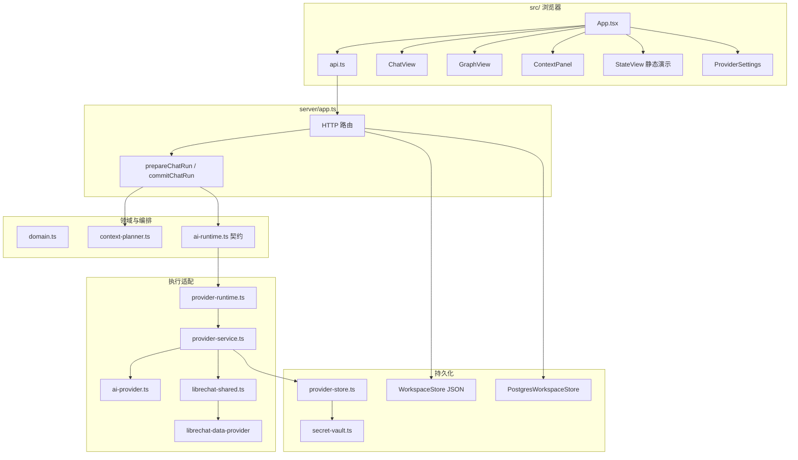

# 项目现状

> 梳理日期：2026-08-29
> 依据：当前仓库代码、`docs/` 验收记录与架构文档  
> 口径：以可运行代码为准；规划文档只用于对照缺口，不视为已交付  
> 状态枚举：**已完备** / **开发中** / **已预留** / **尚未实现** / **待确认**

---

## 0. 如何阅读本文

仓库同时存在两套「M0–M6」编号，不得混用：

| 口径 | 来源 | 含义 |
| --- | --- | --- |
| **Legacy M0–M6** | `docs/M*_ACCEPTANCE.md`、`docs/archive/Rhiza_Phase1_核心MVP与UI设计.md` | 已落地的 Web MVP：对话网络 + 显式 Context + 本地/可选 PG 持久化 |
| **Architecture Reset M0–M6** | `docs/0815Rhiza_三步走开发战略与架构重构规划_v2.3_高性能与跨平台优化.md`、`docs/0818Rhiza_技术架构设计书_v3.0_事件驱动工作图谱与可移植运行时.md` | 目标内核：Event Journal、Universal Work Graph、`ExecutionRun`、Portable Workspace 等 |

**当前仓库实际位置**：Legacy Phase 1 的工程门禁已串到 M6；产品验收未全部关闭。V4.1 主施工路径已完成 M01–M03：Application Command/Query 边界、最小 Identity 与 Multi-Workspace 已落地；M04+ 尚未开工，当前仍无 `workspace_events` 与持久化 Run。

部分旧文档与代码不一致，见 [§8](#8-文档与代码不一致项)。对无法从本仓库确认的远程分支、上游快照与人工测试证据，一律标为 **待确认**。

---

## 1. 现在已经具备什么

Rhiza 是一个可独立构建、运行的 **Web MVP**：单进程 Express API + React 工作台，把讨论组织为 **Discussion Node + Semantic Edge**，每次正式模型调用冻结一份不可变 **Context Manifest**，并通过 OpenAI-compatible Provider 做真实流式生成。

用户今天可以完成的闭环：

1. 配置多供应商、发现/收藏/置顶模型、加密保存 API Key。
2. 在节点内多轮对话（流式、停止、重试、重新生成、编辑重发、附件、Markdown/公式/Mermaid、Reasoning/Tool Call/Usage 展示）。
3. 从消息或划线文本开临时支线，显式「保留」后落成正式节点与 `derived-from` 边；支线可合并回主线。
4. 在 Graph 中缩放/平移/拖拽、搜索、创建/删除节点与关系，布局与 Chat 共用活动节点。
5. 用 Auto / Assisted / Strict 模式管理 Active / Recommended / Excluded Context；Pin / 排除 / 从 Node、Segment、File 加入来源；超预算时 Pin 不被静默丢弃。
6. 每次正式调用由本地确定性 Planner 生成上下文投影，诊断写入 Manifest；历史回答可展开当时的来源快照。
7. 在确定性 local user 下创建、切换、重命名、归档和恢复多个 Workspace；scoped API 与 Repository membership 校验保证 Workspace 间数据不可见、不可写。

默认存储以 `var/data/workspace.json` 为 default Workspace，并在同目录保存 Workspace directory 与 scoped Workspace 文件。显式打开 `postgresPersistence=true` 且提供 `DATABASE_URL` 后，工作区可切到包含 `users`、`workspaces`、`workspace_members` 的 PostgreSQL Repository。Provider 目录始终是加密 JSON，不随 PG 切换。

这套实现验证的是 **「复杂对话 → 可追溯 Context 工作空间」**，不是 Control Plane、也不是 Universal Work Graph。

---

## 2. 当前技术架构（以代码为准）

### 2.1 运行形态

| 层 | 实际实现 | 关键路径 |
| --- | --- | --- |
| Web 客户端 | React 19 + Vite，原生 CSS 令牌 | `src/App.tsx`、`src/components/*`、`app/static/css/` |
| HTTP 边界 | Express，无 `/api/v1`、无认证 | `server/app.ts` `createApp()` |
| 领域类型 | 单体 TypeScript 类型，非独立包 | `server/domain.ts`、`src/types.ts` |
| 应用编排 | 路由函数内直接 `store.update()` | `server/app.ts`（`prepareChatRun` / `commitChatRun`） |
| Context | 同步函数，全量扫描 Workspace | `server/context-planner.ts` `planContext()` |
| 执行 | 唯一生产路径 `ProviderRuntime` | `server/ai-runtime.ts` → `provider-runtime.ts` → `provider-service.ts` → `ai-provider.ts` |
| 存储 | `WorkspaceRepository` 双实现 | JSON：`server/store.ts`；PG：`server/postgres-store.ts` |
| 密钥 | AES-256-GCM 本机密钥 | `server/secret-vault.ts`、`var/data/.provider-key` |
| LibreChat | 仅 npm 包，不 vendored 运行时 | `server/librechat-shared.ts` + `librechat-data-provider@0.8.509` |

开发：`npm run dev` → 前端 `127.0.0.1:4173`，API `127.0.0.1:8787`。生产：`npm run build && npm start` 由同一 Node 进程托管 `dist/` 与 API。

### 2.2 实际分层（不是目标分层）

```text
Browser (React)
    │  src/api.ts  （HTTP + POST SSE）
    ▼
Express Product API  ──  server/app.ts
    │
    ├── WorkspaceRepository ── JSON 或 PostgreSQL snapshot
    ├── Context Planner     ── 同步、进程内、全量候选
    └── AIRuntime.generate  ── ProviderRuntime（硬编码）
            │
            ▼
      OpenAI-compatible /chat/completions SSE
            │
            ▼
      RuntimeEvent: RUN_START / CONTENT_DELTA / REASONING_DELTA
                    / TOOL_CALL_DELTA / USAGE / RUN_END / RUN_ERROR
            │
            ▼
      仅 RUN_END 之后原子写入 Message + Manifest
```

v3.0 设计中的 Headless Core、Application Commands、Domain Journal、Graph Projector、Trace Sink、Host Adapter **在代码中不存在**。当前 Express 路由同时承担 HTTP Adapter、应用服务与领域编排。

### 2.3 领域模型（已持久化）

定义于 `server/domain.ts`，PostgreSQL 对应 `db/migrations/0001_rhiza_core.*.sql`、`0002_chat_parity.*.sql`、`0003_domain_persistence.*.sql`。

| 对象 | 含义 | 持久化 |
| --- | --- | --- |
| `ActorRef` / `ScopeRef` | Application 请求的主体与作用域 | Command/Query envelope；HTTP 由 local actor 与 Workspace path 解析 |
| `WorkspaceRecord` / membership | Workspace 目录、状态、revision 与成员关系 | JSON directory；PG `workspaces` / `workspace_members` |
| `WorkspaceData` | 单个 Workspace 的领域聚合根 | scoped JSON 整文件；PG 拆表 + `rhiza_projects.state` jsonb |
| `DiscussionNode` | 用户可见讨论单元（main/branch） | `rhiza_nodes` |
| `DiscussionEdge` | `derived-from` / `references` / `related-to` / `merged-into` | `rhiza_edges` |
| `Anchor` | 划线/消息来源 | `rhiza_anchors` |
| `Segment` | 节点内片段，供 Planner / Context 使用 | `rhiza_segments` |
| `StoredMessage` | user/assistant；含版本、usage、reasoning、toolCalls | `rhiza_messages`（`event_ordinal`） |
| `ContextItem` | Active / Recommended / Excluded | JSON 顶层；PG 写入 `state` jsonb |
| `ContextManifest` | 一次调用的不可变快照 | `rhiza_context_manifests` |
| `StoredAttachment` / `FileChunk` | 附件元数据与分块索引 | 元数据入库存；二进制在 `var/uploads/{id}` |
| `AuditEvent` | 每次 `update` 追加 `workspace.updated` | JSON 数组或 `rhiza_audit_events` |

**不在领域模型中**（仅规划文档出现）：Goal、Task、TaskPlan、Workstream、Assignment、Knowledge、Decision、Artifact、ExecutionRun、Effect、ExecutorProfile、Handoff、Lease、通用 Identity/Scope Registry、Portable Bundle。当前仅实现 local user、Workspace membership 与引用 contract。

Provider 侧类型在 `server/provider-domain.ts`：`StoredProvider`、`ModelRecord`、加密密钥。与 Workspace **分开存储**。

### 2.4 HTTP API（全部已实现）

路由装配在 `server/http/app.ts`，兼容入口由 `server/app.ts` 暴露。前端客户端为 `src/api.ts`。标注「前端未接」表示 `src/api.ts` / UI 没有调用。

| 方法 | 路径 | 作用 |
| --- | --- | --- |
| GET | `/api/health` | Provider 状态 + feature flags 快照 |
| GET/POST | `/api/v1/workspaces` | 列出或创建 local actor 可访问的 Workspace |
| GET/PATCH | `/api/v1/workspaces/:workspaceId` | scoped 读取、重命名、归档或恢复 |
| POST | `/api/v1/workspaces/:workspaceId/switch` | 校验 membership 并切换 Workspace |
| ALL | `/api/v1/workspaces/:workspaceId/...` | 将领域请求按 path scope 路由到现有 Application handler |
| GET | `/api/workspace` | default Workspace 兼容快照 + Provider 目录 |
| PATCH | `/api/workspace/mode` | Auto / Assisted / Strict |
| PATCH | `/api/workspace/context/:id` | Pin / Active / Recommended / Excluded |
| POST | `/api/workspace/context` | 将 Node / Segment / File 加入 Context |
| GET/POST | `/api/providers` | 读取 / 新建供应商 |
| PUT | `/api/providers/:id` | 更新供应商 |
| POST | `/api/providers/:id/discover` | 同步 `/models` |
| PATCH | `/api/models/:id` | 收藏 / 置顶 |
| POST | `/api/models/:id/select` | 切换当前模型 |
| POST | `/api/attachments` | Base64 上传、文本/PDF 抽取、分块索引 |
| POST | `/api/chat/stream` | SSE 流式；断开连接即 Abort |
| POST | `/api/chat` | 非流式兼容入口（UI 主路径不用） |
| POST | `/api/nodes` | 正式支线 + Anchor + `derived-from` |
| POST | `/api/temp-chat` | 临时对话，**不写盘** |
| POST | `/api/nodes/:id/activate` | 切换活动节点 |
| PATCH | `/api/nodes/:id/status` | draft/active/resolved/stale/archived（**前端未接**） |
| POST | `/api/nodes/:id/segments` | 创建 Segment（**前端未接**） |
| PATCH | `/api/nodes/:id/position` | Graph 坐标 |
| POST | `/api/nodes/:id/merge` | 合并摘要 + `merged-into` |
| POST/DELETE | `/api/graph/nodes`、`/api/graph/nodes/:id` | 图谱节点 |
| POST/DELETE | `/api/graph/edges`、`/api/graph/edges/:id` | 语义边 |

不存在：Auth、`/api/chat/stop`（停止靠断开 SSE）、Project State CRUD、ExecutionRun、Replay、Workspace 导入导出、多 Project API。

### 2.5 功能开关

`server/feature-flags.ts`，环境变量 `RHIZA_FEATURE_FLAGS`。未知名或非法值启动失败。

| 开关 | 默认 | 代码行为 |
| --- | --- | --- |
| `postgresPersistence` | `false` | **已接线**：`server/index.ts` 选择 `PostgresWorkspaceStore` |
| `libreChatRuntime` | `false` | **未接线**：始终 `new ProviderRuntime(provider)` |
| `fileContext` | `false` | **未接线**：`POST /api/attachments` 不检查此开关 |

### 2.6 工程门禁

- 本地：`npm run verify:m6`（lint、strict tsc、unit、e2e、licenses、build，并再跑 `src/App.test.tsx`）
- CI：`.github/workflows/ci.yml`，Node 24 + PostgreSQL 17，跑 lint / typecheck / unit / e2e / licenses / build
- 迁移：`scripts/migrate.ts`，按文件名排序、事务执行、SHA-256 checksum；E2E 含嵌入式 PG 与（有 `DATABASE_URL` 时）真库

`verify:m1`…`verify:m5` 均为前一里程碑的别名，**不增加独立用例**。

---

## 3. 模块依赖与架构关系



依赖规则（现状）：

- 前端只经 `src/api.ts` 访问后端；组件不持有 API Key。
- `server/domain.ts` 不得 import LibreChat / Mongo —— `server/architecture.test.ts` 守卫。
- Runtime 只发 `RuntimeEvent`；何时写入 Message/Manifest 由 Product API 决定。
- Graph 与 Chat 共用 `activeNodeId`；Graph **不是** 从 Event Journal 投影出的读模型，节点表本身就是真相源。
- `StateView` 不进入上述数据流。

---

## 4. 模块现状总表

状态判定标准：

- **已完备**：有实现、有测试或验收记录，主路径可用；允许记录已知缺口。
- **开发中**：代码已部分落地，但主路径不完整、前后端不对齐，或验收未关闭。
- **已预留**：有类型、开关、schema 列、空按钮或文档合同，但没有承载目标能力的实现。
- **尚未实现**：规划/产品文档有，本仓库无对应代码。

### 4.1 已完备

#### 工程基线（Legacy M0）

- 独立 build/run、CI、许可证报告：`package.json`、`.github/workflows/ci.yml`、`reports/third-party-licenses.json`
- Runtime / UI Adapter 骨架：`server/ai-runtime.ts`、`src/api.ts`
- Domain 与 LibreChat 隔离：`server/architecture.test.ts`
- PostgreSQL **migration baseline**（表结构 + 迁移器，不等于默认运行时存储）
- 依据：`docs/M0_ACCEPTANCE.md`

#### 对话主路径（Legacy M1）

- 流式 SSE、Stop（客户端 Abort）、Retry、Regenerate、Edit & Resend
- 消息版本字段：`versionGroupId` / `version` / `operation` / `sourceMessageId` / `replyToMessageId`
- Markdown/GFM、代码、表格、KaTeX、Mermaid：`src/components/MarkdownContent.tsx`、`MarkdownRenderer.tsx`
- 附件上传与 Prompt 注入：`POST /api/attachments`、`buildLibreChatAgentMessages`
- Reasoning / Tool Call / Usage：**展示与落盘**，工具 **不执行**
- 依据：`docs/M1_ACCEPTANCE.md`、`e2e/provider-stream.e2e.test.ts`、`server/app.test.ts`

缺口（不否定完备，但影响体验）：Retry 在后端几乎等同新 `send`，只改 `operation` 标记；临时支线走 `/api/temp-chat`，**非流式**。

#### 领域持久化（Legacy M2）

- `WorkspaceRepository` 隔离 JSON / PG
- PG 连接池、单次 `update` 一事务、`event_ordinal`、节点归档 vs 图谱物理删除
- 依据：`docs/M2_ACCEPTANCE.md`、`e2e/postgres-store.e2e.test.ts`

已知缺口见 [§5.2](#52-postgresql-产品化)。

#### 分支与 Conversation Graph（对应归档文档 M3，无独立验收文件）

代码已具备归档 Phase1「M3 Branching + Graph Core」列出的主交付：

- Anchor、从消息/选区开支线、自动 `derived-from`
- Graph 缩放/平移/拖拽、搜索、Focus/Fit、Quick Graph、坐标持久化
- Chat / 树 / 图共享活动节点
- 依据：`server/app.ts` 节点与 graph 路由、`src/components/GraphView.tsx`、`GraphView.test.tsx`、`ChatView.tsx`

无 `docs/M3_ACCEPTANCE.md`。归档标准中的「100 Node 无明显障碍」「用户测试 80% 可独立完成支线」**未在仓库留下证据** → 产品验收 **待确认**。

#### 显式 Context + Manifest（Legacy M4）

- Inspector 三区、Pin/Remove/Exclude、从 Node/Segment/File 加入
- 每次正式调用唯一 `requestId` + `manifestId`；Regenerate 新建 Manifest
- 超 32K 警告，Pin 仍进入请求
- 依据：`docs/M4_ACCEPTANCE.md`、`ContextPanel.tsx`、`prepareChatRun` / `commitChatRun`

#### 本地 Context Planner + 文件索引（Legacy M5）

- Node / Segment / FileChunk 同一候选集
- 词法 + feature-hash 向量 + 图距离；显式 Context 先占预算
- 约 4KB 分块；大文件不把全文当 `extractedText` 常驻 API
- Planner 失败降级为显式 Active + 当前节点
- 依据：`docs/M5_ACCEPTANCE.md`、`server/context-planner.ts`、`scripts/benchmark-planner.ts`

限制：无真实 embedding 模型、无向量库、Auto 与 Assisted **算法相同**（仅 Strict 跳过自动检索）。

#### Provider Registry

- 多供应商、OpenAI-compatible Chat Completions、`/models` 发现、收藏/置顶、AES-256-GCM
- 预设：OpenAI / OpenRouter / DeepSeek / SiliconFlow / Ollama / custom
- `ProviderSettings.tsx`、`ModelSelector.tsx`、`provider-service.ts`

模型选择是 **工作区全局** 的 `activeModelId`，不是节点级。

#### Web 壳层（Legacy M6 工程部分）

- 首次引导、命令面板（固定命令，无搜索）、快捷键、离线禁发/重连、Loading/Empty/Error
- 响应式：1120 / 820 / 760 断点、Context 抽屉、底栏
- 依据：`docs/M6_ACCEPTANCE.md`、`src/App.test.tsx`（文档记录 20 项）

未关闭项见 [§5.1](#51-m6-产品验收收尾)。

---

### 4.2 开发中

下列模块已有真实代码，但主路径不完整、验收未关，或前后端能力不对齐。

---

#### 5.1 M6 产品验收收尾

| 项 | 内容 |
| --- | --- |
| **已完成** | 引导、命令面板入口、可见操作入口、Graph/Chat 同步、离线/错误恢复、核心空态；`npm run verify:m6` 工程门禁 |
| **未完成** | ① 100 Node 连续使用一小时的内存证据；② 真实用户可用性测试与 P0/P1 修复记录 |
| **进度** | 工程开发按验收文档视为完成；产品验收 **不能** 标全部通过 |
| **依赖** | 生产构建、可加载的 100 Node 数据集、外部测试者 |
| **阻塞** | 仓库明确「不伪造用户证据」；长时内存测试无法用短单元测试替代（`docs/M6_ACCEPTANCE.md`） |

---

#### 5.2 PostgreSQL 产品化

| 项 | 内容 |
| --- | --- |
| **已完成** | schema 0001–0003、checksum 迁移器、连接池 Repository、CI 真库迁移 E2E、工作区领域对象读写 |
| **未完成** | Provider 目录仍固定 JSON；附件二进制只在本地文件系统；`PostgresWorkspaceStore.readFrom` **不映射** `summary` / `chunkCount`（写入附件时这两字段会在读回丢失）；Context / FileChunk 堆在 `rhiza_projects.state` jsonb，非独立表 |
| **进度** | 作为可选后端可用；不是默认路径；不是 v3.0 的 Journal + Projection |
| **依赖** | `DATABASE_URL` + `RHIZA_FEATURE_FLAGS=postgresPersistence=true`；`RHIZA_PROJECT_ID` 须为 UUID（若设置） |
| **阻塞** | 无功能性死锁。产品化缺口是双写语义与字段丢失，以及删除仍走 `deleteMissing()` 物理删（与 v3.0 tombstone/Replay 目标冲突） |

依据：`server/index.ts`、`server/postgres-store.ts`（附件 SELECT 约 L143）。

---

#### 5.3 Context 三模式的行为差异

| 项 | 内容 |
| --- | --- |
| **已完成** | 模式可 PATCH 持久化；UI 可切换；`Strict` 时 Planner 只返回显式 Active |
| **未完成** | `Auto` 与 `Assisted` 在 `planContext()` **无分支**；Assisted「推荐需用户确认再生效」未实现；发送后 Inspector 列表不会被 Planner 结果自动改写为 Recommended |
| **进度** | 开关与 Strict 隔离已完成；产品语义三模式约一半 |
| **依赖** | 需要定义 Assisted 的确认 UX，以及是否把自动检索写回 `contextItems` |
| **阻塞** | 无外部依赖。当前 Recommended 区主要来自 `server/seed.ts` 静态项（如「竞品模式拆解」） |

依据：`server/context-planner.ts` L157；`server/seed.ts` L10–14。

---

#### 5.4 Selective Merge

| 项 | 内容 |
| --- | --- |
| **已完成** | `POST /api/nodes/:id/merge` 写入合并消息与 `merged-into`；API 接受 `targetNodeId`、`summary` |
| **未完成** | UI 只调用 `api.mergeNode(id)`，无粒度选择（全文/摘要/结论/状态项/引用）；无冲突检测 |
| **进度** | 后端骨架可用；产品设计 P0「Selective Merge」未达到设计深度 |
| **依赖** | Project State（若合并状态项）；冲突模型 |
| **阻塞** | 前端未暴露已有参数；设计中的多粒度合并没有领域类型 |

依据：`src/App.tsx` `mergeNode`、`src/api.ts` L114、`product-design.md` §09 / §15。

---

#### 5.5 节点生命周期与 Segment 管理

| 项 | 内容 |
| --- | --- |
| **已完成** | `PATCH /api/nodes/:id/status`（含 archived 只读）；`POST /api/nodes/:id/segments`；schema 含 `stale` / `archived`；Context 可把已有 Segment 加入来源 |
| **未完成** | `src/api.ts` 无对应方法；Sidebar / Chat 不能改节点状态、不能创建 Segment；无自动 stale |
| **进度** | 后端契约在，前端管理面缺失 |
| **依赖** | 无 |
| **阻塞** | 纯接线工作；产品上「归档」「所有项目」按钮目前无 handler（`Sidebar.tsx` L76） |

---

#### 5.6 LibreChat Runtime 迁移

| 项 | 内容 |
| --- | --- |
| **已完成** | `AIRuntime` / `RuntimeEvent`；`ProviderRuntime` 可替换边界；`librechat-data-provider@0.8.509` 的 Model Spec、endpoint 文件策略、角色化消息顺序；流式归一化与 `RUN_END` 才提交 |
| **未完成** | `libreChatRuntime` 开关未使用；`AIRuntime` **没有** `invokeTool` / `runAgent`（这两方法只出现在 `docs/librechat-migration.md`，代码接口仅 `listModels` + `generate`）；`vendor/librechat-runtime/` 只有 README；无 MCP Gateway；无 CycloneDX/SPDX SBOM（仅许可证 JSON）；无 Mongo，也无「完整 LibreChat 运行时」 |
| **进度** | clean-base 门禁中，共享 schema/策略与事件协议已落地；Agent/MCP/Auth/SBOM 未做 |
| **依赖** | `docs/know-how.md` 写明 `@librechat/agents@3.2.46` 要求 Node 24。CI 已用 Node 24；vendor README 仍写「项目跑在 Node 22」—— **待确认** 本地开发 Node 主版本 |
| **阻塞** | 开关未接线；完整 agents 包未安装；迁移文档 §6 仍写「尚未实现 PostgreSQL、文件上传」，与代码不符，容易误导施工顺序 |

依据：`server/index.ts` L22、`server/ai-runtime.ts` L37–41、`vendor/librechat-runtime/README.md`、`docs/librechat-migration.md`。

远程是否仍存在 `librechat-v0.8.7` / `codex/rhiza-librechat-runtime` 分支、本机是否仍有上游快照：**待确认**（当前产品仓库不含 LibreChat 源码）。

---

#### 5.7 命令面板与项目管理壳

| 项 | 内容 |
| --- | --- |
| **已完成** | `Cmd/Ctrl+K` 打开；视图切换、打开 Context、聚焦输入、帮助 |
| **未完成** | 标题为「搜索或运行命令」但无模糊搜索、无跨 Node/文件检索；Sidebar 项目切换器硬编码「Rhiza 产品研究」，无多 Project API |
| **进度** | 快捷命令可用；Search / 多项目为壳 |
| **依赖** | 多 Project 领域与检索索引（均尚未实现） |
| **阻塞** | 后端只有单 `projectId` 工作区 |

---

#### 5.8 Graph 从「可用」到「设计 P0/P1」

核心交互已完备。相对 `product-design.md` §10 与 `docs/architecture.md` Known Constraints，下列算开发中/未做的增量，而不是另起模块：

- 无框选、无自动布局/聚类、无 DOM 虚拟化（300 节点测试仍全量渲染）
- 无语义缩放（Segment/Message 层）、无图层过滤、无从图拖入 Context Tray
- 删除节点会 **级联物理删除** 消息、Segment、Manifest（`DELETE /api/graph/nodes/:id`），与 v3.0「Graph 是投影、删除不得抹历史」直接冲突

无单独施工分支。阻塞来自产品优先级与即将到来的架构重置（若按 v3.0 做，继续增强「图即真相」会加大迁移成本）。

---

### 4.3 已预留（有接口 / 结构 / 扩展点，能力未承载）

| 预留点 | 已有形态 | 设计意图（文档） | 现状 |
| --- | --- | --- | --- |
| `libreChatRuntime` | feature flag | 切换到 LibreChat 派生 Runtime | 启动路径忽略该值 |
| `fileContext` | feature flag | 文件上下文能力门禁 | 附件 API 始终启用，flag 无效 |
| `AIRuntime.kind` | `'provider-adapter' \| 'librechat'` | 第二执行后端 | 生产只有 ProviderRuntime |
| Manifest `runtime` 字段 | 同上联合类型 | 记录本次调用走哪条 Runtime | 可写入；librechat 路径未接线 |
| `docs/librechat-migration.md` 中的 `invokeTool` / `runAgent` | **仅文档** | Agent / Tool 合同 | **代码 `AIRuntime` 无此方法** |
| `rhiza_projects.state` jsonb | PG 列 | 可扩展 Project State 等 | 现只存 mode、contextItems、fileChunks |
| `DiscussionStatus` 含 `stale` | 类型 + schema + PATCH | 依赖变化后失效 | 无自动 stale、无 UI |
| `rhiza_messages.kind` 含 `system` / `tool` | CHECK 约束 | 工具/系统消息 | 应用层只写 user/assistant |
| `WorkspaceRepository` | `read` / `update` / `close` | 存储可替换 | JSON + PG 已用；不是 UoW+Journal |
| 消息版本字段 | M1 schema | Provenance / 审计 | 服务 edit-resend/regenerate；无 Replay API |
| `event_ordinal` | 每节点序号 | 稳定恢复顺序 | **不是** workspace 级 Event Journal sequence |
| Chat「保存为引用」「提取为状态」 | 无 handler 按钮 | 引用对象 / Project State | `ChatView.tsx` L223 |
| 「引用节点」@ 按钮 | 无 handler | 组合其他节点进本轮 | `ChatView.tsx` L237 |
| Context「更改角色」 | `disabled` 按钮 | 扩展 Fact/Hypothesis 等 | `ContextPanel.tsx` |
| Sidebar 归档 / 所有项目 / 项目切换 | 无 onClick | 多项目与归档导航 | `Sidebar.tsx` L68–76 |
| `StateView` | 静态四宫格 | Project State 主视图 | 无 API，数字为假数据 |
| `src/data.ts` `graphNodes` | 未引用导出 | 旧静态图 demo | 死代码 |
| v3.0「有意延后」列表 | 仅设计书 §23 | Capability Registry、Router、Assignment、Extension SDK 等 | 明确 **今天不实现空壳**；代码中也无空接口 |

`vendor/librechat-runtime/README.md` 是集成边界说明，不是可执行 Runtime。

---

### 4.4 尚未实现

按规划来源分组。均已在本仓库检索：无对应类型、表、路由或包。

#### 产品设计 `product-design.md`（P1/P2 及未达深度的 P0）

| 能力 | 优先级 | 说明 |
| --- | --- | --- |
| Project State 领域与编辑 | P1 | 无实体、无 CRUD；UI 为演示 |
| AI 推荐引擎（用户确认后生效） | P1 | Planner 自动检索进 **当次 Manifest**，不维护独立 Recommended 工作流 |
| Context 角色扩展（Hypothesis 等） | P1 | 仅 Fact / Constraint / Decision / Reference |
| 冲突 / Supersede / Stale 传播 | P1 | 无 |
| Context Tray | P1 | 无 |
| 高级 Graph（图层、主题区、固定布局） | P1 | 无 |
| Node Detail 独立视图 | §04 | 无 |
| 节点级模型选择、Compare / Synthesize | P2 / §13 | 无 |
| Agent Node | P2 | 无 |
| 团队协作 / 权限 | P2 | 无 |
| 桌面 / 移动原生客户端 | §12 | 仅响应式 Web |

当前更接近设计 **阶段 A（Conversation Graph）部分交付**；阶段 B（Context IDE）只有 Planner + Inspector，没有 State / Tray / 冲突。

#### 战略 v2.3 / 架构 v3.0（Architecture Reset）

| 目标 | 状态 |
| --- | --- |
| `packages/domain` 等 monorepo 包拆分、Headless Core | 尚未实现（仍是 `server/` + `src/`） |
| Domain Event Journal（`workspace_events`） | M05 已实现 Event Envelope、per-Workspace sequence、append-only DB trigger、baseline backfill 与活动时间线 |
| ObjectRef / ActorRef / ScopeRef 与 Workspace membership | M03 已实现最小 contract、local actor seam 与 Workspace scope；通用身份认证/授权未实现 |
| Universal Work Graph 投影（Graph 与 Conversation 表分离） | 尚未实现 |
| 持久化 `ExecutionRun` 状态机、失败/取消/超时历史 | M06 已实现 Chat/临时 Chat durable Run、输入 hash、服务端取消、谱系与启动恢复；验收见 M06 evidence |
| Context Runtime：Contributor / Index / Compiler / ResourceVersion / content hash | 尚未实现（现为单函数 + Manifest 无 hash） |
| Replay API、统一 Provenance 查询 | 尚未实现 |
| Execution Trace Store、独立 Stream Store | M06 已实现独立 trace 表、128 条批量背压和 256 项瞬态 ring；不写入 Domain Journal |
| HostRuntimePort、Desktop Host、Rhiza Protocol | 尚未实现 |
| Portable Workspace Bundle 导入导出 | 尚未实现 |
| content-addressed BlobStore | 尚未实现（`var/uploads/{uuid}`） |
| Command Envelope / 幂等 Receipt | M05 已实现 committed/rejected `command_receipts`；State + Event + Receipt 由 PostgreSQL/PGlite adapter 同事务提交，相同 command id 不重复事件 |
| Adaptive Routing、Capability Map | 尚未实现 |
| Goal / Task / Workstream / Assignment / Handoff / Lease / Delegation | 尚未实现 |
| Impact Graph / Effect | 尚未实现 |
| Extension Registry / MCP Gateway / 公开 SDK | 尚未实现 |
| 统一 Auth、多用户、跨 Workspace | 尚未实现 |
| Architecture Reset M6 的产品/物理 Spike 与 Gate | 尚未实现 |

v3.0 把上述 Reset 标为「当前 M6 之后的施工」；**尚未开始不等于开发中**。

---

## 5. 正在做什么、为未来准备了什么

### 5.1 正在做（从代码能看见的未完成面）

没有单独的 in-progress 功能分支标记。未完成面集中在：

1. **把 Legacy M6 从「工程通过」收到「产品通过」**（长时性能 + 真用户测试）。
2. **补齐已露出的 UI 空按钮与未接线 API**（节点状态、Segment、Merge 参数、项目切换）。
3. **让 Context 三模式和 Recommended 区名副其实**（现在 Assisted≈Auto，推荐区靠 seed）。
4. **LibreChat 仍停在 data-provider 复用**，完整 Runtime / Agent / MCP 未开工。

这些是 MVP 收口，不是 v3.0 内核迁移。

### 5.2 为未来准备了什么（真实扩展点）

有实际复用价值的缝：

1. **`AIRuntime` + `RuntimeEvent`**：换执行后端不必改 Chat/Graph/Manifest 提交语义（但要补持久化 Run 才能满足 v3.0）。
2. **`WorkspaceRepository`**：存储可替换；下一步若做 Journal，现有 PG snapshot 应视为 **legacy importer**，而不是继续堆 jsonb。
3. **不可变 Manifest + 消息版本字段**：是 Replay/Provenance 的产品前提，还缺 hash、compiler version 与查询 API。
4. **feature flags 的 fail-fast 机制**：可继续加开关；当前两个未接线 flag 证明「有开关 ≠ 有能力」。
5. **LibreChat 只进 Adapter、不进 Domain**：边界测试已在，符合长期反腐层，但完整 Runtime 仍缺。
6. **设计令牌层** `app/static/css/tokens.css`：换肤不必改业务组件。

v3.0 §23 明确 **不要** 为空的 Capability Registry、分布式总线、完整权限引擎等做空壳。代码也确实没有这些空接口。

---

## 6. 距离规划目标的缺口

### 6.1 相对产品设计（用户能感知的）

| 设计阶段 | 缺口 |
| --- | --- |
| 阶段 A | Selective Merge 深度不足；Graph 无聚类/语义缩放；Project 管理仅为单项目种子 |
| 阶段 B | Project State、Tray、角色扩展、冲突/Stale 基本未做；Planner 有检索无「推荐确认」闭环 |
| 阶段 C / D | 多模型并行、Agent Node、可执行依赖网络、协作 — 全部尚未实现 |

### 6.2 相对 README「目标架构 / 三步走」

README 已声明路线图是目标态。与代码的差距：

```text
目标：Client → Headless Core → Control/State + Projection + Execution
现在：React → Express 单体 → JSON/PG 快照 + 同步 Planner + Provider SSE
```

Phase 1 Foundation（Event Journal、Work Graph、ExecutionRun、Context Runtime、Replay）**尚未开始**。Phase 2/3（任务工作区、多 Executor、Lease、Extension）同。

### 6.3 相对 v3.0 列出的「当前实现主要矛盾」

设计书 §0 十条，用代码复核后 **仍然成立**：

1. Legacy / Architecture 两套 M0–M6 同名 — 文档问题，代码未改编号。
2. Graph 删除物理删消息与 Manifest — `server/app.ts` DELETE graph node。
3. `AuditEvent` ≠ Domain Journal — 仅 `workspace.updated`。
4. 无持久化 ExecutionRun — 取消/错误不落 Run 历史。
5. Graph 全量包含在 `/api/workspace`。
6. Planner 同步扫描整个 Workspace。
7. Manifest 无 ResourceVersion / content hash / compiler version。
8. 无 Host / Trace / Bundle 前置缝。
9. Architecture M6 Spike 未做。
10. 性能门禁除 Planner P95 与部分 Graph 测试外，无 v3.0 那套自动阈值。

### 6.4 相对 LibreChat clean-base 自列门禁

`docs/librechat-migration.md` §5 七条，按代码：

| 门禁 | 现状 |
| --- | --- |
| 锁定 commit 的可重现分支 | README/vendor 有 commit 号；**本仓库无上游源码** → 远程分支 **待确认** |
| 删除 Admin/Sandpack 等 | 从未 vendored 完整产品，故不适用 |
| AIRuntime 含 Tool/MCP 映射 | 仅 generate；Tool 只解析 SSE |
| PG 为 Domain SoT | **可选**，默认仍是 JSON |
| 每次生成绑定 Manifest | **已完备** |
| Replay 测试 | **尚未实现** |
| Notices + SBOM | Notices/许可证 JSON 有；CycloneDX/SPDX **无** |

---

## 7. Legacy 里程碑对照

| 里程碑 | 文档结论 | 代码核实 |
| --- | --- | --- |
| M0 Clean Base | 已完成 | 同意 |
| M1 Chat Parity | 已完成 | 同意；Tool 不执行、临时支线非流式 |
| M2 Domain & Persistence | 已完成 | 同意；PG 为 opt-in，且有附件字段缺口 |
| M3 Branching + Graph | **无验收文档**；`verify:m3` = `verify:m2` | 功能在代码中；用户测试与 100 Node 体验 **待确认** |
| M4 Context + Manifest | 已完成 | 同意 |
| M5 Planner + Files | 已完成 | 同意；Auto≡Assisted |
| M6 UX Hardening | 工程完成，两项人工证据未关 | 同意 |
| M7 MVP Validation Gate | 仅归档 Phase1 路线图 | **尚未实现** |

Architecture Reset M0–M6：见 [§4.4](#44-尚未实现)，视为 **尚未实现**。

---

## 8. 文档与代码不一致项

阅读旧文档时不要把下列句子当成现状：

| 文档 | 过时陈述 | 代码事实 |
| --- | --- | --- |
| `docs/architecture.md` L117 | 「Context Planner 推荐与冲突检测仍为演示数据」 | Planner **已实现**；冲突检测仍无；Recommended **种子**仍是演示 |
| 同文件 L17–18、L119 | 「PG 运行时切换留给 M2」 | M2 已交付 opt-in Repository |
| 同文件 L120；`librechat-migration.md` §6 | 「文件上传 / 运行时 PG 属于后续」 | 上传与 PG Repository **已有** |
| `docs/architecture.md` L28 | `src/data.ts` 为 MVP 演示数据 | 运行时数据来自 `GET /api/workspace` / `server/seed.ts`；`graphNodes` 未被引用 |
| `vendor/librechat-runtime/README.md` | 项目运行在 Node 22 | CI 为 Node 24；本地 engines **未声明** → **待确认** |
| `StateView` 文案 | 「MVP 不接入真实模型服务」 | 真实 Provider 流式 **已接入**；该字符串是演示数据 |

`docs/architecture.md` 中仍准确的约束：Graph 虚拟化/框选/自动布局未做；临时支线不跨刷新；Project State 无持久化 API；无多用户 Auth。

---

## 9. 待确认

以下无法仅凭当前产品仓库断言：

1. 远程 Git 是否仍持有 `librechat-v0.8.7`（commit `9e74cc0e…`）与 `codex/rhiza-librechat-runtime`。
2. 开发者本机 Node 主版本（22 vs 24）及 `@librechat/agents` 是否已在其他 clone 中试验。
3. M3/M6 要求的真实用户测试、100 Node 一小时内存曲线。
4. `Rhiza-Dev-codex-rhiza-librechat-runtime/var/data/` 是否为过期夹具、是否仍被文档流程使用（产品路径读写的是仓库根下 `var/data/`）。
5. 生产依赖「latest」锁定策略下的实际安装版本漂移（`package.json` 大量 `"latest"`；以 lockfile 为准，本文未逐条核对）。

---

## 10. 关键文件索引

| 用途 | 路径 |
| --- | --- |
| 产品愿景与「当前可用 / 目标架构」声明 | `README.md` |
| 当前实现架构（部分过时） | `docs/architecture.md` |
| 产品对象与 P0/P1/P2 | `product-design.md` |
| Legacy 验收 | `docs/M0_ACCEPTANCE.md` … `docs/M6_ACCEPTANCE.md` |
| 战略 / 目标内核 | `docs/0815…v2.3….md`、`docs/0818…v3.0….md` |
| LibreChat 边界 | `docs/librechat-migration.md`、`vendor/librechat-runtime/README.md` |
| 实现约定 | `docs/know-how.md` |
| HTTP 与编排 | `server/app.ts` |
| 领域 | `server/domain.ts` |
| Planner | `server/context-planner.ts` |
| Runtime 契约 / 适配 | `server/ai-runtime.ts`、`provider-runtime.ts` |
| 存储 | `server/store.ts`、`postgres-store.ts` |
| 前端壳 | `src/App.tsx`、`src/api.ts` |
| 迁移 | `db/migrations/`、`scripts/migrate.ts` |

---

## 11. 一句话对照

| 问题 | 答案 |
| --- | --- |
| **现在已经具备什么？** | 可运行的单租户 Web MVP：节点级对话、Conversation Graph、显式 Context、不可变 Manifest、本地混合 Planner、多 Provider 流式调用、JSON 默认存储与可选 PostgreSQL。 |
| **正在做什么？** | Legacy M6 产品验收未关；若干后端 API 与 UI 空控件未对齐；Context 三模式与 Merge 未达设计语义。仓库内 **没有** Architecture Reset 的进行中实现。 |
| **为未来准备了什么？** | 可替换的 `AIRuntime` / `WorkspaceRepository`、Manifest 与消息版本、feature flag 机制、LibreChat 仅作 Adapter 的边界；以及大量规划文档。 |
| **距离规划还差什么？** | 产品侧：State / Tray / 冲突 / 选择性合并 / 多项目。架构侧：Event Journal、投影 Graph、ExecutionRun、Replay、Host、Portable Bundle、Auth/MCP/Agent。那是另一条 M0–M6，尚未开工。 |
